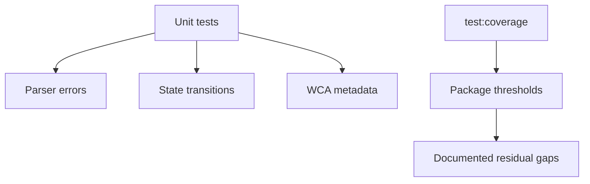

# Scramble Puzzle Test Coverage



Coverage for `@cubekit/scramble-puzzle` is intentionally focused on public parser
and state behavior rather than unreachable internals.

## Current Thresholds

- Statements: `97.21`
- Branches: `93.57`
- Functions: `99.42`
- Lines: `98.34`

## Residual Gaps

- Regex-defensive parser branches that are not reachable after public move
  validation rejects malformed tokens.
- A Clock delta guard for invalid arithmetic states.
- Cube rotation formatting branches blocked by move validation.

## Verify

```bash
pnpm --filter @cubekit/scramble-puzzle test:coverage
```

---

_Last updated: 2026-05-26 | Reason: record scramble-puzzle coverage policy_
