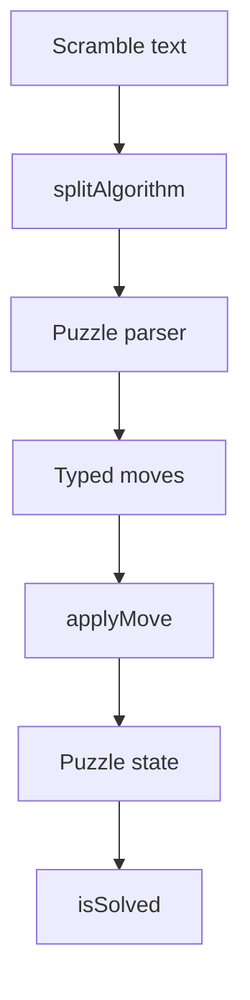

# WCA Notation And State

The puzzle package turns WCA/TNoodle notation into typed moves and applies those
moves to immutable state snapshots. `scramble-core` depends on these contracts for
parseability checks, and `scramble-image` depends on the resulting sticker state.

## Key Rules

- Parser failures should throw `InvalidMoveError`; whole-scramble failures through
  `applyAlgorithm` should become `InvalidScrambleError`.
- Cube notation accepts face turns, wide turns, and rotations that are valid for
  the target cube size; invalid widths are rejected at parse or apply time.
- Clock, Megaminx, Pyraminx, Skewb, and Square-1 each own puzzle-specific move
  validation and malformed-state guards in their state modules.
- Square-1 has two successor concepts: all legal state successors and
  scramble-successors that preserve slashability expectations.

## Key Files

- [packages/scramble-puzzle/src/algorithm.ts#L1](../../../packages/scramble-puzzle/src/algorithm.ts#L1) - shared split/apply wrapper.
- [packages/scramble-puzzle/src/cube/cube-parser.ts#L1](../../../packages/scramble-puzzle/src/cube/cube-parser.ts#L1) - cube notation parser.
- [packages/scramble-puzzle/src/square1/square1-state.ts#L1](../../../packages/scramble-puzzle/src/square1/square1-state.ts#L1) - Square-1 state and successor rules.

---

_Last updated: 2026-05-26 | Reason: document scramble-puzzle notation and state contracts_
