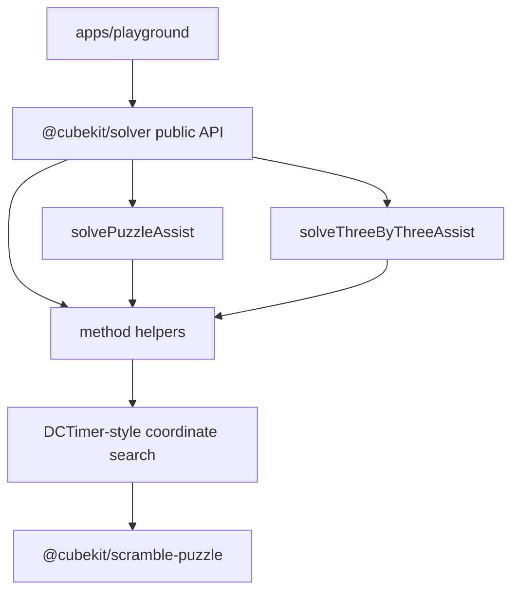

# Solver Package



`@cubekit/solver` owns platform-agnostic auxiliary restore helpers. It ports
DCTimer-style helper searches into structured TypeScript results without
depending on scramble generation or SVG rendering packages.

## Key Rules

- The public scope is Cross, XCross, EOline, EOFC, Roux S1, Petrus S1, 2x2
  Face/Layer, Square-1 shape in FTM/TTM-style metrics, and Pyraminx V.
- The package depends only on
  [@cubekit/scramble-puzzle](../../../packages/scramble-puzzle/src/index.ts#L1)
  for notation parsing and shared puzzle state semantics.
- Do not import `@cubekit/scramble-core`, `@cubekit/scramble-image`, React, DOM,
  Taro, or browser globals from `packages/solver/src/`.
- 3x3 solver input accepts ordinary face turns and rejects rotations/wide moves.
  2x2 helpers accept DCTimer's URF coordinate move set, Pyraminx V ignores
  tip-only moves, and Square-1 shape uses tuple/slash notation.
- Results are structured by method, target, setup rotation, solution, depth, and
  FTM/QTM metrics; callers own display formatting.

## Verify

```bash
pnpm --filter @cubekit/solver test
pnpm --filter @cubekit/solver test:coverage
pnpm --filter @cubekit/solver typecheck
pnpm --filter @cubekit/solver build
```

## Key Files

- [packages/solver/src/index.ts#L1](../../../packages/solver/src/index.ts#L1) - public exports.
- [packages/solver/src/types.ts#L1](../../../packages/solver/src/types.ts#L1) - structured assist result API.
- [packages/solver/src/facade.ts#L1](../../../packages/solver/src/facade.ts#L1) - aggregate dispatcher for 3x3, 2x2, Square-1, and Pyraminx.
- [packages/solver/src/three-by-three/facade.ts#L1](../../../packages/solver/src/three-by-three/facade.ts#L1) - aggregate method dispatcher.
- [packages/solver/src/three-by-three/cross.ts#L1](../../../packages/solver/src/three-by-three/cross.ts#L1) - Cross, XCross, and EOFC search family.
- [packages/solver/src/three-by-three/eoline.ts#L1](../../../packages/solver/src/three-by-three/eoline.ts#L1) - EOline search.
- [packages/solver/src/three-by-three/roux.ts#L1](../../../packages/solver/src/three-by-three/roux.ts#L1) - Roux S1 search.
- [packages/solver/src/three-by-three/petrus.ts#L1](../../../packages/solver/src/three-by-three/petrus.ts#L1) - Petrus S1 search.
- [packages/solver/src/two-by-two/two-by-two.ts#L1](../../../packages/solver/src/two-by-two/two-by-two.ts#L1) - 2x2 Face and Layer helpers.
- [packages/solver/src/square-one/square-one-shape.ts#L1](../../../packages/solver/src/square-one/square-one-shape.ts#L1) - Square-1 shape helper.
- [packages/solver/src/pyraminx/pyraminx-v.ts#L1](../../../packages/solver/src/pyraminx/pyraminx-v.ts#L1) - Pyraminx V helper.

---

_Last updated: 2026-05-31 | Reason: add 2x2, Square-1, and Pyraminx auxiliary solver scope_
