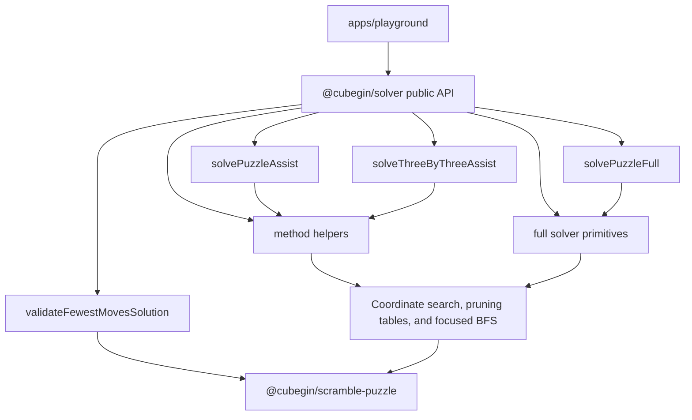

# Solver Package



`@cubegin/solver` owns platform-agnostic auxiliary restore helpers and full
solver primitives. It provides structured TypeScript results for method-specific
assist searches, a unified full restore facade, and the full solvers used by
scramble generation without depending on scramble generation or SVG rendering
packages.

## Key Rules

- The auxiliary public scope is Cross, XCross, EOline, EOFC, Roux S1/S2,
  Petrus S1/S2, CFOP F2L, ZZ F2L, 2x2x2 block, EO+DR, 3x3 TwoPhase, 3x3
  General mask, 2x2 Face/Layer, Square-1 shape in FTM/TTM-style metrics,
  Pyraminx V, and Skewb Face.
- Full solver primitives include 2x2, 3x3 min2phase/WCA search, 4x4
  threephase, Clock linear state solver, Pyraminx, Skewb, and Square-1.
- `solvePuzzleFull` exposes full restore output for 3x3, 4x4, 2x2,
  Pyraminx, Skewb, Square-1, and Clock. 2x2 full input follows the current
  URF coordinate move scope.
- The package depends only on
  [@cubegin/scramble-puzzle](../../../packages/scramble-puzzle/src/index.ts#L1)
  for notation parsing and shared puzzle state semantics.
- Do not import `@cubegin/scramble-core`, `@cubegin/scramble-image`, React, DOM,
  Taro, or browser globals from `packages/solver/src/`.
- 3x3 assist input accepts ordinary face turns and rejects rotations/wide moves.
  Staged cstimer-style helpers use facelet mask searches. 2x2 helpers accept
  the URF coordinate move set, Pyraminx V ignores tip-only moves, Skewb Face
  accepts Skewb face turns, and Square-1 shape uses tuple/slash notation.
- Results are structured by method, target, setup rotation, solution, depth, and
  FTM/QTM metrics; callers own display formatting.
- `validateFewestMovesSolution` is the platform-agnostic FMC adjudication
  facade. It normalizes accepted 3x3 notation, reports OBTM and ETM, applies the
  scramble followed by the submitted formula, enforces the 80 ETM ceiling, and
  identifies exact or suspicious inverse-scramble solutions. UI packages own
  countdowns, review decisions, and persistence.

## Verify

```bash
pnpm --filter @cubegin/solver test
pnpm --filter @cubegin/solver test:coverage
pnpm --filter @cubegin/solver typecheck
pnpm --filter @cubegin/solver build
```

## Key Files

- [packages/solver/src/index.ts#L1](../../../packages/solver/src/index.ts#L1) - public exports.
- [packages/solver/src/types.ts#L1](../../../packages/solver/src/types.ts#L1) - structured assist result API.
- [packages/solver/src/full/facade.ts#L1](../../../packages/solver/src/full/facade.ts#L1) - aggregate dispatcher for full restore solvers.
- [packages/solver/src/assist/facade.ts#L1](../../../packages/solver/src/assist/facade.ts#L1) - aggregate dispatcher for 3x3, 2x2, Square-1, Pyraminx, and Skewb.
- [packages/solver/src/assist/three-by-three/facade.ts#L1](../../../packages/solver/src/assist/three-by-three/facade.ts#L1) - aggregate 3x3 method dispatcher.
- [packages/solver/src/assist/three-by-three/cross.ts#L1](../../../packages/solver/src/assist/three-by-three/cross.ts#L1) - Cross, XCross, and EOFC search family.
- [packages/solver/src/assist/three-by-three/eoline.ts#L1](../../../packages/solver/src/assist/three-by-three/eoline.ts#L1) - EOline search.
- [packages/solver/src/assist/three-by-three/roux.ts#L1](../../../packages/solver/src/assist/three-by-three/roux.ts#L1) - Roux S1 search.
- [packages/solver/src/assist/three-by-three/petrus.ts#L1](../../../packages/solver/src/assist/three-by-three/petrus.ts#L1) - Petrus S1 search.
- [packages/solver/src/assist/three-by-three/stage-mask.ts#L1](../../../packages/solver/src/assist/three-by-three/stage-mask.ts#L1) - cstimer-style staged 3x3 mask helpers.
- [packages/solver/src/assist/two-by-two/face-layer.ts#L1](../../../packages/solver/src/assist/two-by-two/face-layer.ts#L1) - 2x2 Face and Layer helpers.
- [packages/solver/src/assist/square1/shape.ts#L1](../../../packages/solver/src/assist/square1/shape.ts#L1) - Square-1 shape helper.
- [packages/solver/src/assist/pyraminx/v.ts#L1](../../../packages/solver/src/assist/pyraminx/v.ts#L1) - Pyraminx V helper.
- [packages/solver/src/assist/skewb/face.ts#L1](../../../packages/solver/src/assist/skewb/face.ts#L1) - Skewb Face helper.
- [packages/solver/src/full/clock-solver.ts#L1](../../../packages/solver/src/full/clock-solver.ts#L1) - Clock full state solver.
- [packages/solver/src/full/min2phase/search-wca.ts#L1](../../../packages/solver/src/full/min2phase/search-wca.ts#L1) - 3x3 WCA min2phase search wrapper.
- [packages/solver/src/fewest-moves/validate.ts#L1](../../../packages/solver/src/fewest-moves/validate.ts#L1) - FMC notation, move metrics, solved-state, and inverse-scramble validation.

---

_Last updated: 2026-07-20 | Reason: add the platform-agnostic Fewest Moves validator_
