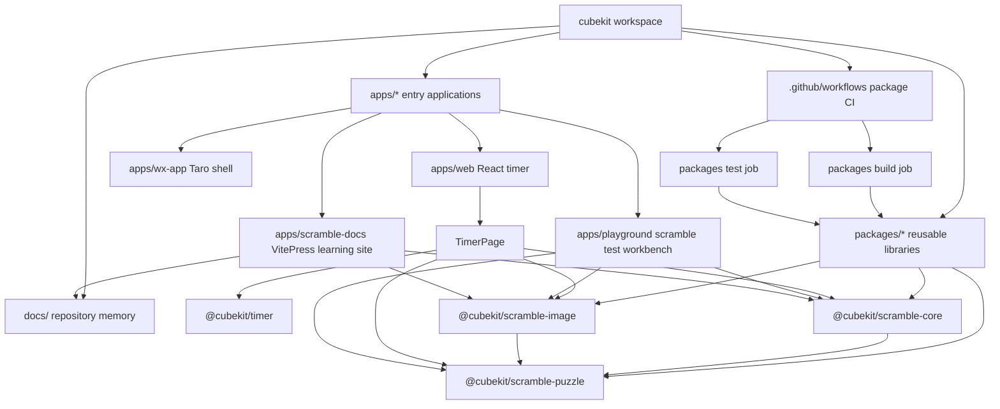

# Project Structure



CubeKit is organized as a pnpm workspace where apps compose reusable packages.
The web app currently carries the usable timer experience; the WeChat
miniprogram is a Taro shell waiting for feature parity.

## Directory Layout

```text
apps/web/              React 18 web/H5 app and timer UI
apps/playground/       React scramble generator/image testing workbench
apps/scramble-docs/    VitePress bilingual scramble learning site
apps/wx-app/           Taro WeChat miniprogram shell
packages/timer/        platform-agnostic timer state and formatting
packages/scramble-puzzle/  TNoodle-compatible event ids, parsers, and states
packages/scramble-core/    TNoodle-compatible WCA scramble generators
packages/scramble-image/   DOM-free TNoodle-compatible SVG renderers
docs/                  repository memory and Superpowers specs/plans
docs/packages/         package-scoped knowledge for new scramble packages
docs/apps/             app-scoped knowledge for playground and docs apps
scripts/               lightweight repository checks
.github/workflows/     GitHub Actions workflows
```

## Startup Path

- Web starts at [apps/web/src/main.tsx#L1](../apps/web/src/main.tsx#L1), which
  renders React without the removed cstimer browser shim.
- [apps/web/src/app.tsx#L1](../apps/web/src/app.tsx#L1) wraps
  [TimerPage](../apps/web/src/timer/timer-page.tsx#L14) in the app shell.
- `TimerPage` owns the page-level `scramble -> timing -> result` state and calls
  `@cubekit/timer`, `@cubekit/scramble-core`, and `@cubekit/scramble-image`.
- Playground starts with `pnpm dev:playground` at
  [apps/playground/src/main.tsx#L1](../apps/playground/src/main.tsx#L1). Its
  [App](../apps/playground/src/app.tsx#L1) calls the new `scramble-core` and
  `scramble-image` packages through
  [usePlayground](../apps/playground/src/playground/use-playground.ts#L1).
- Scramble Docs starts with `pnpm dev:scramble-docs` at
  [apps/scramble-docs/docs/index.md#L1](../apps/scramble-docs/docs/index.md#L1).
  Its [VitePress config](../apps/scramble-docs/docs/.vitepress/config.mts#L1)
  owns bilingual routing and Mermaid diagram rendering.
- WeChat starts from [apps/wx-app/src/app.ts#L1](../apps/wx-app/src/app.ts#L1)
  and currently renders the placeholder index page at
  [apps/wx-app/src/pages/index/index.tsx#L1](../apps/wx-app/src/pages/index/index.tsx#L1).

## Key Files

- [package.json#L7](../package.json#L7) - root scripts for dev, build, test,
  docs guard, and check.
- [pnpm-workspace.yaml#L1](../pnpm-workspace.yaml#L1) - workspace packages and
  dependency catalog.
- [.github/workflows/packages.yml#L1](../.github/workflows/packages.yml#L1) -
  package-only CI build and test jobs.
- [vite.config.ts#L3](../vite.config.ts#L3) - root vite-plus lint and formatting
  policy.
- [apps/web/vite.config.ts#L9](../apps/web/vite.config.ts#L9) - React plugin,
  browser aliases, and jsdom test environment.
- [apps/playground/vite.config.ts#L1](../apps/playground/vite.config.ts#L1) - React plugin and source aliases for testing the new scramble packages.
- [apps/playground/src/playground/playground-service.ts#L1](../apps/playground/src/playground/playground-service.ts#L1) - adapter boundary around generator and renderer package calls.
- [apps/scramble-docs/docs/.vitepress/config.mts#L1](../apps/scramble-docs/docs/.vitepress/config.mts#L1) - VitePress locale routing and Mermaid fence conversion.
- [docs/apps/scramble-docs/index.md#L1](apps/scramble-docs/index.md#L1) - scramble docs app ownership and verification.
- [apps/wx-app/config/index.ts#L3](../apps/wx-app/config/index.ts#L3) - Taro
  build configuration.
- [apps/web/package.json#L7](../apps/web/package.json#L7) - web scripts build workspace dependencies before dev, test, typecheck, and build.
- [packages/scramble-puzzle/src/index.ts#L1](../packages/scramble-puzzle/src/index.ts#L1) - TNoodle-compatible puzzle domain barrel.
- [packages/scramble-core/src/index.ts#L1](../packages/scramble-core/src/index.ts#L1) - TNoodle-compatible generator barrel.
- [packages/scramble-image/src/index.ts#L1](../packages/scramble-image/src/index.ts#L1) - TNoodle-compatible SVG renderer barrel.
- [docs/packages/scramble-puzzle/index.md#L1](packages/scramble-puzzle/index.md#L1) - puzzle package ownership and verification.
- [docs/packages/scramble-core/index.md#L1](packages/scramble-core/index.md#L1) - core generator ownership and verification.
- [docs/packages/scramble-image/index.md#L1](packages/scramble-image/index.md#L1) - image renderer ownership and verification.
- [docs/apps/playground/index.md#L1](apps/playground/index.md#L1) - playground ownership and diagnostics role.
- [docs/tnoodle-implementation-notes.md#L1](tnoodle-implementation-notes.md#L1) - implementation notes and upgrade routing for the new packages.

---

_Last updated: 2026-05-31 | Reason: web app migrated off removed legacy scramble package_
