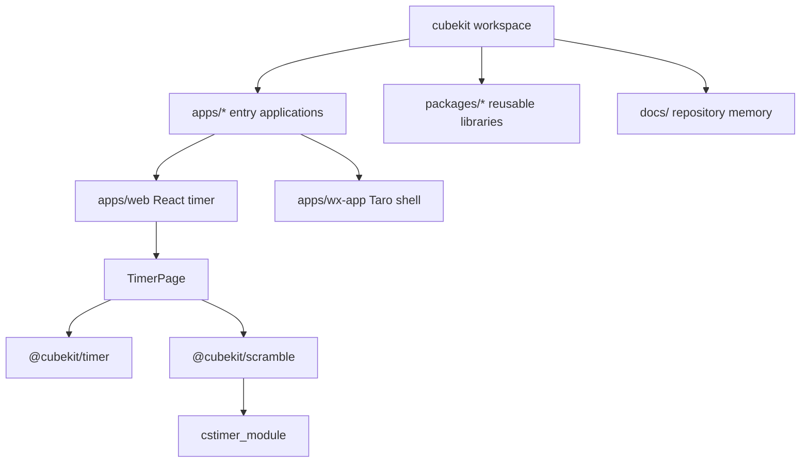

# Project Structure



CubeKit is organized as a pnpm workspace where apps compose reusable packages.
The web app currently carries the usable timer experience; the WeChat
miniprogram is a Taro shell waiting for feature parity.

## Directory Layout

```text
apps/web/              React 18 web/H5 app and timer UI
apps/wx-app/           Taro WeChat miniprogram shell
packages/timer/        platform-agnostic timer state and formatting
packages/scramble/     WCA scramble and SVG wrapper around cstimer_module
docs/                  repository memory and Superpowers specs/plans
scripts/               lightweight repository checks
```

## Startup Path

- Web starts at [apps/web/src/main.tsx#L1](../apps/web/src/main.tsx#L1), which
  imports the cstimer browser shim before rendering React.
- [apps/web/src/app.tsx#L1](../apps/web/src/app.tsx#L1) wraps
  [TimerPage](../apps/web/src/timer/timer-page.tsx#L14) in the app shell.
- `TimerPage` owns the page-level `scramble -> timing -> result` state and calls
  `@cubekit/timer` and `@cubekit/scramble`.
- WeChat starts from [apps/wx-app/src/app.ts#L1](../apps/wx-app/src/app.ts#L1)
  and currently renders the placeholder index page at
  [apps/wx-app/src/pages/index/index.tsx#L1](../apps/wx-app/src/pages/index/index.tsx#L1).

## Key Files

- [package.json#L7](../package.json#L7) - root scripts for dev, build, test,
  docs guard, and check.
- [pnpm-workspace.yaml#L1](../pnpm-workspace.yaml#L1) - workspace packages and
  dependency catalog.
- [vite.config.ts#L3](../vite.config.ts#L3) - root vite-plus lint and formatting
  policy.
- [apps/web/vite.config.ts#L9](../apps/web/vite.config.ts#L9) - React plugin,
  browser aliases, and jsdom test environment.
- [apps/wx-app/config/index.ts#L3](../apps/wx-app/config/index.ts#L3) - Taro
  build configuration.

---

_Last updated: 2026-05-25 | Reason: initial memory setup after replacing legacy knowledge docs_
