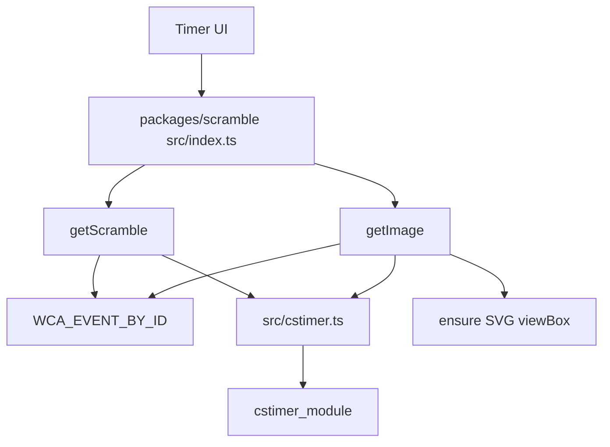

# Scramble Runtime

`@cubekit/scramble` is a typed, synchronous wrapper around `cstimer_module`.
Its public API uses WCA event ids while hiding cstimer's internal type ids.

## Key Rules

- Only [packages/scramble/src/cstimer.ts#L1](../packages/scramble/src/cstimer.ts#L1)
  imports `cstimer_module`. All wrapper features should go through this adapter.
- WCA public ids, cstimer ids, labels, and fixed scramble lengths live together in
  [packages/scramble/src/wca-events.ts#L52](../packages/scramble/src/wca-events.ts#L52).
- `getScramble` applies WCA lengths for known events and forwards arbitrary
  strings as the non-WCA training escape hatch. See
  [packages/scramble/src/scramble.ts#L19](../packages/scramble/src/scramble.ts#L19).
- `getImage` returns SVG strings and injects a missing `viewBox` so CSS resizing
  does not clip large cube nets. See [packages/scramble/src/image.ts#L32](../packages/scramble/src/image.ts#L32).
- Browser main-thread consumers must load a shim before `cstimer_module`
  evaluates, or move scramble work into a Web Worker. The web app shim is the
  first import in [apps/web/src/main.tsx#L1](../apps/web/src/main.tsx#L1) and is
  implemented at [apps/web/src/\_stubs/cstimer-browser-shim.ts#L1](../apps/web/src/_stubs/cstimer-browser-shim.ts#L1).

## Runtime Matrix

- Node, vitest, and build-time usage work without a shim.
- Browser main thread needs the `process` / `require` / `global` shim before any
  scramble import.
- Browser Web Worker is the cleaner long-term runtime boundary for cstimer.
- WeChat miniprogram support should be verified before wiring the package into
  `apps/wx-app`.

## Key Files

- [packages/scramble/src/index.ts#L1](../packages/scramble/src/index.ts#L1) - public barrel.
- [packages/scramble/package.json#L32](../packages/scramble/package.json#L32) - inlined cstimer dependency metadata.
- [packages/scramble/vite.config.ts#L5](../packages/scramble/vite.config.ts#L5) - package build config that bundles and splits cstimer.
- [apps/web/vite.config.ts#L16](../apps/web/vite.config.ts#L16) - browser `node:module` stub for bundled cstimer runtime.

---

_Last updated: 2026-05-25 | Reason: initial memory setup after replacing legacy knowledge docs_
