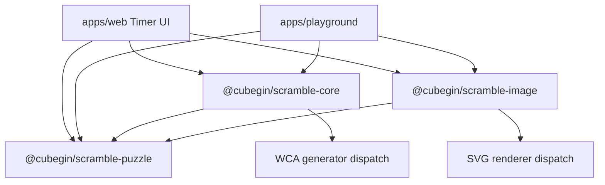

# Scramble Runtime

The web timer now consumes the TNoodle-compatible scramble packages directly.
`@cubegin/scramble-puzzle` owns WCA event ids and puzzle parsing,
`@cubegin/scramble-core` owns async-shaped WCA scramble generation, and
`@cubegin/scramble-image` owns DOM-free SVG rendering. The removed
`packages/scramble` cstimer wrapper and browser shim must not be restored.

## Key Rules

- TNoodle-compatible source lives in three packages:
  `@cubegin/scramble-puzzle` for parsers/states,
  `@cubegin/scramble-core` for generators and solvers, and
  `@cubegin/scramble-image` for SVG renderers.
- Package-specific maintenance knowledge lives under `docs/packages/*`, while
  local package `AGENTS.md` files only route maintainers to those docs.
- `@cubegin/scramble-core` exposes `createDefaultScrambleGenerator` for all 17
  WCA events. The facade is async-shaped and can move behind a Web Worker later.
- `@cubegin/scramble-image` exposes `renderScrambleImage(eventId, scramble)` and
  uses `scramble-puzzle` to apply moves before rendering SVG.
- `apps/web` builds `@cubegin/timer` and the three scramble packages before dev,
  build, test, and typecheck so package `dist` exports are available.
- `apps/playground` is a test workbench, not a production app migration. It
  imports the new packages directly, aliases Vite runtime resolution to package
  source, and runs `prepare:deps` before typecheck/build so package dist types
  stay fresh.
- Playground supports deterministic browser smoke tests with `?seed=<integer>`,
  parsed in [apps/playground/src/playground/browser-seed.ts#L1](../apps/playground/src/playground/browser-seed.ts#L1).
- `@cubegin/scramble-core` returns `333mbld` as one multi-line attempt containing
  one 3x3 no-inspection scramble per cube. The playground adapter splits those
  lines into individual display/render rows so each listed scramble stays the same
  shape as `333bld`.

## Runtime Matrix

- Node, vitest, build-time usage, and browser main-thread usage work without the
  removed cstimer shim.
- WeChat miniprogram support should be verified before wiring the package into
  `apps/wx-app`.
- Heavy generators such as 4x4 threephase should still move behind a worker
  boundary before the timer UI depends on them for latency-sensitive flows.
- `apps/playground` runs generators on the main thread because it is a developer
  test workbench. Production UI should still move heavy generation behind a
  worker boundary.

## Key Files

- [apps/web/src/timer/timer-page.tsx#L1](../apps/web/src/timer/timer-page.tsx#L1) - timer state and async scramble generation.
- [apps/web/src/timer/views/scramble-view.tsx#L1](../apps/web/src/timer/views/scramble-view.tsx#L1) - web SVG rendering through `@cubegin/scramble-image`.
- [apps/web/src/timer/components/event-selector.tsx#L1](../apps/web/src/timer/components/event-selector.tsx#L1) - WCA event list from `@cubegin/scramble-puzzle`.
- [apps/web/package.json#L7](../apps/web/package.json#L7) - `prepare:deps` for workspace package exports.
- [packages/scramble-puzzle/src/events.ts#L1](../packages/scramble-puzzle/src/events.ts#L1) - canonical 17-event WCA list for the new packages.
- [packages/scramble-core/src/generator.ts#L1](../packages/scramble-core/src/generator.ts#L1) - async generator facade and default WCA event dispatch.
- [packages/scramble-image/src/render.ts#L1](../packages/scramble-image/src/render.ts#L1) - WCA event dispatch for SVG rendering.
- [docs/packages/scramble-puzzle/index.md#L1](packages/scramble-puzzle/index.md#L1) - puzzle package knowledge.
- [docs/packages/scramble-core/wca-generation-rules.md#L1](packages/scramble-core/wca-generation-rules.md#L1) - WCA generation rule mapping.
- [docs/packages/scramble-image/renderer-contracts.md#L1](packages/scramble-image/renderer-contracts.md#L1) - renderer contracts.
- [apps/playground/src/playground/playground-service.ts#L1](../apps/playground/src/playground/playground-service.ts#L1) - browser-facing adapter around `createDefaultScrambleGenerator` and `renderScrambleImage`.
- [apps/playground/src/playground/use-playground.ts#L1](../apps/playground/src/playground/use-playground.ts#L1) - React state boundary for event, batch, selection, manual render, and diagnostics.
- [docs/tnoodle-implementation-notes.md#L1](tnoodle-implementation-notes.md#L1) - package implementation notes and upgrade flow.

---

_Last updated: 2026-05-31 | Reason: web runtime migrated to TNoodle-compatible packages_
