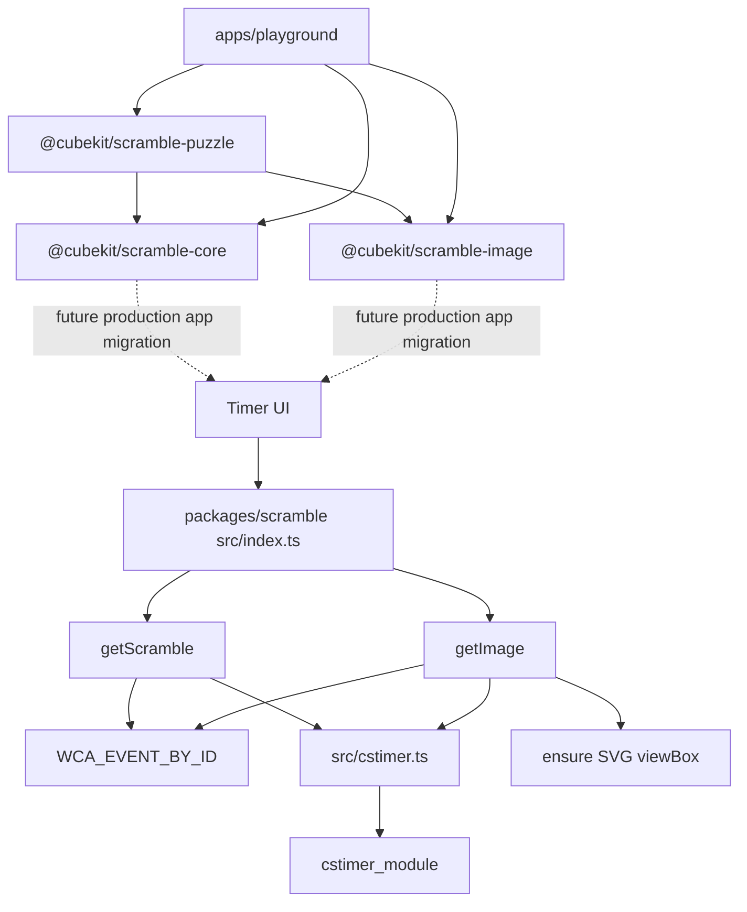

# Scramble Runtime

`@cubekit/scramble` is a typed, synchronous wrapper around `cstimer_module`.
Its public API uses WCA event ids while hiding cstimer's internal type ids.
The new TNoodle-compatible `@cubekit/scramble-puzzle`,
`@cubekit/scramble-core`, and `@cubekit/scramble-image` packages are available
for package-level verification and the standalone playground. Production apps
still use the legacy `@cubekit/scramble` wrapper.

## Key Rules

- Only [packages/scramble/src/cstimer.ts#L1](../packages/scramble/src/cstimer.ts#L1)
  imports `cstimer_module`. All wrapper features should go through this adapter.
- WCA public ids, cstimer ids, labels, and fixed scramble lengths live together in
  [packages/scramble/src/wca-events.ts#L52](../packages/scramble/src/wca-events.ts#L52).
- `getScramble` applies WCA lengths for known events and forwards arbitrary
  strings as the non-WCA training escape hatch. See
  [packages/scramble/src/scramble.ts#L19](../packages/scramble/src/scramble.ts#L19).
- `getImage` returns SVG strings and injects a missing `viewBox` so CSS resizing
  does not clip large cube nets. See [packages/scramble/src/image.ts#L32](../packages/scramble/src/image.ts#L32).
- Browser main-thread consumers must load a shim before `cstimer_module`
  evaluates, or move scramble work into a Web Worker. The web app shim is the
  first import in [apps/web/src/main.tsx#L1](../apps/web/src/main.tsx#L1) and is
  implemented at [apps/web/src/\_stubs/cstimer-browser-shim.ts#L1](../apps/web/src/_stubs/cstimer-browser-shim.ts#L1).
- TNoodle-compatible source now lives in three packages:
  `@cubekit/scramble-puzzle` for parsers/states,
  `@cubekit/scramble-core` for generators and solvers, and
  `@cubekit/scramble-image` for SVG renderers.
- `@cubekit/scramble-core` exposes `createDefaultScrambleGenerator` for all 17
  WCA events. The facade is async-shaped and can move behind a Web Worker later.
- `@cubekit/scramble-image` exposes `renderScrambleImage(eventId, scramble)` and
  uses `scramble-puzzle` to apply moves before rendering SVG.
- `apps/playground` is a test workbench, not a production app migration. It
  imports the new packages directly, aliases Vite runtime resolution to package
  source, and runs `prepare:deps` before typecheck/build so package dist types
  stay fresh.
- Playground supports deterministic browser smoke tests with `?seed=<integer>`,
  parsed in [apps/playground/src/playground/browser-seed.ts#L1](../apps/playground/src/playground/browser-seed.ts#L1).
- `@cubekit/scramble-core` returns `333mbld` as one multi-line attempt containing
  one 3x3 no-inspection scramble per cube. The playground adapter splits those
  lines into individual display/render rows so each listed scramble stays the same
  shape as `333bld`.

## Runtime Matrix

- Node, vitest, and build-time usage work without a shim.
- Browser main thread needs the `process` / `require` / `global` shim before any
  scramble import.
- Browser Web Worker is the cleaner long-term runtime boundary for cstimer.
- WeChat miniprogram support should be verified before wiring the package into
  `apps/wx-app`.
- The new TNoodle-compatible packages avoid the cstimer browser shim, but heavy
  generators such as 4x4 threephase should still be run behind a worker before
  app integration.
- `apps/playground` runs generators on the main thread because it is a developer
  test workbench. Production UI should still move heavy generation behind a
  worker boundary.

## Key Files

- [packages/scramble/src/index.ts#L1](../packages/scramble/src/index.ts#L1) - public barrel.
- [packages/scramble/package.json#L32](../packages/scramble/package.json#L32) - inlined cstimer dependency metadata.
- [packages/scramble/vite.config.ts#L5](../packages/scramble/vite.config.ts#L5) - package build config that bundles and splits cstimer.
- [apps/web/vite.config.ts#L16](../apps/web/vite.config.ts#L16) - browser `node:module` stub for bundled cstimer runtime.
- [packages/scramble-puzzle/src/events.ts#L1](../packages/scramble-puzzle/src/events.ts#L1) - canonical 17-event WCA list for the new packages.
- [packages/scramble-core/src/generator.ts#L1](../packages/scramble-core/src/generator.ts#L1) - async generator facade and default WCA event dispatch.
- [packages/scramble-image/src/render.ts#L1](../packages/scramble-image/src/render.ts#L1) - WCA event dispatch for SVG rendering.
- [apps/playground/src/playground/playground-service.ts#L1](../apps/playground/src/playground/playground-service.ts#L1) - browser-facing adapter around `createDefaultScrambleGenerator` and `renderScrambleImage`.
- [apps/playground/src/playground/use-playground.ts#L1](../apps/playground/src/playground/use-playground.ts#L1) - React state boundary for event, batch, selection, manual render, and diagnostics.
- [docs/tnoodle-implementation-notes.md#L1](tnoodle-implementation-notes.md#L1) - package implementation notes and upgrade flow.

---

_Last updated: 2026-05-26 | Reason: document playground 333mbld display normalization_
