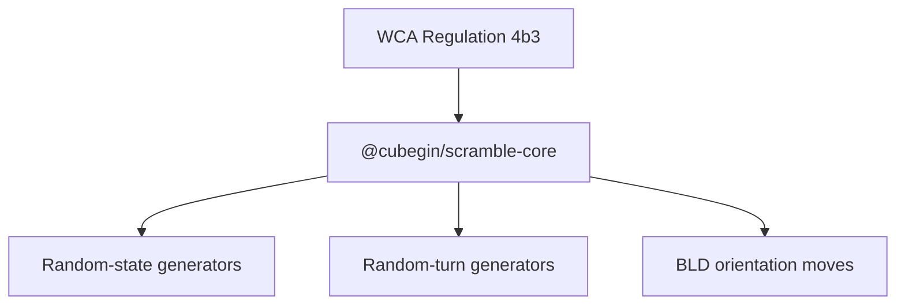

# Scramble Closeout Implementation Plan

> **For agentic workers:** REQUIRED SUB-SKILL: Use superpowers:subagent-driven-development (recommended) or superpowers:executing-plans to implement this plan task-by-task. Steps use checkbox (`- [ ]`) syntax for tracking.

**Goal:** Finish the TNoodle-compatible packages and playground as maintainable workspace units with package coverage, WCA-rule tests, package-scoped docs, license alignment, and READMEs.

**Architecture:** Keep package logic unchanged unless WCA-rule regression tests expose a real gap. Put durable knowledge under root `docs/packages/*` and `docs/apps/*`; keep local `AGENTS.md` files as small routing documents. Use package-local Vitest coverage config so each package owns its own coverage command and thresholds.

**Tech Stack:** TypeScript 5, pnpm 10 workspace catalogs, vite-plus/Vitest, V8 coverage provider, Markdown repo-memory docs.

---

## File Map

- Modify `pnpm-workspace.yaml` to add `@vitest/coverage-v8` to the catalog.
- Modify `pnpm-lock.yaml` through `pnpm install --ignore-scripts`.
- Modify `packages/scramble-puzzle/package.json`, `packages/scramble-core/package.json`, and `packages/scramble-image/package.json` with `test:coverage`, coverage provider dev dependency, SPDX license, and package files.
- Modify `packages/scramble-puzzle/vite.config.ts`, `packages/scramble-core/vite.config.ts`, and `packages/scramble-image/vite.config.ts` with package coverage config.
- Add or modify WCA/coverage tests in:
  - `packages/scramble-puzzle/src/events.test.ts`
  - `packages/scramble-puzzle/src/*/*.test.ts`
  - `packages/scramble-core/src/integration.test.ts`
  - `packages/scramble-core/src/generators/*.test.ts`
  - `packages/scramble-image/src/integration.test.ts`
  - `packages/scramble-image/src/svg/svg.test.ts`
  - existing playground tests when docs mention behavior such as `333mbld` row normalization.
- Create package/app docs under:
  - `docs/packages/scramble-puzzle/`
  - `docs/packages/scramble-core/`
  - `docs/packages/scramble-image/`
  - `docs/apps/playground/`
- Create lightweight routing files:
  - `packages/scramble-puzzle/AGENTS.md`
  - `packages/scramble-core/AGENTS.md`
  - `packages/scramble-image/AGENTS.md`
  - `apps/playground/AGENTS.md`
- Create package README/license/notice files:
  - `packages/scramble-puzzle/README.md`, `LICENSE`, `NOTICE`
  - `packages/scramble-core/README.md`, `LICENSE`, `NOTICE`
  - `packages/scramble-image/README.md`, `LICENSE`, `NOTICE`
  - `apps/playground/README.md`
- Modify root docs and memory:
  - `README.md`
  - `AGENTS.md`
  - `docs/project-structure.md`
  - `docs/tnoodle-implementation-notes.md`
  - `docs/dependency-licensing.md`
  - `docs/scramble-runtime.md`
  - `docs/.state.md`
  - `docs/.todo.md` if follow-ups change.

---

### Task 1: Coverage Infrastructure

**Files:**
- Modify: `pnpm-workspace.yaml`
- Modify: `packages/scramble-puzzle/package.json`
- Modify: `packages/scramble-core/package.json`
- Modify: `packages/scramble-image/package.json`
- Modify: `packages/scramble-puzzle/vite.config.ts`
- Modify: `packages/scramble-core/vite.config.ts`
- Modify: `packages/scramble-image/vite.config.ts`
- Generated: `pnpm-lock.yaml`

- [ ] **Step 1: Add coverage provider to workspace catalog**

Add this catalog entry to `pnpm-workspace.yaml`:

```yaml
  '@vitest/coverage-v8': ^4
```

- [ ] **Step 2: Add package coverage scripts**

For each new scramble package, add:

```json
"test:coverage": "vp test --coverage"
```

and add:

```json
"@vitest/coverage-v8": "catalog:"
```

to `devDependencies`.

- [ ] **Step 3: Add package coverage config**

Add a `test.coverage` block to each package `vite.config.ts`:

```ts
test: {
  coverage: {
    provider: 'v8',
    reporter: ['text', 'json-summary'],
    reportsDirectory: 'coverage',
    include: ['src/**/*.ts'],
    exclude: ['src/**/*.test.ts', 'src/test-support/**'],
    thresholds: {
      statements: 100,
      branches: 100,
      functions: 100,
      lines: 100,
    },
  },
},
```

If a package has legitimate defensive solver branches that cannot be reached
without corrupting invariants, lower only that package threshold after a coverage
run proves the exact gap, and document the reason in the package test-coverage doc.

- [ ] **Step 4: Update lockfile**

Run:

```bash
pnpm install --ignore-scripts
```

Expected: lockfile updates without running the root `postinstall` skill installer.

- [ ] **Step 5: Verify coverage command reaches test execution**

Run:

```bash
pnpm --filter @cubegin/scramble-puzzle test:coverage
pnpm --filter @cubegin/scramble-core test:coverage
pnpm --filter @cubegin/scramble-image test:coverage
```

Expected: tests execute. Threshold failures are acceptable at this step and become
input for Task 2.

- [ ] **Step 6: Commit coverage infrastructure**

```bash
git add pnpm-workspace.yaml pnpm-lock.yaml packages/scramble-puzzle/package.json packages/scramble-core/package.json packages/scramble-image/package.json packages/scramble-puzzle/vite.config.ts packages/scramble-core/vite.config.ts packages/scramble-image/vite.config.ts
git commit -m "test(scramble): add package coverage commands"
```

---

### Task 2: WCA Rule And Package Contract Tests

**Files:**
- Modify: `packages/scramble-puzzle/src/events.test.ts`
- Modify: relevant `packages/scramble-puzzle/src/*/*.test.ts`
- Modify: `packages/scramble-core/src/integration.test.ts`
- Modify: relevant `packages/scramble-core/src/generators/*.test.ts`
- Modify: relevant `packages/scramble-core/src/solvers/**/*.test.ts`
- Modify: `packages/scramble-image/src/integration.test.ts`
- Modify: `packages/scramble-image/src/svg/svg.test.ts`
- Modify implementation files only when a failing WCA test exposes missing behavior.

- [ ] **Step 1: Add failing tests for missing WCA matrix assertions**

Add tests that explicitly name the WCA rule they protect. Examples:

```ts
it('keeps the supported WCA event list at 17 official ids', () => {
  expect(WCA_EVENT_IDS).toEqual([
    '333',
    '222',
    '444',
    '555',
    '666',
    '777',
    '333bld',
    '333fm',
    '333oh',
    'clock',
    'minx',
    'pyram',
    'skewb',
    'sq1',
    '444bld',
    '555bld',
    '333mbld',
  ]);
});
```

For `scramble-core`, add or strengthen tests for:

```ts
it('generates one no-inspection 3x3 line per multi-blind cube', () => {
  const scramble = generateMultiBlindScramble({
    random: createSeededRandom(0x333_0003),
    cubeCount: 3,
  });

  const lines = scramble.split('\n');
  expect(lines).toHaveLength(3);
  expect(lines.every((line) => line.trim().split(/\s+/).length >= 20)).toBe(true);
});
```

For `scramble-image`, add or strengthen root SVG contract tests:

```ts
it('renders every WCA event to a single SVG document root', () => {
  for (const eventId of WCA_EVENT_IDS) {
    const svg = renderScrambleImage(eventId, SAMPLE_SCRAMBLES[eventId]);

    expect(svg.startsWith('<svg ')).toBe(true);
    expect(svg.match(/<svg /g)).toHaveLength(1);
    expect(svg).toContain('viewBox=');
  }
});
```

- [ ] **Step 2: Run targeted tests and confirm RED where behavior is missing**

Run the smallest relevant command after each new assertion, for example:

```bash
pnpm --filter @cubegin/scramble-core test src/generators/two-by-two.test.ts
```

Expected: existing behavior tests pass; any new WCA assertion that exposes a real
gap fails for the named reason.

- [ ] **Step 3: Implement missing WCA behavior only when tests prove a gap**

If a minimum-distance generator accepts too-close states, filter sampled states at
the generator boundary, following the existing Skewb/Pyraminx/Square-1 pattern:

```ts
for (let attempt = 0; attempt < MAX_WCA_ATTEMPTS; attempt += 1) {
  const state = solver.randomState(random);
  const isTooCloseToSolved = solver.solveIn(state, WCA_MIN_SCRAMBLE_DISTANCE - 1) !== null;

  if (isTooCloseToSolved) continue;

  return solver.generateExactly(state, SCRAMBLE_LENGTH);
}
```

Use event-specific solvers and error messages with the existing
`@cubegin/scramble-core` prefix.

- [ ] **Step 4: Raise coverage by testing public and boundary behavior**

Add tests for error boundaries, parser invalid inputs, immutable state, renderer
escaping, renderer dispatch errors, seeded deterministic output, and package
entrypoint exports. Avoid tests that assert private table internals unless those
tables are already public through package behavior.

- [ ] **Step 5: Run package coverage and calibrate thresholds**

Run:

```bash
pnpm --filter @cubegin/scramble-puzzle test:coverage
pnpm --filter @cubegin/scramble-core test:coverage
pnpm --filter @cubegin/scramble-image test:coverage
```

Expected: thresholds pass or remaining solver defensive gaps are documented and
thresholds are set to the highest stable value for that package.

- [ ] **Step 6: Commit WCA and coverage tests**

```bash
git add packages/scramble-puzzle/src packages/scramble-core/src packages/scramble-image/src packages/scramble-puzzle/vite.config.ts packages/scramble-core/vite.config.ts packages/scramble-image/vite.config.ts
git commit -m "test(scramble): cover wca package contracts"
```

---

### Task 3: Package/App Knowledge And AGENTS Routing

**Files:**
- Create docs under `docs/packages/scramble-puzzle/`
- Create docs under `docs/packages/scramble-core/`
- Create docs under `docs/packages/scramble-image/`
- Create docs under `docs/apps/playground/`
- Create `packages/scramble-puzzle/AGENTS.md`
- Create `packages/scramble-core/AGENTS.md`
- Create `packages/scramble-image/AGENTS.md`
- Create `apps/playground/AGENTS.md`
- Modify root `AGENTS.md` and existing root docs.

- [ ] **Step 1: Create owner-scoped docs**

Each doc must start with Mermaid, then concise prose, then links and footer.

Minimum `docs/packages/scramble-core/wca-generation-rules.md` shape:

````markdown
# WCA Generation Rules



`@cubegin/scramble-core` implements the testable generation rules used by the
17 WCA event ids.

## Key Rules

- 2x2, Skewb, Pyraminx, and Square-1 enforce event-specific minimum solve
  distances at the generator boundary.
- 5x5, 6x6, 7x7, and Megaminx use fixed random-turn lengths.
- Blindfolded cube events append random orientation moves.

---

_Last updated: 2026-05-26 | Reason: document scramble-core closeout rules_
````

- [ ] **Step 2: Create lightweight local AGENTS files**

Each local `AGENTS.md` should be short and route to root docs:

````markdown
# @cubegin/scramble-core

This package owns TNoodle-compatible WCA scramble generation.

## Read First

- [../../docs/packages/scramble-core/index.md](../../docs/packages/scramble-core/index.md)
- [../../docs/packages/scramble-core/wca-generation-rules.md](../../docs/packages/scramble-core/wca-generation-rules.md)
- [../../docs/tnoodle-baseline.md](../../docs/tnoodle-baseline.md)

## Verify

```bash
pnpm --filter @cubegin/scramble-core test
pnpm --filter @cubegin/scramble-core test:coverage
pnpm --filter @cubegin/scramble-core typecheck
```
````

- [ ] **Step 3: Update root routing docs**

Update root `AGENTS.md`, `docs/project-structure.md`,
`docs/tnoodle-implementation-notes.md`, and `docs/scramble-runtime.md` to link
the owner-scoped docs.

- [ ] **Step 4: Verify docs**

Run:

```bash
pnpm test:docs
```

Expected: pass.

- [ ] **Step 5: Commit knowledge routing**

```bash
git add AGENTS.md docs packages/scramble-puzzle/AGENTS.md packages/scramble-core/AGENTS.md packages/scramble-image/AGENTS.md apps/playground/AGENTS.md
git commit -m "docs(scramble): add package knowledge routing"
```

---

### Task 4: License Alignment

**Files:**
- Modify: root `package.json` if SPDX alignment is chosen for root.
- Modify: `packages/scramble-puzzle/package.json`
- Modify: `packages/scramble-core/package.json`
- Modify: `packages/scramble-image/package.json`
- Create: package `LICENSE` and `NOTICE` files.
- Modify: `docs/dependency-licensing.md`
- Modify: `docs/tnoodle-baseline.md`

- [ ] **Step 1: Align SPDX license fields**

Use:

```json
"license": "GPL-3.0-only"
```

for the three TNoodle-compatible packages. Keep any root or legacy-package change
scoped to documented license alignment.

- [ ] **Step 2: Copy GPL text into package LICENSE files**

Copy root `LICENSE` into:

```text
packages/scramble-puzzle/LICENSE
packages/scramble-core/LICENSE
packages/scramble-image/LICENSE
```

- [ ] **Step 3: Add package NOTICE files**

Use this shape:

```text
@cubegin/scramble-core
Copyright (C) 2026 The Cubegin authors

This package is licensed under the GNU General Public License version 3 only.
See the LICENSE file in this directory for the full text.

This package ports behavior compatible with:

    Name:       TNoodle lib-scrambles
    Version:    0.19.2
    Source:     https://github.com/thewca/tnoodle-lib/tree/v0.19.2
    License:    GNU General Public License v3.0

Cubegin is not an official WCA scramble program. Official competitions must use
the current official WCA scramble program from the WCA website.
```

- [ ] **Step 4: Update license docs**

Record the distinction:

- `thewca/tnoodle` app/server repo is AGPL-3.0.
- `thewca/tnoodle-lib` / Maven `lib-scrambles` is GPL-v3.0.
- Cubegin's migrated packages track `tnoodle-lib`, so they use `GPL-3.0-only`.

- [ ] **Step 5: Verify package manifests**

Run:

```bash
pnpm exec vp check --no-fmt packages/scramble-puzzle/package.json packages/scramble-core/package.json packages/scramble-image/package.json docs/dependency-licensing.md docs/tnoodle-baseline.md
```

Expected: no warnings, lint errors, or type errors.

- [ ] **Step 6: Commit license alignment**

```bash
git add package.json packages/scramble-puzzle/package.json packages/scramble-core/package.json packages/scramble-image/package.json packages/scramble-puzzle/LICENSE packages/scramble-core/LICENSE packages/scramble-image/LICENSE packages/scramble-puzzle/NOTICE packages/scramble-core/NOTICE packages/scramble-image/NOTICE docs/dependency-licensing.md docs/tnoodle-baseline.md
git commit -m "chore(scramble): align package licenses"
```

---

### Task 5: README Updates

**Files:**
- Create: `packages/scramble-puzzle/README.md`
- Create: `packages/scramble-core/README.md`
- Create: `packages/scramble-image/README.md`
- Create: `apps/playground/README.md`
- Modify: root `README.md`

- [ ] **Step 1: Add package README files**

Each package README should include:

- package purpose;
- import/API example;
- supported WCA event or puzzle scope;
- local commands;
- relationship to TNoodle baseline;
- license note and official-WCA disclaimer.

Example API block for `scramble-core`:

```ts
import { createDefaultScrambleGenerator } from '@cubegin/scramble-core';

const generator = createDefaultScrambleGenerator({
  random: { nextInt: (maxExclusive) => Math.floor(Math.random() * maxExclusive) },
});

const scramble = await generator.generate('333');
```

- [ ] **Step 2: Add playground README**

Document:

```bash
pnpm dev:playground
```

and:

```text
http://127.0.0.1:5173/?seed=42
```

as the deterministic smoke/E2E entrypoint.

- [ ] **Step 3: Update root README**

Root README must mention:

- `apps/playground`;
- `packages/scramble-puzzle`;
- `packages/scramble-core`;
- `packages/scramble-image`;
- `dev:playground` and `build:playground`;
- package coverage commands;
- GPL/TNoodle license distinction.

- [ ] **Step 4: Verify docs format**

Run:

```bash
pnpm test:docs
pnpm exec vp check --no-fmt README.md packages/scramble-puzzle/README.md packages/scramble-core/README.md packages/scramble-image/README.md apps/playground/README.md
```

Expected: pass.

- [ ] **Step 5: Commit README updates**

```bash
git add README.md packages/scramble-puzzle/README.md packages/scramble-core/README.md packages/scramble-image/README.md apps/playground/README.md
git commit -m "docs(scramble): update package readmes"
```

---

### Task 6: Final Verification And Memory

**Files:**
- Modify: `docs/.state.md`
- Modify: `docs/.todo.md` if E2E or coverage follow-ups changed.

- [ ] **Step 1: Run package tests**

```bash
pnpm --filter @cubegin/scramble-puzzle test
pnpm --filter @cubegin/scramble-core test
pnpm --filter @cubegin/scramble-image test
pnpm --filter playground test
```

Expected: all pass.

- [ ] **Step 2: Run package coverage**

```bash
pnpm --filter @cubegin/scramble-puzzle test:coverage
pnpm --filter @cubegin/scramble-core test:coverage
pnpm --filter @cubegin/scramble-image test:coverage
```

Expected: all pass.

- [ ] **Step 3: Run typecheck/build for touched packages and playground**

```bash
pnpm --filter @cubegin/scramble-puzzle typecheck
pnpm --filter @cubegin/scramble-core typecheck
pnpm --filter @cubegin/scramble-image typecheck
pnpm --filter playground typecheck
pnpm --filter @cubegin/scramble-puzzle build
pnpm --filter @cubegin/scramble-core build
pnpm --filter @cubegin/scramble-image build
pnpm --filter playground build
```

Expected: all pass.

- [ ] **Step 4: Run docs and scoped lint checks**

```bash
pnpm test:docs
pnpm exec vp check --no-fmt README.md AGENTS.md docs packages/scramble-puzzle packages/scramble-core packages/scramble-image apps/playground
```

Expected: scoped check passes. If root `pnpm check` still fails on known
pre-existing app issues, report it separately.

- [ ] **Step 5: Update memory state**

Update `docs/.state.md` with the latest reviewed commit and closeout area.
Update `docs/.todo.md` only for remaining follow-ups such as playground E2E.

- [ ] **Step 6: Commit final memory update**

```bash
git add docs/.state.md docs/.todo.md
git commit -m "docs: update memory for scramble closeout"
```

---

## Self-Review

- Spec coverage: every design goal maps to at least one task: coverage Task 1,
  WCA tests Task 2, knowledge Task 3, license Task 4, README Task 5, verification
  Task 6.
- Red-flag scan: no incomplete markers or open-ended implementation steps remain; calibration
  has explicit commands and documentation requirements.
- Type consistency: file paths and package names match current workspace naming.
