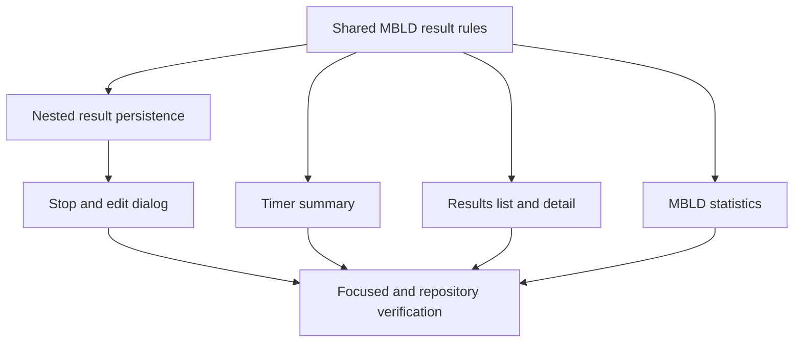

# Web Multi-Blind Results Implementation Plan

**Date**: 2026-07-16
**Spec**: [Multi-Blind results design](../specs/2026-07-16-web-multi-blind-results-design.md)

## Delivery Shape

## Tasks

1. Add failing shared tests for normalization, cumulative penalties, whole-second
   truncation, derived DNF, display formatting, WCA comparison, and summary.
2. Add a focused `multi-blind-result` module under shared timer-session and
   export it without changing ordinary solve statistics.
3. Extend `MultiBlindSolveResult`, `AddSolveInput`, and the web session database
   with nested-result cloning and `updateSolveMultiBlind`.
4. Add store tests covering add and edit persistence.
5. Add timer tests for the stopped-result dialog, validation, save, edit/delete
   toolbar, shortcut suspension, MBLD summary, and ordinary-event regression.
6. Implement the compact result dialog with label/input rows for solved count and
   cumulative +2, field-specific bounds and errors, whole-attempt DNF, explicit
   `本次不记录` discard, and edit. Whole-attempt DNF keeps save enabled, retains
   valid counts, and normalizes empty or invalid counts to `0 / 0`. Keep attempted
   count and result preview out of the visible layout. Initialize new attempts as
   all-success (`solved = attempted`, cumulative `+2 = 0`).
7. Route timer summary and recent-result formatting through MBLD helpers.
8. Add results-page tests for MBLD-only score controls, row formatting, detail
   metadata/editing, and overview metrics without averages or time charts.
9. Implement MBLD list/detail/statistics branches while preserving ordinary
   events unchanged.
10. Update [timer workflow](../../timer-workflow.md) and memory state with a
    Mermaid-first explanation, concise prose, relative links with #L anchors,
    and an updated footer.
11. Run focused shared/web tests, typecheck, docs tests, diff checks, and live
    localhost verification at mobile and desktop widths when browser access is
    available.

## Git And Safety

- Continue on `codex/web-scramble-bottom-actions`; protect the existing dirty
  worktree and do not switch or rebase before implementation.
- Stage or deliver only after explicit user confirmation. If confirmed, use the
  full delivery path; if declined, leave changes uncommitted and report status.
- Resolve only clear base conflicts; after any rebase, rerun verification before
  pushing.
- CI follow-up starts only after commit, push, and a PR/new head. Use the GitHub
  CLI fallback `/opt/homebrew/bin/gh`, check after about 10 seconds, then poll
  fresh CI about once per minute. Stop on pass, clear failure, ambiguity, or a
  blocker. CI ETA is unknown until a run exists.
- Dependency skill changes are deferred to issue/PR/TODO/subagent follow-up and
  are not edited in-place here.

## Verification Matrix

- Shared: MBLD rule unit tests plus existing timer-session tests.
- Store: memory database add/edit round trip and context state updates.
- Timer: MBLD stop/save/edit/discard, summary, keyboard, ordinary penalties.
- Results: MBLD rows/detail/stats and ordinary scores/stats regressions.
- Repository: web typecheck, docs tests, `git diff --check`, and live HTTP/browser
  smoke checks.

---

_Last updated: 2026-07-20 | Reason: add whole-DNF normalization and clarify the discard action_
