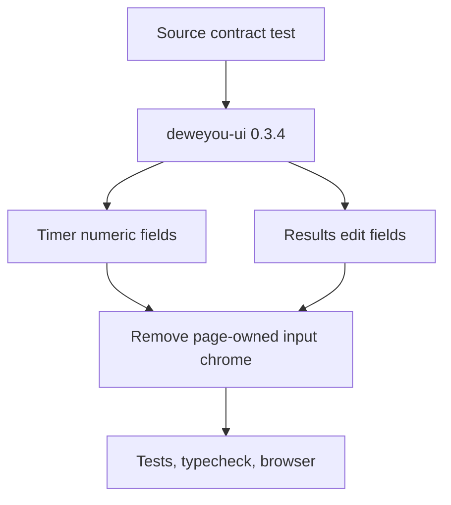

# Web Number Input Implementation Plan

**Date**: 2026-07-19
**Spec**: [Web number input design](../specs/2026-07-19-web-number-input-design.md)

## Delivery Shape

## Tasks

1. Add failing source-contract assertions that timer and results pages do not
   render native number inputs directly.
2. Upgrade the shared design-system catalog dependency and lockfile.
3. Replace MBLD cube-count, result-entry, and result-edit fields with controlled
   `NumberInput` instances.
4. Preserve dynamic bounds and business validation while moving labels and
   errors into component props.
5. Remove page CSS that duplicates component-owned input, focus, and error
   styles; retain only dialog layout constraints.
6. Update timer workflow and repository memory state.
7. Run focused tests, the complete web suite, web typecheck, docs checks, diff
   checks, and live browser verification at mobile and desktop widths.

## Git Safety

- Continue on `codex/web-scramble-bottom-actions` and preserve the existing dirty
  worktree.
- Do not switch, rebase, stage, commit, or push without a separate delivery
  request.

---

_Last updated: 2026-07-19 | Reason: define the design-system number-input migration_
