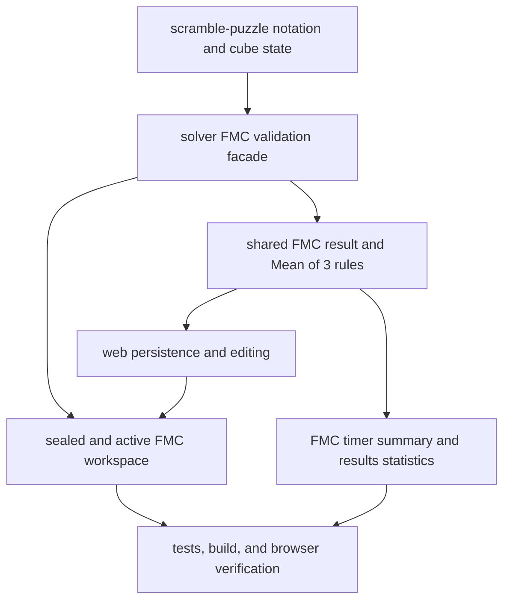

# Web Fewest Moves Workspace Implementation Plan

**Date**: 2026-07-20
**Spec**: [Fewest Moves workspace design](../specs/2026-07-20-web-fewest-moves-design.md)

## Delivery Shape

## Tasks

1. Add failing solver tests for canonical formula normalization, OBTM, ETM,
   solved-state validation, syntax failure, over-80 DNF, exact inverse DNF, and
   four-move inverse-prefix review.
2. Implement and export the platform-agnostic FMC validator from
   `@cubegin/solver`, composing existing `scramble-puzzle` parsing and cube-state
   semantics without duplicating them in the web app.
3. Add failing shared tests for structured FMC result formatting, ranking,
   current/best Mean of 3, DNF propagation, and statistics.
4. Extend `SolveRecord`, add/update inputs, IndexedDB cloning, and repository
   methods to persist and edit the submitted formula and derived FMC result.
5. Add timer tests for the sealed pre-start state, 60-minute countdown, scramble
   reveal, five-minute warning, editable token selection/insertion/replacement,
   physical keyboard navigation, compact base-plus-modifier touch input, live
   metrics, early submit, timeout freeze, validation outcomes, review decision,
   saving, editing, and non-FMC regressions.
6. Implement the dedicated FMC workspace, shared token editor state, desktop
   keyboard toggle, and compact mobile touch keyboard while preserving the
   ordinary and MBLD timer flows.
7. Add timer summary and recent-row FMC formatting with move-count semantics.
8. Add results tests and implement FMC rows, detail, edit/revalidate, score
   statistics, and Mean of 3 without ordinary time averages or time charts.
9. Update timer workflow and package docs to record the solver validation facade,
   result contract, and web state ownership.
10. Run focused solver/shared/web tests, typecheck, repository checks, and live
    browser verification at mobile and desktop widths.

## TDD Order

- Solver validator behavior first.
- Shared result calculations second.
- Persistence round trips third.
- Timer state and interaction behavior fourth.
- Results presentation behavior fifth.

Each layer should fail for the intended behavior before its implementation is
added. Keep test fixtures small and derive valid solutions by pairing a scramble
with its inverse rather than invoking a heavyweight search.

## Git And Safety

- Continue on `codex/web-scramble-bottom-actions` and preserve unrelated dirty
  files. `.pnpm-store/` remains untracked and excluded.
- The approved FMC spec and this plan are part of the feature delivery.
- Do not add handwriting recognition, Delegate-grade adjudication, competition
  synchronization, cloud draft sync, method analysis, or a new formula player.
- Commit and push only when the user asks for delivery or confirms the finished
  browser behavior.

## Verification Matrix

- Solver: normalization, metrics, cube state, inverse review, public export.
- Shared: result formatting, comparison, Mean of 3, statistics, legacy records.
- Store: add/edit structured result and IndexedDB clone safety.
- Timer: sealed/reveal/countdown/editor/validation/save/edit plus ordinary-event
  and MBLD regression coverage.
- Results: FMC overview/list/detail/statistics plus ordinary and MBLD regression
  coverage.
- Repository: focused typechecks, `pnpm check`, `git diff --check`, and live
  localhost checks at 375px and desktop widths.

---

_Last updated: 2026-07-21 | Reason: add the approved editable-token and compact-keyboard pass_
