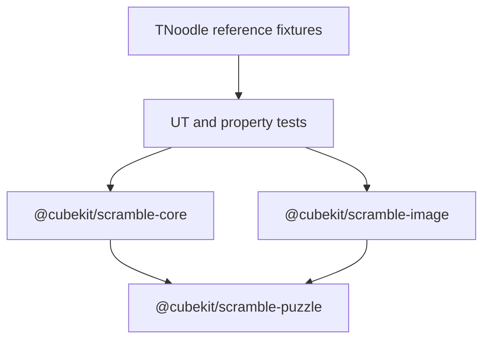
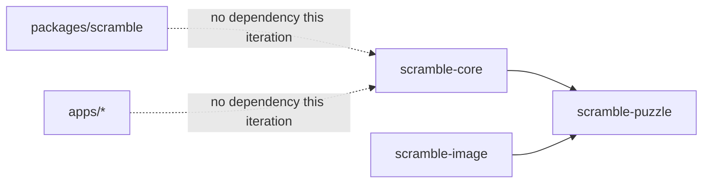
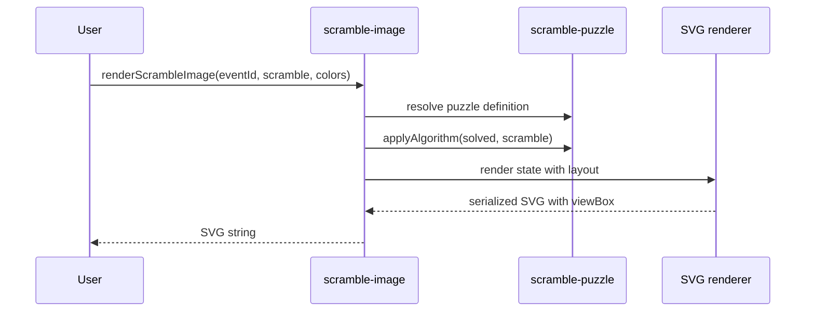

# TNoodle-Compatible Scramble Packages - Design Spec

**Date**: 2026-05-26
**Scope**: new `packages/scramble-puzzle`, `packages/scramble-core`, and
`packages/scramble-image`
**Out of scope**: app integration, changing `packages/scramble`, publishing API
compatibility, and final license-policy changes

---

## 1. Goals

Build a TypeScript implementation of TNoodle-compatible WCA scramble generation
and scramble-image rendering in new packages, without wiring the new packages
into apps yet.

The work targets the current official WCA scramble program baseline:

- `thewca/tnoodle` `v1.2.3`
- `thewca/tnoodle-lib` `v0.19.2`
- 17 WCA event families currently exposed by CubeKit

The finished packages should prove capability migration through unit tests and
fixture/property checks before any consumer app imports them. The TypeScript
interfaces in this document are implementation contracts for the new packages,
not a compatibility promise for the existing `@cubekit/scramble` public API.

---

## 2. Package Architecture



### `packages/scramble-puzzle`

Owns shared puzzle-domain logic:

- WCA event ids and puzzle ids
- puzzle descriptors and notation metadata
- move parsers for each notation family
- solved-state constructors
- state transition functions
- `applyAlgorithm`
- invalid-move and invalid-scramble errors
- canonical move helpers needed by generators

This package does not generate random scrambles and does not render SVG.

### `packages/scramble-core`

Owns TNoodle-compatible generation:

- random source abstraction
- WCA minimum-distance filtering
- event-to-puzzle generation mapping
- random-state solvers and random-turn generators
- duplicate handling for scramble batches
- worker-friendly async facade around expensive generation

This package depends on `scramble-puzzle` and does not depend on SVG rendering.

### `packages/scramble-image`

Owns SVG rendering:

- puzzle-specific SVG layouts
- color schemes
- rendering from `eventId + scramble`
- rendering from already-applied puzzle state where useful
- stable SVG serialization with `viewBox`

This package depends on `scramble-puzzle` so it can reuse notation parsing and
state transitions. It must not depend on `scramble-core`, because image rendering
should work for TNoodle-generated, fixture, and user-provided scrambles.

---

## 3. Dependency Rules



- No apps are changed in this iteration.
- `packages/scramble` remains untouched until a later migration.
- `scramble-puzzle` must stay platform-agnostic: no DOM, React, Taro, Web
  Worker globals, or browser-only APIs.
- `scramble-core` may expose async worker-ready APIs, but its pure generators
  should be testable in Node.
- `scramble-image` returns strings or serializable SVG objects only; it should
  not require the DOM.

---

## 4. Shared Domain Model

`scramble-puzzle` provides the common vocabulary that lets independent puzzle
implementations integrate cleanly.

```ts
export type WcaEventId =
  | '333'
  | '222'
  | '444'
  | '555'
  | '666'
  | '777'
  | '333bld'
  | '333fm'
  | '333oh'
  | 'clock'
  | 'minx'
  | 'pyram'
  | 'skewb'
  | 'sq1'
  | '444bld'
  | '555bld'
  | '333mbld';

export interface PuzzleDefinition<State, Move> {
  id: string;
  eventIds: readonly WcaEventId[];
  createSolvedState(): State;
  parseAlgorithm(algorithm: string): readonly Move[];
  applyMove(state: State, move: Move): State;
  applyAlgorithm(state: State, algorithm: string): State;
  isSolved(state: State): boolean;
  normalizeState?(state: State): State;
}
```

Each puzzle owns its concrete state and move shapes. The shared interface is
generic so Cube, Clock, Megaminx, Square-1, Pyraminx, and Skewb do not have to
pretend they share one move grammar.

---

## 5. Generation Design

`scramble-core` treats TNoodle generation as the compatibility target, not
`cstimer_module`.

### Event mapping

Core maps public WCA events to puzzle generators:

| Event | Generator family |
| --- | --- |
| `333`, `333oh` | 3x3 random state, min2phase-compatible |
| `333bld` | 3x3 no-inspection orientation variant |
| `333mbld` | composite 3x3 no-inspection scrambles with explicit cube count |
| `333fm` | 3x3 FMC padded random-state variant |
| `222` | 2x2 random state with exact minimum length |
| `444` | 4x4 random state, threephase-compatible |
| `444bld` | 4x4 no-inspection orientation variant |
| `555` | 5x5 random-turn cube |
| `555bld` | 5x5 no-inspection orientation variant |
| `666`, `777` | random-turn cube |
| `clock` | fixed Clock random-turn grammar |
| `minx` | fixed Megaminx `R/D/U` line grammar |
| `pyram` | Pyraminx random state with tips |
| `skewb` | Skewb random state |
| `sq1` | Square-1 random state, slashability-aware |

### Random source

Generation accepts an explicit `RandomSource` so tests can use deterministic
streams without relying on Java `SecureRandom` exact behavior.

```ts
export interface RandomSource {
  nextInt(maxExclusive: number): number;
}
```

Exact seeded output parity with Java `SHA1PRNG` is not a requirement for the
first implementation. The compatibility requirement is valid distribution,
notation, distance, state legality, and TNoodle property parity.

### Worker boundary

Heavy solvers are isolated behind an async facade:

```ts
export interface ScrambleGenerator {
  generate(eventId: WcaEventId, options?: GenerateOptions): Promise<ScrambleResult>;
  generateBatch(eventId: WcaEventId, count: number, options?: GenerateOptions): Promise<readonly ScrambleResult[]>;
}
```

The implementation can run directly in Node tests and later move expensive
solvers into Web Workers without changing the high-level contract.

### MultiBLD boundary

`333mbld` is handled as a core generation feature, not a WCIF feature. Core
generates a composite attempt from repeated 3x3 no-inspection scrambles and
accepts an explicit cube count in generation options. WCIF round splitting,
extra-scramble handling, and attempt assignment remain out of scope.

---

## 6. Image Rendering Design

`scramble-image` renders by applying the scramble through `scramble-puzzle`, then
drawing the resulting state.



Renderers are puzzle-specific:

- cube net renderer for NxN cubes
- Clock dial renderer
- Megaminx unfolded renderer
- Pyraminx triangular renderer
- Skewb unfolded renderer
- Square-1 shape renderer

SVG tests should prefer structural and state-derived assertions over full string
snapshots. A small number of snapshots can cover serialization regressions.

---

## 7. Testing Strategy

Testing is the completion gate for capability migration.

### `scramble-puzzle`

- parse valid TNoodle notation fixtures for every event family
- reject invalid moves with useful errors
- apply known algorithms to solved states
- inverse algorithms return to solved state
- normalized equality handles rotations where TNoodle treats rotations as
  zero-cost equivalents

### `scramble-core`

- every WCA event generates syntactically valid scrambles
- generated scrambles apply successfully to their puzzle state
- generated states satisfy WCA minimum-distance rules
- fixed-grammar events match TNoodle shape rules
- generated batches remove duplicate strings
- solver-specific fixture tests cover 2x2, 3x3, 4x4, Pyraminx, Skewb, and
  Square-1 edge cases
- property tests compare aggregate behavior against TNoodle-generated fixture
  corpora rather than requiring exact seeded string parity

### `scramble-image`

- solved-state render succeeds for each renderer
- known scramble fixtures produce expected sticker/color placements
- invalid scramble input fails through `scramble-puzzle`
- SVG includes `width`, `height`, and `viewBox`
- SVG output is DOM-free and serializable in Node tests

---

## 8. Parallel Implementation Shape

Subagents can work independently once the shared contracts land.

Suggested work streams:

- stream A: package scaffolding, shared types, test harness, fixture format
- stream B: cube state, cube parser, cube SVG net renderer
- stream C: Clock and Megaminx generation/rendering
- stream D: Pyraminx and Skewb states, solvers, renderers
- stream E: 2x2 solver and fixtures
- stream F: 3x3 min2phase-compatible solver
- stream G: 4x4 threephase-compatible solver
- stream H: Square-1 state, solver, renderer

The integration rule is that puzzle streams merge through `scramble-puzzle`
interfaces, not through ad hoc helper functions.

---

## 9. Licensing Notes

The current repository is GPL-3.0. Directly porting logic from
`thewca/tnoodle-lib` keeps the new implementation in GPL-compatible territory.
The `thewca/tnoodle` server repository is AGPL-3.0; implementation should avoid
copying server, WCIF, PDF, and deployment code into these packages.

Final package license changes are deliberately out of scope for this design and
will be handled separately.

---

## 10. Non-Goals

- No app imports are changed.
- No replacement of `packages/scramble` in this iteration.
- No guarantee of byte-for-byte SVG parity with TNoodle.
- No guarantee of exact seeded output parity with Java `SecureRandom`.
- No WCIF, PDF, zip, or official-competition packaging support.
- No claim that CubeKit becomes the official WCA scramble program.

---

## 11. Success Criteria

- All three packages exist and are independently testable.
- `scramble-core` can generate valid TNoodle-compatible scrambles for all 17 WCA
  events.
- `scramble-image` can render solved and scrambled SVGs for all 17 WCA events.
- `scramble-image` does not depend on `scramble-core`.
- The combined test suite proves notation, state transitions, generator rules,
  and renderer output across all event families.
- Existing apps and `packages/scramble` continue to behave exactly as before
  because they are not touched.
