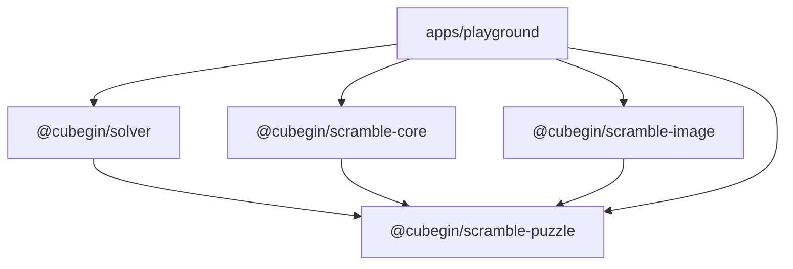

# Auxiliary Solvers - Design Spec

**Date**: 2026-05-31
**Status**: Approved for written spec on 2026-05-31.
**Scope**: new `packages/solver` package and a solver debugging page in
`apps/playground`.
**Out of scope**: production app integration, 4x4/Skewb random-state-only
solvers, changing WCA scramble generation behavior, and compatibility with any
upstream app's raw string output format.

---

## 1. Goals

Build a platform-agnostic TypeScript package for auxiliary solve hints. The
first scope covers the helper methods selected for Cubegin's solver package:

- Cross
- XCross
- EOline
- EOFC
- Roux S1
- Petrus S1
- 2x2 Face
- 2x2 Layer
- Square-1 shape, in face-turn and twist metrics
- Pyraminx V, for D/L/R/F targets

The package should expose structured results that Cubegin apps can render in
their own UI. It should not return raw multi-line display strings as the main
API.

Add a developer-facing page to `apps/playground` so the new solver package can be
exercised manually with generated or handwritten 3x3, 2x2, Square-1, and
Pyraminx scrambles, selected methods, selected targets, and visual preview where
useful.

---

## 2. Architecture



Create `packages/solver` as `@cubegin/solver`. It depends only on
`@cubegin/scramble-puzzle`.

`@cubegin/solver` owns search, pruning tables, target definitions, target
validation helpers, and solver result formatting primitives. It does not generate
WCA scrambles and does not render SVG.

`apps/playground` may depend on `@cubegin/solver`, `@cubegin/scramble-core`,
`@cubegin/scramble-image`, and `@cubegin/scramble-puzzle` because it is the
developer integration workbench.

---

## 3. Dependency Rules

- `packages/solver` must not depend on `packages/scramble-core`.
- `packages/solver` must not depend on `packages/scramble-image`.
- `packages/scramble-core`, `packages/scramble-image`, and
  `packages/scramble-puzzle` must not depend on `packages/solver`.
- Shared notation and 3x3 state helpers should be reused from
  `@cubegin/scramble-puzzle` where they are already public.
- Search-specific coordinate models and pruning tables belong inside
  `@cubegin/solver`; they should not be added to `scramble-puzzle`.
- No new bundled dependency is planned. The package uses the repository's
  existing GPL-3.0-only licensing.

These rules keep the package graph acyclic and keep scramble generation separate
from auxiliary restoration hints.

---

## 4. Public API

The package exposes explicit method functions plus an aggregate helper.

```ts
export type ThreeByThreeAssistMethod =
  | 'cross'
  | 'xcross'
  | 'eoline'
  | 'eofc'
  | 'roux-s1'
  | 'petrus-s1';

export type TwoByTwoAssistMethod = '222-face' | '222-layer';

export type SquareOneAssistMethod = 'sq1-shape-ftm' | 'sq1-shape-twist';

export type PyraminxAssistMethod = 'pyraminx-v';

export type PuzzleAssistMethod =
  | ThreeByThreeAssistMethod
  | TwoByTwoAssistMethod
  | SquareOneAssistMethod
  | PyraminxAssistMethod;

export interface ThreeByThreeAssistOptions {
  readonly targets?: readonly string[];
  readonly maxDepth?: number;
  readonly maxSolutionsPerTarget?: number;
}

export interface ThreeByThreeAssistSolution {
  readonly method: ThreeByThreeAssistMethod;
  readonly target: string;
  readonly targetLabel: string;
  readonly setupRotation: string;
  readonly solution: string;
  readonly depth: number;
  readonly metric: {
    readonly ftm: number;
    readonly qtm: number;
  };
}

export interface ThreeByThreeAssistResult {
  readonly method: ThreeByThreeAssistMethod;
  readonly scramble: string;
  readonly solutions: readonly ThreeByThreeAssistSolution[];
}

export type PuzzleAssistResult = ThreeByThreeAssistResult /* generic result */;

export function solveCross(
  scramble: string,
  options?: ThreeByThreeAssistOptions,
): ThreeByThreeAssistResult;

export function solveXCross(
  scramble: string,
  options?: ThreeByThreeAssistOptions,
): ThreeByThreeAssistResult;

export function solveEOLine(
  scramble: string,
  options?: ThreeByThreeAssistOptions,
): ThreeByThreeAssistResult;

export function solveEOFC(
  scramble: string,
  options?: ThreeByThreeAssistOptions,
): ThreeByThreeAssistResult;

export function solveRouxS1(
  scramble: string,
  options?: ThreeByThreeAssistOptions,
): ThreeByThreeAssistResult;

export function solvePetrusS1(
  scramble: string,
  options?: ThreeByThreeAssistOptions,
): ThreeByThreeAssistResult;

export function solveTwoByTwoFace(
  scramble: string,
  options?: PuzzleAssistOptions,
): PuzzleAssistResult;

export function solveTwoByTwoLayer(
  scramble: string,
  options?: PuzzleAssistOptions,
): PuzzleAssistResult;

export function solveSquareOneShapeFaceTurnMetric(
  scramble: string,
  options?: PuzzleAssistOptions,
): PuzzleAssistResult;

export function solveSquareOneShapeTwistMetric(
  scramble: string,
  options?: PuzzleAssistOptions,
): PuzzleAssistResult;

export function solvePyraminxV(scramble: string, options?: PuzzleAssistOptions): PuzzleAssistResult;

export function solvePuzzleAssist(
  eventId: '333' | '222' | 'sq1' | 'pyram',
  methods: readonly PuzzleAssistMethod[],
  scramble: string,
  options?: PuzzleAssistOptions,
): readonly PuzzleAssistResult[];

export function solveThreeByThreeAssist(
  scramble: string,
  methods: readonly ThreeByThreeAssistMethod[],
  options?: ThreeByThreeAssistOptions,
): readonly ThreeByThreeAssistResult[];
```

Targets use stable string ids. The initial target ids map to Cubegin's
user-facing auxiliary target families:

| Method     | Target family                                         |
| ---------- | ----------------------------------------------------- |
| Cross      | six face colors: `D`, `U`, `L`, `R`, `F`, `B`         |
| XCross     | six face colors, with first-slot selection internal   |
| EOline     | twelve edge-line targets such as `DF DB`              |
| EOFC       | twelve cross plus EO targets such as `D(FB)`          |
| Roux S1    | eight block targets such as `LU`, `LD`, `FU`          |
| Petrus S1  | eight 2x2x2 block targets such as `ULF`, `DRB`        |
| 2x2 Face   | six face colors: `D`, `U`, `L`, `R`, `F`, `B`         |
| 2x2 Layer  | six first-layer targets: `D`, `U`, `L`, `R`, `F`, `B` |
| SQ1 Shape  | solved Square-1 shape; metric selected by method      |
| Pyraminx V | four V targets: `D`, `L`, `R`, `F`                    |

If `targets` is omitted, each function searches all targets for that method.
Invalid scrambles or unknown targets throw typed errors exported by the package.

---

## 5. Solver Behavior

The TypeScript implementation should provide deterministic Cubegin helpers with
stable search targets, move ordering, and depth caps. The implementation can use
public puzzle-solving techniques such as coordinate search, pruning tables, IDA
search, and method-specific target predicates, but the package API and
documentation are Cubegin-owned.

Implementation areas:

- Cross, XCross, and EOFC.
- EOline.
- Roux S1 only; Roux S2 remains out of scope.
- Petrus S1 only; Petrus S2 remains out of scope.
- 2x2 face and layer helpers.
- Square-1 shape helper.
- Pyraminx V helper.
- Shared combinatorics, permutation, orientation, and pruning helpers.

Implementation notes:

- Use TypeScript modules split by concern: shared coordinates/pruning helpers,
  cross family, EOline, Roux S1, Petrus S1, public facade, and test support.
- Initialize heavy move and pruning tables lazily at module level so package
  import stays cheap enough for browser apps.
- Parse scramble text through `@cubegin/scramble-puzzle` for validation, then
  translate parsed puzzle turns into each solver's coordinate move indices.
- Accept the move set used by each Cubegin helper. 3x3 helpers accept ordinary
  face turns and reject rotations/wide moves; 2x2 helpers accept the URF
  coordinate move set; Pyraminx V ignores tip-only moves; Square-1 uses tuple
  and slash notation.
- Results contain solutions in user-facing notation. Any target-specific
  rotation is returned separately as `setupRotation` so callers can decide how to
  display it.

---

## 6. Target Validation

Unit tests should verify solutions by applying `scramble + setupRotation +
solution` to a solved 3x3 state and checking method-specific predicates. This
prevents tests from depending only on exact search strings.

Target predicates belong inside `@cubegin/solver` because they define the solver
contract:

- Cross: target cross edges are solved and oriented relative to the requested
  face.
- XCross: cross is solved and one first-layer corner-edge slot is solved.
- EOline: all edges are oriented for the target orientation and the requested
  line edges are placed.
- EOFC: cross is solved and all edges satisfy the EO condition for the target
  orientation.
- Roux S1: the requested 1x2x3 first block is solved.
- Petrus S1: the requested 2x2x2 block is solved.
- 2x2 Face: the target face stickers are solved.
- 2x2 Layer: the target face and adjacent first-layer stickers are solved.
- SQ1 Shape: the puzzle shape is restored.
- Pyraminx V: the selected V target is solved, ignoring tip-only orientation.

The predicates are public test-support or exported diagnostic helpers only if the
implementation needs them outside package tests. They are not part of the first
stable API unless required by playground diagnostics.

---

## 7. Playground Page

Add a solver debugging surface to `apps/playground` while preserving the current
scramble/image workbench.

UI shape:

- Add top-level tabs or a compact mode switch:
  - `Scrambles`
  - `Solvers`
- The Solver page includes:
  - event selector for 3x3, 2x2, Square-1, and Pyraminx
  - scramble textarea
  - button that generates one scramble for the selected solver event
  - changing the solver event automatically generates one scramble for the new
    event
  - event-specific method multi-select or checkbox group
  - target select that updates for the chosen event and includes an All targets
    option when the event supports multiple targets
  - Solve button
  - result table grouped by method and target
  - selected solution preview using existing cube SVG rendering where practical
  - error panel for invalid scrambles, invalid targets, or search failures
  - duration and result-count diagnostics

The first screen of playground remains a usable developer tool, not a landing
page. Styling should stay quiet and dense like the existing workbench.

Implementation should keep package calls behind a local playground service so
tests can inject deterministic fixtures and so solver UI does not import package
details directly throughout React components.

---

## 8. Error Handling

`@cubegin/solver` should expose package-specific error classes:

- invalid solver scramble
- unsupported move for auxiliary solver scope
- unknown method
- unknown target
- no solution within configured depth

The aggregate helper should return results for successful methods and throw for
input-level errors. Playground catches errors and displays the error message in
the solver panel without clearing the last successful result until the user runs
another solve.

---

## 9. Test Strategy

Use TDD for implementation.

Package tests:

- API tests for each public solver function.
- Red-green tests for invalid scrambles, invalid targets, and unsupported wide
  moves.
- Predicate-based correctness tests for all methods on the solved state and
  several fixed scrambles.
- Regression tests for representative scrambles where exact target labels and
  solution depths are expected to remain stable.
- Lazy initialization tests to prove repeated calls reuse generated tables and
  do not mutate returned results.

Playground tests:

- Existing scramble/image tests continue to pass.
- Solver tab renders without breaking the scramble tab.
- Generating a solver scramble fills the solver textarea from `scramble-core`
  for the selected event.
- Entering a scramble and solving shows grouped results.
- Solver errors render in the solver panel.
- Selecting a solution updates the preview or composed algorithm text.

---

## 10. Verification

Targeted verification:

```bash
pnpm --filter @cubegin/solver test
pnpm --filter @cubegin/solver typecheck
pnpm --filter @cubegin/solver build
pnpm --filter playground test
pnpm --filter playground typecheck
pnpm --filter playground build
```

Repository verification before handoff:

```bash
pnpm --filter './packages/*' test
pnpm --filter './packages/*' build
pnpm test
pnpm check
```

If full `pnpm check` or root tests reveal pre-existing unrelated failures, report
the exact failing command and continue to keep targeted verification green for
the changed packages.

---

## 11. Open Decisions Closed By This Spec

- The solver package is separate from `scramble-core`.
- The solver package depends only on `scramble-puzzle`.
- Playground may consume solver, core, image, and puzzle together.
- Cross and XCross are included because they are part of the same auxiliary 3x3
  helper family and share tables with EOFC.
- 2x2 Face/Layer, Square-1 shape, and Pyraminx V are included because they are
  auxiliary restoration hints rather than scramble generation engines.
- 4x4 and Skewb stay out of scope here because the available logic for them is
  scramble/random-state generation rather than auxiliary restoration.

---

_Last updated: 2026-05-31 | Reason: clarify Cubegin-owned auxiliary solver scope and package structure_
