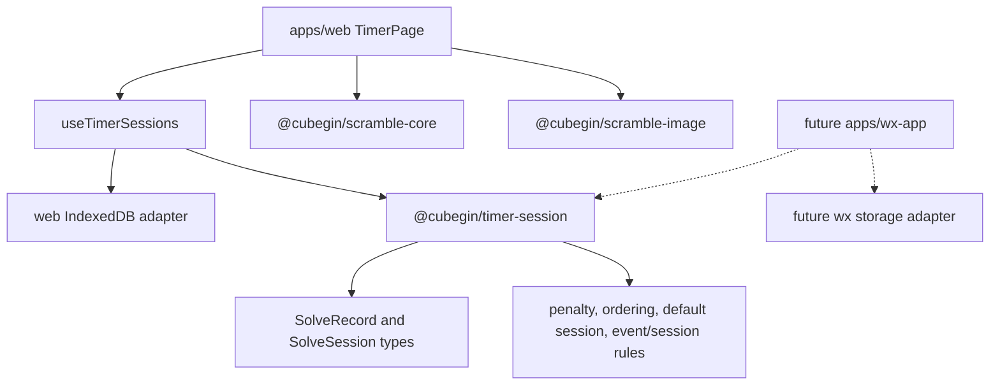
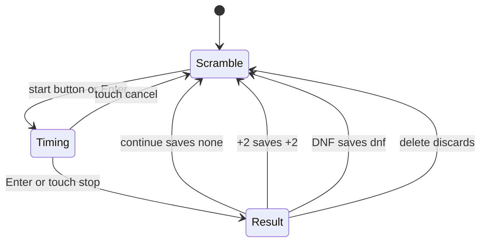

# Cubegin Web Timer Sessions - Design Spec

**Date**: 2026-06-06
**Scope**: `packages/timer-session` plus `apps/web` timer completion
**Out of scope this iteration**: wx-app UI implementation, advanced statistics, cloud sync, account login, importing existing cstimer databases

---

## 1. Goals

Complete the `apps/web` Rubik's cube timer so it supports a practical cstimer-like solve workflow:

- Choose a WCA event, show its scramble text, and show the scrambled puzzle image.
- Start timing from an explicit start button or Enter key, then stop with Enter.
- Show the single solve result with four actions: continue, +2, DNF, and delete.
- Persist solve records in IndexedDB with enough capacity for large local histories.
- Manage solve lists, including one protected default list per WCA event and user-created lists.
- Show each list's solves in reverse creation order with reverse sequence numbers and millisecond display.
- Open a solve detail view with scramble text, scramble image, creation time, penalty editing, and deletion.
- Extract platform-agnostic session and solve logic into `packages/*` so wx-app can reuse the behavior with a different storage adapter.
- Keep the UI visually calm, comfortable, and consistent with `@deweyou-design/react`.

---

## 2. Architecture



### Package boundary

Create `packages/timer-session` as a platform-agnostic package.

The package must not import React, DOM APIs, IndexedDB, localStorage, Taro, or wx globals. It owns:

- solve and session types
- penalty calculations
- default session id/name helpers
- reverse ordering helpers
- event/session transition decisions
- repository interface types that any storage adapter can implement

`apps/web` owns:

- IndexedDB implementation
- React hooks and UI state
- keyboard/touch/browser interactions
- rendering via `@cubegin/scramble-core` and `@cubegin/scramble-image`

---

## 3. Data Model

### Penalty

```ts
export type SolvePenalty = 'none' | '+2' | 'dnf';
```

### SolveRecord

```ts
export interface SolveRecord {
  id: string;
  sessionId: string;
  eventId: WcaEventId;
  scramble: string;
  elapsedMs: number;
  penalty: SolvePenalty;
  createdAt: number;
}
```

`elapsedMs` stores the raw measured time. The +2 adjusted time is derived for display and sorting only. DNF records keep the raw elapsed time for review.

### SolveSession

```ts
export interface SolveSession {
  id: string;
  name: string;
  eventId?: WcaEventId;
  isDefault: boolean;
  createdAt: number;
}
```

Default sessions have `eventId` set and `isDefault: true`. User-created sessions have `isDefault: false`; they may start with `eventId` undefined and adopt an event from their first saved solve.

### Storage indexes

The web IndexedDB database should use these object stores and indexes:

- `sessions`, keyed by `id`, indexed by `createdAt`, `isDefault`, and `eventId`.
- `solves`, keyed by `id`, indexed by `sessionId`, `eventId`, and `createdAt`.

The adapter reads solves for the active list in `createdAt` descending order. It may use an index cursor or load/filter/sort if the implementation remains simple and tested.

---

## 4. Session Rules

### Default sessions

- On first load, ensure one protected default session exists for every `WCA_EVENT_IDS` event.
- Default session ids are deterministic: `default:${eventId}`.
- Default session names use the same display names as the event selector.
- Default sessions cannot be deleted.

### User-created sessions

- Users can create custom sessions from the session panel.
- Custom sessions sort by creation time together with default sessions.
- Custom sessions can be deleted.
- Deleting a custom session also deletes its solves.
- If the deleted custom session is active, switch to the default session for the current event.

### Event to session transition

When the user changes the WCA event in the scramble area:

1. Set the current event to the selected event.
2. Switch the active session to the selected event's default session.
3. Generate a new scramble for the selected event.

### Session to event transition

When the user changes the active session:

1. Set the active session to the selected session.
2. If the session has at least one solve, find its newest solve by `createdAt` and switch the current event to that solve's `eventId`.
3. If the session has no solves but it is a default session, switch the current event to the session's `eventId`.
4. If the session has no solves and is custom, keep the current event unchanged.
5. Generate a new scramble for the resulting current event unless the event remains unchanged and a valid scramble is already shown.

---

## 5. Solve Flow



### Scramble state

The page shows:

- WCA event selector
- current scramble text
- current scramble image
- explicit start button
- session selector and solve list

The start button and Enter key both start timing. Starting is disabled while a scramble is loading or failed.

### Timing state

The page shows a large elapsed timer. The timer font must be:

```css
font-family: Helvetica, Arial, sans-serif;
```

Enter stops the timer. Touch behavior keeps the existing long-press start and cancel-zone stop/cancel model for H5.

### Result state

The result page shows the final time and exactly four clear actions:

- `继续`: save a solve with `penalty: 'none'`, then generate the next scramble.
- `+2`: save a solve with `penalty: '+2'`, then generate the next scramble.
- `DNF`: save a solve with `penalty: 'dnf'`, then generate the next scramble.
- `删除`: do not save the solve, then generate the next scramble.

Saving a solve records the active session id, current event id, current scramble, raw elapsed milliseconds, penalty, and creation time.

If the active session is a custom session without `eventId`, the session can remain event-agnostic; the newest solve rule drives later event switching.

---

## 6. Solve List and Detail

### List display

The active session panel shows solves by `createdAt` descending. Each row shows:

- reverse sequence number, where the newest solve has the largest number and older rows count down
- displayed solve time to milliseconds
- penalty marker when penalty is +2 or DNF
- compact creation time

For a list with `n` solves, the row at zero-based descending index `i` displays sequence number `n - i`.

### Time display

- `none`: format `elapsedMs` to `s.mmm`
- `+2`: format `elapsedMs + 2000` to `s.mmm` and show `+2`
- `dnf`: show `DNF`; the raw elapsed can appear in detail as supporting text

Formatting lives in the reusable session package or reuses `@cubegin/timer` formatting when that keeps the public API clean.

### Detail view

Clicking a solve opens a detail drawer or modal with:

- displayed result
- event label
- scramble text
- scramble image rendered from `eventId` and `scramble`
- creation time
- penalty segmented actions for none, +2, DNF
- delete action

Changing penalty updates the persisted solve and refreshes the list. Deleting removes the solve and closes the detail view.

---

## 7. UI Design

The timer should remain the first-screen experience, not a landing page.

### Desktop layout

- Main surface uses a two-column layout.
- Center column owns event, scramble, image, start/timing/result.
- Side column owns session selector, create/delete controls, and solve list.
- The existing app sidebar remains navigation, but history/settings can stay disabled unless this feature needs a local panel entry.

### Mobile layout

- Timer content remains primary.
- The session/solve panel moves below the scramble or into a bottom sheet-style area.
- Controls must not overlap on narrow screens.

### Deweyou UI usage

Use `@deweyou-design/react/button` for commands. Use native select only if the design package does not expose a suitable select component in the installed version. Keep cards shallow and restrained; individual solve rows may be compact button-like rows, but page sections should not become nested cards.

### Visual tone

The page should feel quiet and focused:

- strong hierarchy for the timer number
- clear but compact solve rows
- muted support text
- no decorative background blobs or oversized marketing hero layout

---

## 8. Error Handling

- If IndexedDB fails to open, show a non-blocking storage error and keep the timer usable for the current in-memory session. The UI must make it clear that results cannot be persisted.
- If saving a solve fails, keep the result screen visible and show an error so the user can retry or delete.
- If scramble generation fails, keep the event and session selection usable and allow retry through refresh.
- If rendering a scramble image fails in detail, show the scramble text and an image error message without blocking penalty edits or deletion.

---

## 9. Testing Plan

### Package tests

Add unit tests for `packages/timer-session`:

- default session id and creation helpers
- penalty display calculation
- reverse sequence number calculation
- event-to-session transition
- session-to-event transition for default, empty custom, and custom with newest solve
- delete eligibility for default versus custom sessions

### Web tests

Add `apps/web` tests for:

- Enter starts from scramble and stops during timing.
- Start button starts timing.
- Continue, +2, DNF, and delete each advance to a new scramble with the correct persistence behavior.
- Event changes switch to the default session.
- Session changes switch event according to newest solve rules.
- Solve detail can update penalty and delete a solve.
- Default sessions cannot be deleted while custom sessions can.

IndexedDB can be tested with a fake adapter at the hook boundary. A narrow adapter test can cover real IndexedDB only if the existing jsdom/vitest environment supports it reliably.

### Verification commands

Use root commands through vite-plus:

```bash
pnpm test
pnpm check
pnpm build:web
```

Before claiming completion, run the web app and inspect the UI across desktop and mobile widths. Use browser verification for the final visual pass.

---

## 10. Implementation Notes

- Keep all reusable package code platform-agnostic.
- Do not restore the removed `packages/scramble` cstimer wrapper or old text-scramble API.
- Keep WCA event ids sourced from `@cubegin/scramble-puzzle`.
- Keep scramble generation through `@cubegin/scramble-core`.
- Keep scramble image rendering through `@cubegin/scramble-image`.
- Use Node >= 22.12 and pnpm 10.
- If adding dependencies for IndexedDB convenience, review `docs/dependency-licensing.md` first. Prefer a small local adapter over a new dependency unless a dependency clearly reduces risk.

---

## 11. Acceptance Checklist

- The main page can switch event, show scramble text, show scramble image, and start with button or Enter.
- Enter stops a running solve and shows the result.
- Result actions save none, +2, and DNF solves, while delete advances without saving.
- Records include event id, scramble, raw elapsed milliseconds, penalty, session id, and creation time.
- One default protected session exists per WCA event.
- Custom sessions can be created and deleted.
- Event changes switch to the matching default session.
- Session changes switch event by newest solve when available, default session event when default and empty, and no event change when custom and empty.
- Active list solves display in reverse creation order with reverse sequence numbers and millisecond result times.
- Solve detail shows scramble, scramble image, creation time, penalty, and supports penalty changes and deletion.
- Timer digits use Helvetica.
- Web persistence uses IndexedDB.
- Reusable session logic lives in `packages/timer-session` and remains platform-agnostic.
- UI is visually comfortable, responsive, and aligned with the existing design system.
