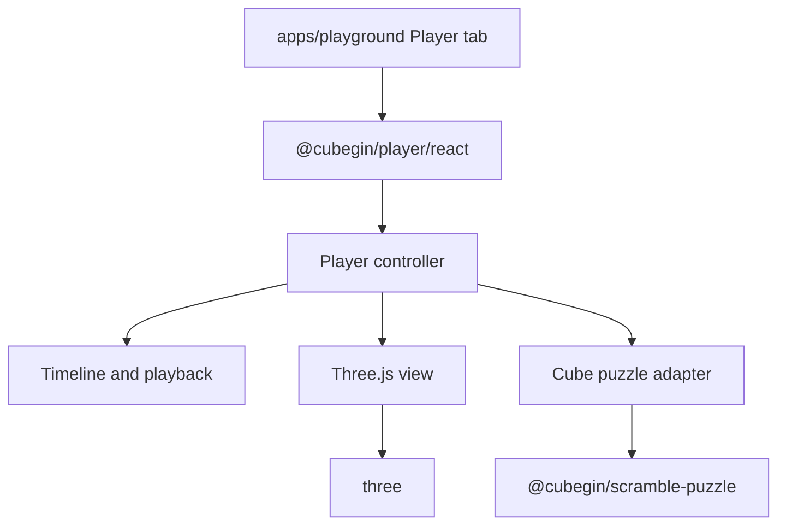

# Cubegin Player Design

## Status

Drafted for review on 2026-06-30.

## Goal

Create a new `@cubegin/player` package that provides Cubegin's own Three.js
formula player. The first release combines the original v0 and v0.5 scope:
ship a usable cube-family player, polish the developer workflow, and validate
the package through the playground before expanding to non-cube puzzle families.

The player is a browser visualization package. It is not a replacement for
`@cubegin/scramble-image`, and it does not own static SVG rendering.

## Product Scope

The first player release supports:

- A new `packages/player` workspace package.
- Three.js as the rendering dependency.
- Cube-family events: `222`, `333`, `444`, `555`, `666`, `777`, `333bld`,
  `333fm`, `333oh`, `333mbld`, `444bld`, and `555bld`.
- `eventId + algorithm` input.
- 3D cube rendering for sizes 2 through 7.
- Playback controls: play, pause, reset to start, and jump to end.
- A scrubber/timeline model that can seek by move index or normalized progress.
- Pointer drag camera orbit for mouse and touch.
- Formula parse errors shown in the UI without crashing the page.
- A new `Player` tab in `apps/playground` for manual event and formula testing.
- Unit tests for event mapping, timeline behavior, cube move animation mapping,
  and React wrapper state updates.
- Browser smoke coverage that proves the canvas renders non-empty content and
  animation advances.

## Non-Goals

- Do not replace or couple to `@cubegin/scramble-image`.
- Do not provide SVG or PNG export in this release.
- Do not integrate into `apps/web` timer yet.
- Do not support non-cube events yet: `clock`, `minx`, `pyram`, `skewb`, `sq1`,
  and `fto` should report a clear unsupported-event state.
- Do not copy `cubing/twisty` internals or implement a TwistyPlayer-compatible
  API surface.
- Do not implement advanced stickering, hint facelets, back views, setup
  algorithms, solution playback, or custom color editing in the first release.
- Do not lower existing package boundaries by putting DOM or Three.js code into
  `@cubegin/scramble-puzzle`, `@cubegin/scramble-core`, or
  `@cubegin/scramble-image`.

## Package Boundary



`@cubegin/player` depends on:

- `@cubegin/shared` for event ids and event metadata.
- `@cubegin/scramble-puzzle` for cube algorithm parsing and move shapes.
- `three` for rendering, scene, camera, and vector math.
- `react` only for the `./react` subpath.

The package owns browser-side rendering and interaction. It should expose a
small imperative API for non-React consumers and a React wrapper for the
playground and future app integration.

## Proposed Files

```text
packages/player/
  AGENTS.md
  LICENSE
  NOTICE
  README.md
  package.json
  tsconfig.json
  vite.config.ts
  src/
    index.ts
    core/
      animation.ts
      errors.ts
      player-controller.ts
      timeline.ts
      types.ts
    events/
      event-map.ts
    puzzles/
      cube/
        cube-animation.ts
        cube-geometry.ts
        cube-move-map.ts
        cube-player-adapter.ts
    three/
      camera-controls.ts
      materials.ts
      scene-lifecycle.ts
      three-player-view.ts
    react/
      player.tsx
      index.ts
```

`apps/playground` adds a `Player` tab and imports from `@cubegin/player/react`.

## Public API

Imperative API:

```ts
export interface CubeginPlayerOptions {
  readonly eventId: EventId;
  readonly algorithm: string;
  readonly initialPosition?: 'start' | 'end';
  readonly controls?: 'none' | 'bottom';
}

export interface CubeginPlayer {
  setEvent(eventId: EventId): void;
  setAlgorithm(algorithm: string): void;
  play(): void;
  pause(): void;
  reset(): void;
  jumpToEnd(): void;
  seek(progress: number): void;
  dispose(): void;
}

export const createCubeginPlayer = (
  container: HTMLElement,
  options: CubeginPlayerOptions,
) => CubeginPlayer;
```

React API:

```tsx
<CubeginPlayer
  eventId="333"
  algorithm="R U R' U'"
  initialPosition="start"
  controls="bottom"
/>
```

The React component owns DOM mounting and disposal. The controller remains
framework-independent.

## Event Support

Cube-family mapping:

| Event | Player puzzle |
| --- | --- |
| `222` | cube size 2 |
| `333`, `333bld`, `333fm`, `333oh`, `333mbld` | cube size 3 |
| `444`, `444bld` | cube size 4 |
| `555`, `555bld` | cube size 5 |
| `666` | cube size 6 |
| `777` | cube size 7 |

Unsupported first-release events:

| Event | Behavior |
| --- | --- |
| `clock` | Show unsupported-event state |
| `minx` | Show unsupported-event state |
| `pyram` | Show unsupported-event state |
| `skewb` | Show unsupported-event state |
| `sq1` | Show unsupported-event state |
| `fto` | Show unsupported-event state |

`333mbld` does not receive special multiline handling in `@cubegin/player`.
Consumers pass the single algorithm they want to play. The playground can still
offer generated MultiBLD rows later by selecting one row at a time.

## Core Design

### Player Controller

The controller is the public orchestration boundary. It owns:

- Current event id.
- Current algorithm text.
- Parsed move list.
- Playback state.
- Timeline state.
- Current rendered puzzle state.
- Error state.
- View lifecycle.

It should catch parser and unsupported-event errors and expose them as typed
player errors. UI consumers decide how to render those errors.

### Timeline

The timeline converts parsed cube moves into animation steps:

```ts
export interface PlayerTimelineStep<Move> {
  readonly move: Move;
  readonly index: number;
  readonly quarterTurns: 1 | 2 | 3;
  readonly durationMs: number;
}
```

The first release can use fixed duration per quarter turn. A 180-degree move can
either use one longer step or two visual quarter-turn phases, but the decision
must be consistent and test-covered. The recommended first release behavior is a
single step with twice the angle and a slightly longer duration.

Timeline operations:

- `play()` starts from the current progress.
- `pause()` freezes the current step and progress.
- `reset()` seeks to the solved state before the first move.
- `jumpToEnd()` applies all moves and seeks to the final state.
- `seek(progress)` maps a number from `0` to `1` to the closest step and
  intra-step progress.

### Cube Adapter

The cube adapter bridges `@cubegin/scramble-puzzle` and Three.js animation. It
uses the existing cube parser to obtain cube moves, then maps each move to:

- rotation axis,
- layer indices,
- rotation angle,
- affected sticker or cubie meshes,
- final state commit after animation completes.

The adapter should not reimplement cube notation parsing. It can implement
visual move mapping because `scramble-puzzle` currently owns state transitions,
not animation axes or mesh grouping.

### Three View

The Three view owns:

- Renderer creation and disposal.
- Scene creation.
- Camera and lighting.
- Responsive resize.
- Mesh construction.
- Animation render loop.
- Pointer drag orbit controls.

The view should be disposable and should not leak animation frames, event
listeners, WebGL contexts, or DOM nodes after unmount.

## Cube Rendering Rules

- Use cubie/sticker geometry rather than one mesh per facelet plane only, so
  layer turns can rotate coherent groups.
- Generate cube sizes 2 through 7 from one geometry builder.
- Use a neutral material system with stable face colors matching Cubegin's
  current cube colors where practical.
- Keep dimensions stable across cube sizes so the player camera can fit every
  supported size without layout shifts.
- Use a transparent or neutral background so the playground can place the player
  inside existing panels.
- Keep mesh names or metadata deterministic enough for tests and debugging.

## Playground UI

Add a fourth tab:

- `Scrambles`
- `Solvers`
- `Icons`
- `Player`

The `Player` tab contains:

- Event selector using `EVENT_IDS`.
- Formula textarea.
- Primary `Load formula` action.
- Playback controls: play/pause, reset, jump end.
- Scrubber input.
- 3D player panel.
- Error panel for unsupported events and invalid algorithms.

The tab is a developer workbench, not a marketing page. It should use the same
quiet panel style as the existing playground. The canvas must have stable
responsive dimensions on desktop and mobile.

## Error Handling

Errors should be typed at the package boundary:

- `UnsupportedPlayerEventError`
- `InvalidPlayerAlgorithmError`
- `PlayerRendererError`

The playground should show error text in the `Player` tab and keep the last
successful render mounted when the new input fails. Renderer setup failures
should show a browser-facing message and dispose any partially created view.

## Dependency And Licensing

`three` is an MIT-licensed runtime dependency. Before implementation merges, the
package must follow the repository dependency-licensing rule: inspect the
package license and shipped license file, then record any required attribution
in `packages/player/NOTICE`.

`@cubegin/player` remains GPL-3.0-only as part of this repository and because it
depends on Cubegin's GPL puzzle packages.

## Testing

Package unit tests:

- Event mapping returns the correct cube size for all supported cube-family
  events.
- Unsupported events produce typed unsupported-event errors.
- Timeline builds one step per parsed move.
- `reset`, `jumpToEnd`, and `seek` produce deterministic timeline positions.
- Cube move mapping returns expected axes, layers, and angles for representative
  moves: `R`, `R'`, `R2`, `Uw`, `3Rw`, `x`, `y`, and `z`.
- Controller catches parser errors and exposes typed invalid-algorithm errors.
- Controller disposal calls view disposal exactly once.

React/playground tests:

- The `Player` tab appears in the playground.
- Event selection updates the player event input.
- Formula input updates the player algorithm after `Load formula`.
- Unsupported events show the unsupported state.
- Invalid cube formulas show an error without leaving the tab.
- Controls call the expected player actions through a mocked player runtime.

Browser smoke tests:

- Open the playground `Player` tab.
- Load a 3x3 formula.
- Verify the canvas is non-empty.
- Click play and verify rendered pixels change.
- Drag the canvas and verify rendered pixels change.
- Resize the viewport and verify the canvas remains framed.

## Verification

Targeted commands for the first implementation:

```bash
pnpm --filter @cubegin/scramble-puzzle build
pnpm --filter @cubegin/player test
pnpm --filter @cubegin/player typecheck
pnpm --filter playground test
pnpm --filter playground typecheck
pnpm --filter playground build
```

Before claiming completion, run the repository verification-before-completion
workflow and record any skipped checks with exact reasons.

## Implementation Phases

### Phase 1: Package Skeleton And Playground Tab

- Add `packages/player`.
- Add package docs, license, exports, and workspace wiring.
- Add `Player` tab with mocked runtime.
- Verify playground layout and tests.

### Phase 2: Cube Geometry And Static Render

- Create Three scene lifecycle.
- Render solved cubes for sizes 2 through 7.
- Add camera fitting, resize handling, materials, and disposal.
- Add canvas smoke checks for non-empty render.

### Phase 3: Timeline And Move Animation

- Parse cube formulas through `@cubegin/scramble-puzzle`.
- Build timeline steps.
- Animate representative face, wide, and rotation moves.
- Commit final state after each move.
- Implement playback controls and scrubber.

### Phase 4: Error Handling, Polish, And Verification

- Add typed player errors.
- Add unsupported-event state.
- Harden disposal and remount behavior.
- Add browser smoke coverage for animation and drag.
- Document first-release support and future adapter expansion.

## Future Expansion

After the cube-family release is stable, add puzzle adapters in this order:

1. Pyraminx and Skewb.
2. FTO.
3. Megaminx.
4. Square-1 and Clock.

These should be separate specs or spec amendments because their geometry and
move animation models are materially different from cube-family animation.
The accepted non-cube expansion spec is
[2026-06-30-cubegin-player-non-cube-design.md](2026-06-30-cubegin-player-non-cube-design.md).
