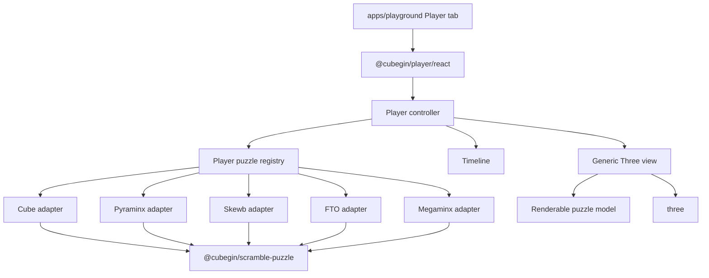

# Cubegin Player Non-Cube Design

## Status

Drafted for review on 2026-06-30.

## Goal

Expand `@cubegin/player` beyond cube-family events by adding 3D playback for:

- `pyram` - Pyraminx
- `skewb` - Skewb
- `fto` - Face-Turning Octahedron
- `minx` - Megaminx

This release should turn the current cube-specific player into an adapter-based
twisty puzzle player while keeping the public playground workflow simple:
select an event, load that event's generated scramble or typed formula, and
play it step by step.

## Product Scope

The non-cube player release supports:

- A shared puzzle adapter contract inside `@cubegin/player`.
- Reworked player controller and Three.js view boundaries that no longer assume
  a cube-only model.
- Existing cube-family behavior preserved through a cube adapter.
- New adapters for Pyraminx, Skewb, FTO, and Megaminx.
- `pyram`, `skewb`, `fto`, and `minx` accepted in the playground Player tab.
- Formula parsing delegated to `@cubegin/scramble-puzzle` definitions.
- Move-by-move playback using the existing controls: play, pause, reset, end,
  scrubber, and playback speed.
- Distinct solved geometry, sticker colors, affected-piece selection, move
  axes, move angles, and state commits for each supported family.
- Unit coverage for the shared adapter contract and each puzzle adapter.
- Browser smoke coverage for at least one cube event and all four non-cube
  events.

## Non-Goals

- Do not add Square-1 or Clock in this release.
- Do not add image export, PNG export, or static scramble-image coupling.
- Do not copy `cubing/twisty` internals or expose a TwistyPlayer-compatible API.
- Do not implement advanced sticker customization, hint stickers, inspection
  overlays, setup algorithms, solution playback, or color editing.
- Do not change `@cubegin/scramble-puzzle` parser or state semantics unless a
  confirmed bug blocks playback.
- Do not move Three.js, DOM, canvas, or React code into
  `@cubegin/scramble-puzzle`, `@cubegin/scramble-core`, or
  `@cubegin/scramble-image`.

## Current Context

The cube-family player already owns the product shell:

- `packages/player/src/core/player-controller.ts` owns load, error, playback,
  seek, reset, and speed state.
- `packages/player/src/core/timeline.ts` turns parsed moves into timed steps.
- `packages/player/src/three/three-player-view.ts` owns Three.js rendering,
  orbit controls, animation frames, and disposal.
- `packages/player/src/puzzles/cube/cube-move-map.ts` maps cube moves to axes,
  layers, and angles.
- `apps/playground` owns formula input, event selection, generated scramble
  defaults, and the Player tab.

The reusable puzzle-domain layer already exposes parser and state definitions
for this release:

- `createPyraminxDefinition()`
- `createSkewbDefinition()`
- `createFtoDefinition()`
- `createMegaminxDefinition()`

`@cubegin/player` should consume those definitions instead of reparsing event
notation.

## Architecture



The shared controller stays framework-independent. The Three view becomes
generic over renderable pieces instead of cube cubies. Each puzzle adapter owns
the geometry and move mapping that are unique to its family.

## Shared Adapter Contract

Add a package-internal adapter boundary that lets the controller and Three view
avoid puzzle-specific conditionals:

```ts
export interface PlayerPuzzleAdapter<Move, State> {
  readonly eventIds: readonly EventId[];
  readonly type: PlayerPuzzleType;
  readonly defaultCameraDistance: number;

  parseFormula(formula: string): readonly Move[];
  createInitialState(): State;
  createRenderableModel(state: State): PlayerRenderableModel;
  describeMove(move: Move, state: State): PlayerMoveAnimation;
  applyMove(state: State, move: Move): State;
}
```

The exact TypeScript names can change during implementation, but the boundary
should preserve these responsibilities:

- Parse through `@cubegin/scramble-puzzle`.
- Create solved state through the puzzle definition.
- Produce a renderable piece/sticker model from state.
- Describe each move as affected pieces plus an axis, pivot, angle, and duration
  multiplier.
- Apply a committed move through the puzzle definition after animation.

## Renderable Model

The generic Three view should render a puzzle model, not a cube size:

```ts
export interface PlayerRenderableModel {
  readonly pieces: readonly PlayerRenderablePiece[];
  readonly bounds: PlayerModelBounds;
}

export interface PlayerRenderablePiece {
  readonly id: string;
  readonly position: Vector3Like;
  readonly orientation: QuaternionLike;
  readonly stickers: readonly PlayerRenderableSticker[];
}

export interface PlayerRenderableSticker {
  readonly id: string;
  readonly face: string;
  readonly color: string;
  readonly polygon: readonly Vector3Like[];
}

export interface PlayerMoveAnimation {
  readonly affectedPieceIds: readonly string[];
  readonly axis: Vector3Like;
  readonly pivot: Vector3Like;
  readonly angleRadians: number;
  readonly durationMultiplier?: number;
}
```

The model intentionally uses polygon stickers. Cubes can keep rectangular
stickers, Pyraminx/FTO can use triangular stickers, and Megaminx can use
pentagonal stickers without adding new view-level branches.

## Event Support

| Event | Adapter | Parser/state source |
| --- | --- | --- |
| `222`, `333`, `444`, `555`, `666`, `777`, BLD/FM/OH variants | cube | `createCubeDefinition()` |
| `pyram` | pyraminx | `createPyraminxDefinition()` |
| `skewb` | skewb | `createSkewbDefinition()` |
| `fto` | face-turning-octahedron | `createFtoDefinition()` |
| `minx` | megaminx | `createMegaminxDefinition()` |

Unsupported after this release:

| Event | Behavior |
| --- | --- |
| `sq1` | Show unsupported-event state |
| `clock` | Show unsupported-event state |

## Puzzle Adapter Responsibilities

### Pyraminx

Pyraminx is the first non-cube adapter and should validate the generic model.

- Geometry: tetrahedron-like shell with triangular stickers.
- Faces: visual faces from `PYRAMINX_FACES`.
- Moves: `U`, `L`, `R`, `B`, plus tip turns `u`, `l`, `r`, `b`.
- Amounts: normal turn and inverse turn from `PyraminxMoveAmount`.
- Animation: full turns affect the face layer, tip turns affect only the tip
  pieces.
- Validation: full turn and tip turn must visibly affect different piece sets.

### Skewb

Skewb validates arbitrary diagonal-style rotation axes on a cube-like shape.

- Geometry: cube-like body with Skewb-style visible stickers.
- Moves: `R`, `U`, `L`, `B`.
- Amounts: normal turn and inverse turn from `SkewbMoveAmount`.
- Animation: affected piece sets are not simple cube layers.
- Validation: the adapter must not reuse cube layer selection.

### FTO

FTO validates an octahedral family with eight triangular faces.

- Geometry: octahedron-like shell with triangular stickers.
- Faces: `U`, `F`, `BR`, `BL`, `D`, `B`, `R`, `L`.
- Moves: `U`, `D`, `F`, `B`, `L`, `R`, `BL`, `BR`.
- Amounts: normal turn and inverse turn from `FtoMoveAmount`.
- Animation: each move rotates the corresponding face-turning slice.
- Validation: face labels and move labels are not treated as cube faces.

### Megaminx

Megaminx validates dodecahedral geometry and multi-amount turns.

- Geometry: dodecahedron-like shell with pentagonal stickers.
- Face moves: `U`, `BL`, `BR`, `R`, `F`, `L`, `D`, `DR`, `DBR`, `B`, `DBL`,
  `DL`, including `2`, `2'`, and inverse suffixes.
- Big turns: `R+`, `R++`, `R-`, `R--`, `D+`, `D++`, `D-`, `D--`.
- Animation: face moves rotate one face region; big turns rotate the defined
  larger region from the Megaminx state model.
- Validation: a generated WCA-style Megaminx scramble must parse and animate.

## Shared Three View Changes

The Three view should move from cube-specific cubie helpers to generic piece
helpers:

- Replace `renderSolvedCube(size)` with a generic render method that receives a
  `PlayerRenderableModel`.
- Keep camera orbit, lighting, renderer setup, resize, frame loop, speed, seek,
  and disposal centralized.
- Build sticker meshes from polygons and attach them to piece groups.
- Use stable object names or metadata based on piece and sticker ids.
- During a move, rotate only `affectedPieceIds` around the adapter-provided
  axis and pivot.
- On step commit, rebuild or update from adapter state so visual drift does not
  accumulate.

Cube rendering should become the first adapter consumer of this generic view.
That preserves current behavior while proving the new abstraction did not only
serve the new puzzles.

## Timeline Changes

Timeline remains move-based and generic:

- One parsed move becomes one timeline step.
- Each step stores the original adapter-specific move.
- The base duration stays shared.
- Adapters can return a `durationMultiplier` for longer moves, such as Megaminx
  double turns.
- The progress slider remains step-based in the playground.

## Playground Changes

The Player tab should include `pyram`, `skewb`, `fto`, and `minx` in the event
selector once their adapters are wired.

When the user changes the player event, the formula field should continue to
default to the corresponding generated scramble from the playground service.
The user can still type any supported formula manually and click `Load formula`.

The UI does not need separate controls for each puzzle. Puzzle-specific
complexity belongs in the adapter and in tests.

## Parallel Agent Strategy

Do not start four implementation agents before the shared adapter contract lands.
They would edit the same controller, event map, and Three view files and produce
conflicting abstractions.

Recommended sequence:

1. Main agent defines the shared adapter contract and migrates cube onto it.
2. Main agent exposes the registry and generic Three view seams.
3. Parallel agents implement isolated puzzle directories:
   - `packages/player/src/puzzles/pyraminx/`
   - `packages/player/src/puzzles/skewb/`
   - `packages/player/src/puzzles/fto/`
   - `packages/player/src/puzzles/megaminx/`
4. Main agent integrates event routing, playground defaults, browser smoke
   checks, and final verification.

Subagent constraints:

- Each subagent may edit only its puzzle directory and tests by default.
- Shared types can be read but not changed without returning a requested change.
- Each subagent must return the move coverage it implemented, known visual
  limitations, and targeted verification output.
- The main agent owns all edits to controller, view, registry, playground, and
  package exports.

## Proposed Files

```text
packages/player/src/
  core/
    player-controller.ts
    timeline.ts
  events/
    event-map.ts
  puzzles/
    puzzle-adapter.ts
    puzzle-registry.ts
    cube/
      cube-player-adapter.ts
      cube-geometry.ts
      cube-move-map.ts
    pyraminx/
      pyraminx-player-adapter.ts
      pyraminx-geometry.ts
      pyraminx-move-map.ts
      pyraminx-player-adapter.test.ts
    skewb/
      skewb-player-adapter.ts
      skewb-geometry.ts
      skewb-move-map.ts
      skewb-player-adapter.test.ts
    fto/
      fto-player-adapter.ts
      fto-geometry.ts
      fto-move-map.ts
      fto-player-adapter.test.ts
    megaminx/
      megaminx-player-adapter.ts
      megaminx-geometry.ts
      megaminx-move-map.ts
      megaminx-player-adapter.test.ts
  three/
    polygon-sticker-mesh.ts
    three-player-view.ts
```

The file names can be adjusted during implementation if the local code shape
reveals a cleaner split. The ownership boundaries should remain.

## Testing

Shared package tests:

- Registry maps cube-family events, `pyram`, `skewb`, `fto`, and `minx`.
- Registry reports `sq1` and `clock` as unsupported.
- Controller can load and play a non-cube adapter with a mocked view.
- Timeline remains step-based for adapter-specific moves.
- Generic Three view can render polygon stickers and dispose resources.

Puzzle adapter tests:

- Each adapter parses a representative generated scramble.
- Each adapter creates a non-empty renderable model with stable piece ids.
- Each adapter returns affected pieces, axis, pivot, and angle for at least one
  representative move.
- Each adapter commits state through its puzzle definition.
- Invalid formulas surface typed player formula errors.

Playground tests:

- Selecting `pyram`, `skewb`, `fto`, and `minx` updates the player formula to
  the event's generated scramble.
- Loading each non-cube event passes the event and formula to the player.
- `sq1` and `clock` still show unsupported state.

Browser smoke tests:

- Open the playground Player tab.
- Load one generated scramble each for `333`, `pyram`, `skewb`, `fto`, and
  `minx`.
- Verify the canvas is non-empty for each event.
- Click play and verify progress advances for each event.
- Check console errors after each event switch.

## Verification

Targeted commands:

```bash
pnpm --filter @cubegin/player test
pnpm --filter @cubegin/player typecheck
pnpm --filter @cubegin/player build
pnpm --filter playground test -- src/app.test.tsx
pnpm --filter playground typecheck
```

Broader verification before completion:

```bash
pnpm --filter @cubegin/scramble-puzzle test
pnpm --filter playground build
```

Browser verification should run against the active playground dev server when
the implementation changes render behavior.

## Implementation Phases

### Phase 1: Shared Adapter Contract

- Add adapter and registry types.
- Migrate cube support to the adapter contract.
- Convert the Three view to render `PlayerRenderableModel`.
- Preserve existing cube tests and browser behavior.

### Phase 2: Pyraminx Adapter

- Add Pyraminx geometry, move mapping, and adapter tests.
- Wire `pyram` into registry and playground.
- Browser-smoke a generated Pyraminx scramble.

### Phase 3: Skewb Adapter

- Add Skewb geometry, move mapping, and adapter tests.
- Wire `skewb` into registry and playground.
- Browser-smoke a generated Skewb scramble.

### Phase 4: FTO And Megaminx Adapters

- Add FTO geometry, move mapping, and adapter tests.
- Add Megaminx geometry, move mapping, and adapter tests.
- Wire `fto` and `minx` into registry and playground.
- Browser-smoke generated scrambles for both events.

### Phase 5: Integration Polish

- Tune camera bounds for all supported puzzle families.
- Tune sticker outlines and body materials for visual consistency.
- Confirm playback speed and step progress semantics across all families.
- Run full targeted verification and record skipped checks.

## Risks

- Geometry can become the largest cost if adapters try to perfectly model every
  physical cut. The first implementation should prioritize clear, stable,
  playable geometry over exact speedcubing-model fidelity.
- Megaminx may require more camera and bounds tuning than the other adapters.
- FTO and Skewb move selection can expose weaknesses in the generic affected
  piece model. If that happens, adjust the adapter contract before implementing
  all four puzzle directories.
- Four parallel implementation agents are useful only after the shared contract
  exists. Before that point, parallel work should be limited to research or
  isolated adapter drafts.

## Implementation Decisions

- Rebuild the renderable model from committed state after each step. Correct
  state is more important than micro-optimization at this stage, and rebuilding
  prevents visual drift across puzzle families.
- Animate Megaminx `++` and `--` big turns as one timeline step with a longer
  duration multiplier. This matches the existing move-per-step timeline model.
