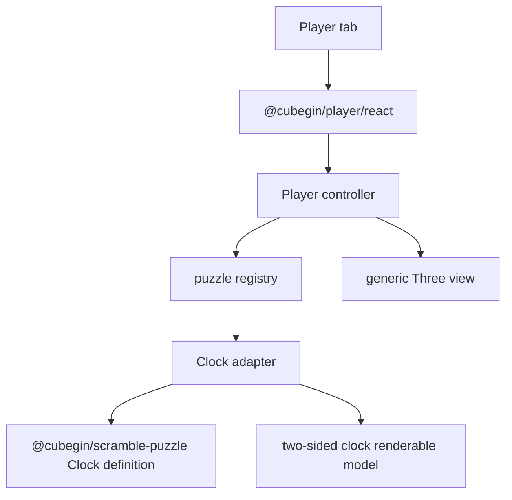

# Cubegin Player Clock Design

## Status

Drafted for implementation on 2026-07-01.

## Goal

Add Magic Clock support to `@cubegin/player` and the playground Player tab.
Clock should accept the existing generated scramble formula, play it one move
at a time, and keep Square-1 unsupported until a separate adapter exists.

## Scope

- Support `clock` in the player event map and adapter registry.
- Reuse `createClockDefinition()` from `@cubegin/scramble-puzzle` for parsing
  and state transitions.
- Render Clock as a two-sided 3D object with 18 animated dial hands.
- Animate turn moves by rotating affected dial hands by 30 degrees per clock
  step.
- Animate `y2` by rotating the whole Clock body 180 degrees so subsequent moves
  operate on the opposite side.
- Keep the existing step-based timeline, progress slider, and speed controls.
- Enable `clock` in the playground Player tab so the generated Clock scramble
  becomes the default formula.

## Non-Goals

- Do not add Square-1 support.
- Do not import or depend on `@cubegin/scramble-image` from `@cubegin/player`.
- Do not add Clock image export or static screenshot generation.
- Do not change Clock parser or state semantics in `@cubegin/scramble-puzzle`.

## Architecture



The Clock adapter implements the existing `PlayerPuzzleAdapter` contract. Its
state is the `ClockState` from `@cubegin/scramble-puzzle`. The renderable model
contains board, pin, dial, and hand pieces. Turn moves affect only hand pieces;
`y2` affects every Clock piece.

Clock state stores logical positions in the currently active orientation. The
adapter maps logical position indices back to physical piece ids using
`state.rightSideUp`, so moves after `y2` animate the visible opposite side.

## Testing

- Add adapter tests that prove Clock parses generated-style notation, creates a
  non-empty 18-dial model, animates turn moves, maps moves after `y2` to the
  opposite side, and exposes `y2` as a whole-body animation.
- Update registry and event-map tests so `clock` is supported and `sq1` remains
  unsupported.
- Update playground tests so the Player tab exposes `clock` and passes its
  generated formula to `@cubegin/player/react`.

## Verification

```bash
pnpm --filter @cubegin/player test
pnpm --filter @cubegin/player typecheck
pnpm --filter playground test -- src/app.test.tsx
pnpm --filter playground typecheck
```

---

_Last updated: 2026-07-01 | Reason: add Clock player adapter scope_
