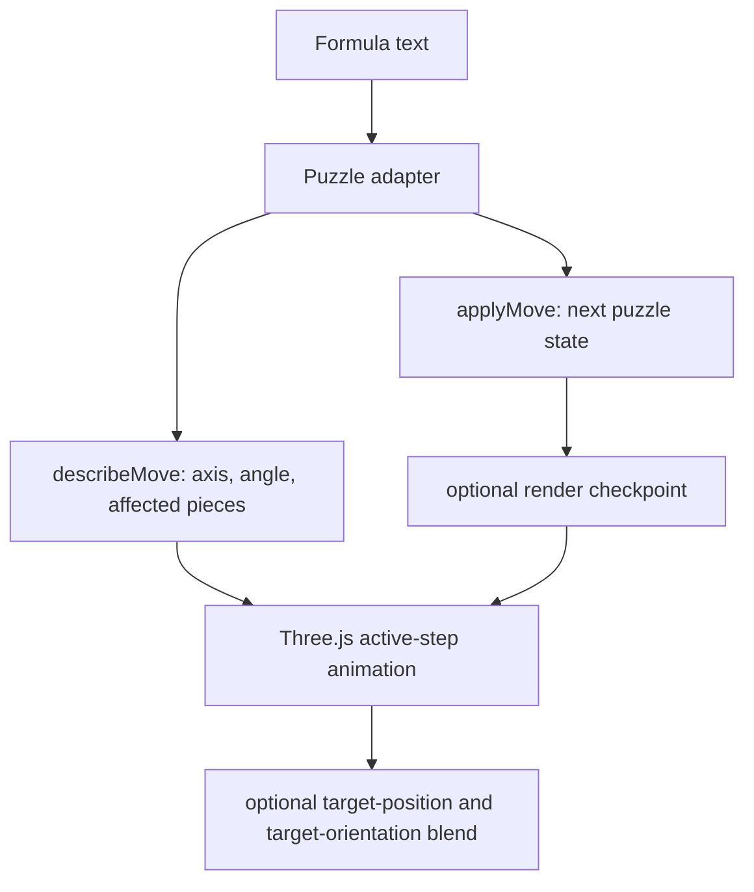
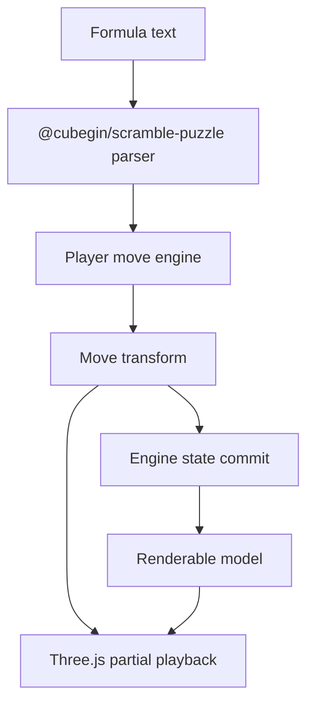
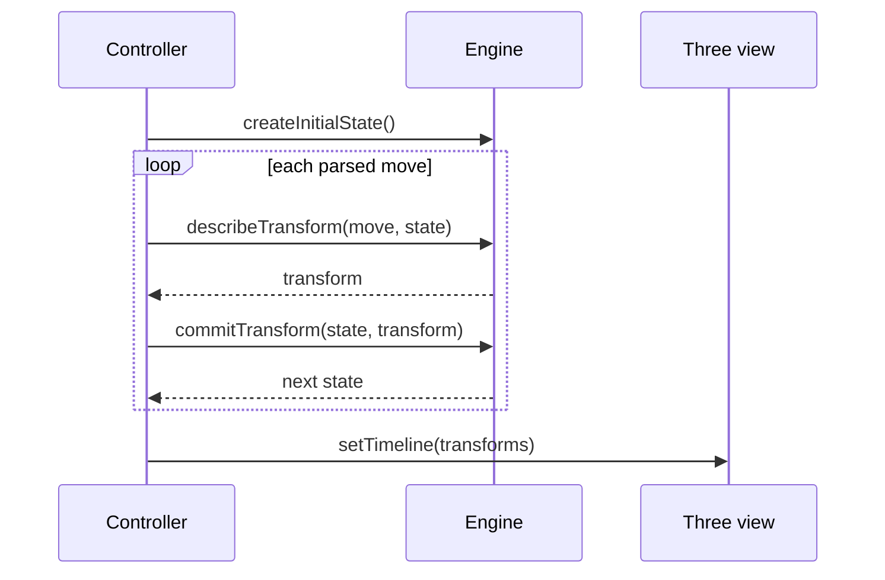

# Cubegin Player Move Engine Redesign

## Status

Drafted on 2026-07-07 after Square-1 playback exposed that the current player
can match an end-state checkpoint while animating a formula in the wrong
physical direction.

## Goal

Make `@cubegin/player` formula playback use one source of truth for notation,
move animation, and committed state. The result should let the playground play
typed or generated formulas for all supported player events while matching the
existing scramble-image reference at the end of the formula and preserving the
expected visible move direction during playback.

## Scope

- Introduce a package-internal move engine boundary for player playback.
- Keep `@cubegin/scramble-puzzle` as the parser and puzzle-state reference.
- Keep Three.js rendering inside `packages/player`.
- Keep `@cubegin/player` independent from `@cubegin/scramble-image`; only
  `apps/playground` may compare against scramble-image previews.
- Rework Square-1 first because its slash move is the clearest failure mode.
- Re-verify cube-family direction semantics, especially `U`, `U'`, `F`, and
  `F'`.
- Add signed animation tests so a passing final state cannot hide a wrong
  visual turn.
- Preserve existing public player APIs unless implementation proves a new API
  is necessary.

## Non-Goals

- Do not add a runtime dependency on `cubing/twisty`.
- Do not replace `@cubegin/scramble-image` or move image rendering into the
  player package.
- Do not change scramble generation, solvers, or WCA event metadata.
- Do not add player image export.
- Do not copy GPL/MPL reference implementation code directly. Reference
  repositories may guide behavior and tests, but Cubegin should keep its own
  implementation.

## Current Problem

The current controller builds playback in two separate streams:



This means `describeMove()` can animate a different physical operation than
`applyMove()` commits. That mismatch is mostly hidden for simple puzzles, but it
breaks down for Square-1 because slash legality, affected pieces, and final
shape all depend on the current geometry. The later `targetPositionByPieceId`
and `targetOrientationByPieceId` hooks can make the final frame look closer to
the committed checkpoint while still moving through a non-physical path.

The redesign makes a move transform the shared source for animation and state
commit:



## Reference Review

The review looked at these external repositories as behavioral references:

| Project | Commit | Relevant takeaway |
| --- | --- | --- |
| [`cubing/cubing.js`](https://github.com/cubing/cubing.js/tree/eff8d4949ed4be939f7f5ef7359e7c8ffdc64855) | `eff8d49` | Square-1 tuples parse to `U_SQ_` and `D_SQ_`; slash parses as `_SLASH_`; the Square-1 puzzle state models 24 wedge positions plus equator orientation. |
| [`cs0x7f/cstimer`](https://github.com/cs0x7f/cstimer/tree/22a6aedde88fd59255ab6a8ae8c06180e7a55d64) | `22a6aed` | The virtual Square-1 player applies the same axis/layer rotation to animation matrices and committed matrices, so playback and final state share the same operation. |
| [`thewca/tnoodle-lib`](https://github.com/thewca/tnoodle-lib/tree/3688c6639596f57b45d771578eca23878bede278) | `3688c66` | Square-1 state uses top-left, top-right, bottom-left, bottom-right half-layer fields plus middle orientation; slash swaps the right top half with the left bottom half and toggles middle orientation. |
| [`tdecker91/puzzle-gen`](https://github.com/tdecker91/puzzle-gen/tree/02ca979fdc7eb84852aa308a2af92887313740e3) | `02ca979` | Square-1 geometry is easiest to render from edge/corner piece widths, with edges consuming one 30-degree slot and corners consuming two 30-degree slots. |

The design borrows behavior-level lessons, not source code.

## Architecture

Add an internal move engine boundary between adapters and the Three.js view:

```ts
export interface PlayerMoveEngine<Move, State> {
  parseFormula(formula: string): readonly Move[];
  createInitialState(): State;
  createRenderableModel(state: State): PlayerRenderableModel;
  describeTransform(move: Move, state: State): PlayerMoveTransform<Move>;
  commitTransform(state: State, transform: PlayerMoveTransform<Move>): State;
}

export interface PlayerMoveTransform<Move = unknown> {
  readonly move: Move;
  readonly durationMultiplier?: number;
  readonly operations: readonly PlayerTransformOperation[];
}

export type PlayerTransformOperation =
  | PlayerAxisRotationOperation
  | PlayerColorPulseOperation
  | PlayerPositionPulseOperation;

export interface PlayerAxisRotationOperation {
  readonly type: 'axis-rotation';
  readonly affectedPieceIds: readonly string[];
  readonly axis: Vector3Like;
  readonly pivot: Vector3Like;
  readonly angleRadians: number;
  readonly pivotByPieceId?: Readonly<Record<string, Vector3Like>>;
  readonly angleRadiansByPieceId?: Readonly<Record<string, number>>;
  readonly rotateInPlace?: boolean;
}
```

The existing `PlayerPuzzleAdapter` can be migrated toward this contract without
changing the public package API. During migration, old `PlayerMoveAnimation`
objects can be adapted into one-operation transforms. New puzzle work should not
add more target-pose blending as the primary correctness mechanism.

## Controller And Timeline

The controller should build each timeline step by asking the engine for a
transform, then commit that same transform:



Timeline progress remains move-step based. For tuple-like moves, a single
notation item may contain multiple operations, such as independent top and
bottom Square-1 turns. The progress bar should count notation steps, while the
view applies every operation in the active transform at the same progress.

## Three.js View

The Three.js view should animate transform operations against the current
committed model:

- Start each frame from the latest committed checkpoint model.
- Apply every completed transform at progress `1` when no checkpoint exists.
- Apply the active transform at its fractional progress.
- Avoid target-pose interpolation for physical twisty moves.
- Keep target-pose interpolation only as a temporary compatibility fallback and
  test it separately so it cannot mask direction regressions.

This keeps rendering generic while making the animation path inspectable in
tests.

## Square-1 Model

Square-1 should be the first engine-backed puzzle because it exercises every
failure mode in the current design.

### State

Use a player state that preserves 24 half-slots:

```ts
export interface SquareOneEngineState {
  readonly wedges: readonly SquareOneWedgeSlot[];
  readonly equatorOrientation: 0 | 3;
}

export interface SquareOneWedgeSlot {
  readonly pieceId: string;
  readonly stickerColors: readonly string[];
  readonly slotWidth: 1 | 2;
}
```

Corners occupy two adjacent half-slots with the same `pieceId`; edges occupy one
half-slot. Renderable pieces are derived from contiguous slots with the same
`pieceId`, not used as the source state. This matches the way Square-1 turns
count small pieces as one step and large pieces as two steps.

### Tuple Turns

`(u,d)` is one notation step with up to two simultaneous operations:

- Top operation rotates the top layer around the vertical axis by `u * 30deg`.
- Bottom operation rotates the bottom layer around the vertical axis by
  `d * 30deg`.
- Positive `u` must match the visible WCA/csTimer convention: `(1,0)` turns the
  U layer one small slot clockwise when viewed from the top.
- The committed wedge order is rotated by the same slot amount used for the
  animation.

### Slash

`/` is a shape-changing transform:

- The move is legal only when the top and bottom layer cuts both align with the
  middle slice seam.
- Affected pieces are selected from current half-slot positions, not from solved
  piece ids.
- The visual operation rotates the right half around the Square-1 slash axis so
  the front side moves toward the back side.
- The committed state swaps the same top-right and bottom-left half-slot ranges
  and toggles equator orientation.
- The final frame is produced by committing the slash transform, not by blending
  arbitrary pieces to a checkpoint pose.

## Cube And Other Puzzle Migration

The same engine contract should be used to re-check existing puzzles:

| Puzzle | Required migration or verification |
| --- | --- |
| Cube family | Add signed animation tests for `U`, `U'`, `F`, `F'`, `R`, and inverse pairs. Keep parser/state in `createCubeDefinition()`, but make the signed transform commit and animation use the same axis convention. |
| Pyraminx | Verify full turns and tip turns affect distinct piece sets. Large moves such as `R`, `U`, `L`, and `B` must include tips where the notation requires them. |
| Skewb | Keep the solved orientation as white top, green front for scramble-image parity. Add a golden for a generated scramble and a single-move inverse pair. |
| FTO | Preserve the face label mapping that matches scramble-image. Add an end-state golden for a generated scramble and signed tests for one visible face turn. |
| Megaminx | Preserve the adjusted bottom-ring color mapping. Add generated-scramble golden tests so future color remaps cannot silently break parity. |
| Clock | Keep Clock separate because it is not a twisty polyhedron; its pin and dial state can still use the transform contract through rotate-in-place dial operations and pin position/color pulses. |
| Square-1 | Rebuild first with half-slot state and slash transforms; do not continue tuning target-pose blends as the main fix. |

## Validation Strategy

Add two kinds of tests.

Semantic golden tests prove the final state is correct:

- For each supported event, parse a small fixed formula.
- Apply the player engine transforms to the end.
- Compare the resulting color/state map against the same state source used by
  `@cubegin/scramble-image` where possible.
- Use playground-side visual comparison only as a manual smoke check, not as the
  only regression guard.

Signed motion tests prove the animation direction is correct:

- Seek to progress `0.5` for a single move.
- Inspect one named piece or sticker center after applying the active transform.
- Assert that it moved in the expected direction.
- Include at least cube `U`, cube `F`, Square-1 `(1,0)`, and Square-1 `/`.

Targeted commands for implementation:

```bash
corepack pnpm --filter @cubegin/player test
corepack pnpm --filter @cubegin/player typecheck
corepack pnpm --filter @cubegin/player build
corepack pnpm --filter playground test
corepack pnpm --filter playground typecheck
```

When touching a narrow player path on a noisy branch, scoped tests and
file-scoped checks are more reliable than broad formatting churn.

## Implementation Slices

1. Add the move-engine types and adapt the current one-operation animation path
   without changing behavior.
2. Add signed motion tests for cube `U`, `U'`, `F`, and `F'`; fix cube signs if
   those tests prove the current mapping disagrees with scramble-image.
3. Rewrite Square-1 engine state around 24 half-slots and add tests for
   `(1,0)`, `/`, `(1,0) /`, and an invalid slash.
4. Update the Three.js view to consume transform operations and remove
   target-pose dependence from Square-1.
5. Add semantic golden tests for Megaminx, Skewb, Pyraminx, FTO, Clock, and
   Square-1 using fixed generated scrambles.
6. Refresh playground diagnostics so the Player tab continues to show the
   scramble-image end reference while the package remains decoupled from it.

## Cost Estimate

| Work | Estimate |
| --- | --- |
| Engine contract and compatibility adapter | 1 day |
| Cube signed-motion tests and direction fixes | 0.5 to 1 day |
| Square-1 half-slot state and slash playback rewrite | 1.5 to 2 days |
| Three.js transform operation cleanup | 0.5 to 1 day |
| Non-cube semantic goldens and fixes | 2 to 3 days |
| Playground diagnostics and docs refresh | 0.5 day |

Total expected cost is 5 to 8 engineering days. Square-1 alone is 2 to 3 days
because geometry, slash legality, and signed playback all need to align.

## Licensing

`@cubegin/player` remains GPL-3.0-only in this repository. Three.js is an
MIT-licensed runtime dependency, but player distribution already flows through
Cubegin's GPL package boundary. The external repositories reviewed here should
remain references for behavior and test expectations unless a separate source
provenance review approves copying code or adding a dependency.
