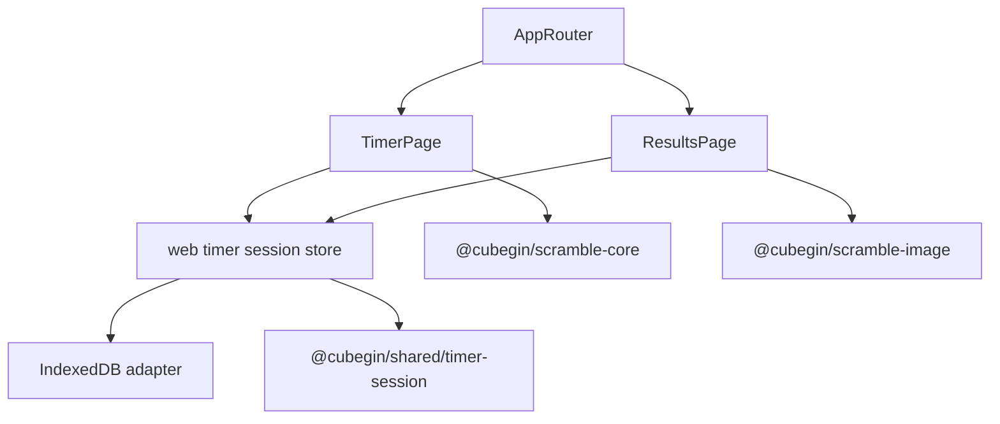

# Cubegin Results Page Design Spec

**Date**: 2026-07-08
**Scope**: `apps/web` results page, persistent local solve history, timer-to-results data flow
**Out of scope this iteration**: cloud sync, account login, import/export, bulk operations, advanced chart analytics, wx-app UI parity

---

## 1. Goals

Build a real `/results` page for the web timer that replaces the placeholder and gives users a compact local training history:

- Persist timer lists and solve records locally so results survive page reloads.
- Reuse the timer page's right-side list switcher pattern for training-list selection.
- Show a low-noise results surface with score history and statistics as two peer view families.
- Let both view families use the same dropdown trigger: scores select `single`, `av3`, `ao5`, `ao20`, `ao50`, or `ao100`; statistics select `统计数据`, `时间分布`, or `折线图`.
- Keep the single-solve list minimal: sequence number, displayed solve time, and current `ao5`.
- Keep detailed scramble, event, timestamp, penalty, and delete actions in the detail surface instead of the list rows.
- On wide screens, show a right-side detail preview. On narrow screens, open the same detail in a modal/sheet.
- Let users edit a solve penalty and delete a solve from icon/compact controls matching the timer result toolbar's style.
- Keep each statistics view focused on one question: key metrics, time distribution, or recent trend.

---

## 2. Current Context



`TimerPage` currently owns lists and solve records in React state. The results page needs to see the same data and keep it after reloads, so list and solve ownership moves to a web-local session store backed by IndexedDB.

Reusable session behavior remains in `@cubegin/shared/timer-session`: solve types, displayed time formatting, reverse sequence numbers, statistics, and average rules. `apps/web` owns browser persistence, React state, routes, and UI.

---

## 3. Data Model And Persistence

Use the existing shared types:

```ts
interface SolveRecord {
  id: string;
  sessionId: string;
  eventId: EventId;
  scramble: string | string[];
  elapsedMs: number;
  penalty: 'none' | '+2' | 'dnf';
  createdAt: number;
}

interface SolveSession {
  id: string;
  name: string;
  eventId?: EventId;
  isDefault: boolean;
  createdAt: number;
}
```

The web store initializes one default session per event. It must support:

- list sessions
- create/update active timer lists
- switch active list
- add solves from `TimerPage`
- update solve penalty from results detail
- delete solve from results detail
- expose derived active-list solves sorted newest-first

IndexedDB object stores:

- `sessions`, keyed by `id`, indexed by `createdAt`, `isDefault`, and `eventId`
- `solves`, keyed by `id`, indexed by `sessionId`, `eventId`, and `createdAt`
- `meta`, keyed by `key`, for active list id and schema state if needed

If IndexedDB is unavailable or a read/write fails, show a recoverable error state with a retry action. Do not silently fall back to ephemeral storage without telling the user.

---

## 4. Results Page Layout

### Global Structure

The page follows the timer/settings visual system:

- Cubegin brand in the header
- existing icon-only primary navigation
- active training-list switcher in the top-right, visually matching the timer page list control
- no extra filter bar
- no search input
- no bottom "go timer" action

The page keeps a screen-reader heading (`成绩列表` / `Results`) but does not render a visible title. The content header is intentionally quiet so the table starts near the top of the page.

### Top Content Switch

Place the primary `成绩` / `统计` tabs on the left side of one shared underlined content bar. Use the serif navigation typeface so these two tabs carry the page identity without a separate visible title. A single selector sits on the right within that same underline, choosing the current family's concrete view. It is a light sub-filter with a transparent background, no default border, and smaller sans-serif type. The tabs have no outer capsule or shadow; the active tab has a thin brand-color marker that overlaps the shared divider and the inactive tab remains directly tappable. Both the tabs and selector change text color only on hover, never adding a background fill. The selector is the only place that shows a chevron and it never appears twice at once, so the user first understands the current mode and then chooses its specific list or chart.

The score trigger initially shows `单次成绩` / `Single`. Its options are:

- `单次成绩`
- `av3`
- `ao5`
- `ao20`
- `ao50`
- `ao100`

The statistics trigger initially shows `统计数据` / `Overview`. Its options are:

- `统计数据` / `Overview`
- `时间分布` / `Time distribution`
- `折线图` / `Line chart`

Selecting a tab enters its matching view family and remembers the other family's latest dropdown value. Selecting the visible dropdown updates only the active view family. There is no second dropdown inside the content area.

On narrow screens the tabs and the one visible dropdown remain 44px high. They may narrow slightly but must not truncate either Chinese default label.

---

## 5. Score Views

### Single Solve View

The single-solve table/list shows only:

- reverse sequence number
- displayed solve time
- current `ao5` at that solve, or `--` if unavailable
- current `ao12` at that solve, or `--` if unavailable
- creation time, only when the table container is wider than 640px

The table is a flat data surface, not a card: no outer border, rounding, or shadow. `#`, result, `ao5`, and `ao12` fit their unwrapped content; creation time absorbs any remaining width on containers wider than 640px and otherwise stays in the result detail. This preserves the reading priority `#`, result, `ao5`, `ao12`, then creation time. In each of the result, `ao5`, and `ao12` columns, the best available value uses a restrained green emphasis and the worst uses red; DNF and unavailable values stay neutral. List rows are selectable. The selected row controls the wide-screen detail preview. On narrow screens, tapping a row opens the detail modal/sheet.

Displayed time uses `getSolveDisplayText`, so `+2` displays as adjusted time with `+`, and DNF displays as `DNF`.

### Average Views

Average views are selected through the score-type dropdown. Each view shows rolling windows for the selected type.

For `ao5`, row examples:

- range: `124-128`
- value: `10.112`
- composition: compact list of the five displayed solves

For `av3`, average is untrimmed. For `ao5`, `ao20`, `ao50`, and `ao100`, average follows WCA-style trimming for the best and worst displayed values. DNF windows follow existing shared average behavior: if the average cannot produce a numeric value, show `DNF`.

Selecting an average row controls an average detail preview on wide screens or opens the modal/sheet on narrow screens. Average detail shows:

- average value
- average type and sequence range
- component solves with sequence number and displayed time
- explanatory text for trimmed averages

Average detail is read-only. To edit a component solve, the user returns to the single-solve type and opens that solve.

---

## 6. Detail Surfaces

### Single Solve Detail

Wide screens show a right-side detail preview. Narrow screens open a modal/sheet.

The single solve detail shows:

- displayed result as the dominant value
- sequence number
- event label
- active list name
- creation time
- full scramble text
- scramble image, scaled to the detail column without clipping; 6x6 and 7x7 use compact notation type and a smaller wide-screen net cap so the full diagram remains visible alongside their longer notation
- penalty controls: `无`, `+2`, `DNF`
- delete icon button in the same control row as penalty controls

The delete control should visually match the timer result toolbar: compact icon button, separate danger styling, no large destructive footer button.

Changing penalty immediately persists and updates the list, summary, averages, and charts. Deleting asks for confirmation before removal.

When a different solve is selected, a scrollable wide-screen detail preview returns to its top so the result and penalty controls are never hidden above the viewport.

### Average Detail

Average detail shows the selected rolling window and component solves. It has no penalty editor and no delete action.

---

## 7. Statistics View

The statistics dropdown selects one focused surface at a time:

- `统计数据`: total count, best, mean, and current `ao5` where available
- `时间分布`: distribution bars for displayed solve times
- `折线图`: recent numeric solves in chronological order

This is not a full analytics dashboard. Keep chart labels and interaction minimal. Charts must have text equivalents or accessible labels.

---

## 8. Responsive Behavior

### Wide Screens

Use a two-column layout:

- main column: current score/statistics content
- side column: selected detail preview

The side preview is shown only when the current view has a selected row. Empty selection can default to the newest solve/window.

When the side preview is visible, the content header stays above both panes. The score list and the side preview each scroll vertically on their own; they never share a single content scroll area. The list fills the available row, while the side preview keeps its natural content height and becomes scrollable only after it reaches the row's available height.

### Narrow Screens

Use one column:

- header and list switcher stay at the top
- the two dropdown view triggers stay visible near the title with 44px touch targets
- rows are touch-friendly
- detail opens as a modal/sheet

Mobile rows still keep the single-solve list minimal: sequence, result, and `ao5`. Full scramble and metadata stay in detail.

---

## 9. Empty, Loading, And Error States

- Empty score view: show `暂无成绩` / `No solves yet` and keep the global navigation as the path back to the timer.
- Empty average view: show that the selected average needs more solves, such as `ao5 需要至少 5 次成绩`.
- Empty statistics view: show a compact empty state until enough solves exist to draw charts.
- Loading: reserve layout space with lightweight skeletons for the list and detail area.
- Error: show a readable local-history error and a retry button.

---

## 10. Testing And Verification

Automated coverage should include:

- session store initialization with default event lists
- IndexedDB persistence round trip for sessions and solves
- TimerPage adding a solve to the shared store
- ResultsPage rendering single solve rows with sequence, time, and `ao5`
- switching the score-type dropdown between single and `ao5`
- switching the statistics dropdown between metrics, time distribution, and line chart
- editing a penalty and recalculating summaries/averages
- deleting a solve
- narrow-screen modal/sheet accessibility basics
- route behavior: `/results` renders ResultsPage, not the placeholder

Browser verification should cover:

- desktop layout with side detail preview
- mobile layout with modal/sheet detail
- keyboard focus for list switcher, both view dropdowns, rows, penalty controls, and delete icon
- no horizontal overflow
- dark theme contrast

---

## 11. Acceptance Criteria

- `/results` is a working persisted results page, not a placeholder.
- Timer solves saved on `/` appear on `/results` without losing timer navigation state.
- Reloading preserves sessions and solves from IndexedDB.
- Primary `成绩` / `统计` tabs switch view families; one context dropdown switches score lists or focused statistics views without duplicating controls.
- The single list only shows sequence, result, and `ao5`.
- Wide screens show selected detail on the right.
- Narrow screens open detail in a modal/sheet.
- Solve penalty edits and deletes update persisted data and derived averages.
- Statistics dropdown separates core metrics, a recent line chart, and time distribution.
