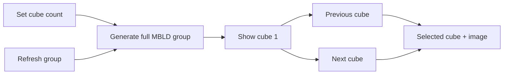

# Web Multi-Blind Scramble Toolbar Design Spec

**Date**: 2026-07-15
**Scope**: `apps/web` timer scramble display for `333mbld`
**Out of scope**: scramble history, MBLD result scoring, cloud persistence, other events

## Goal

Make a multi-blind scramble readable on the timer page by showing one cube at a
time while retaining the full generated group for the solve record.



## Toolbar

For `333mbld`, replace the single refresh layout with:

```text
[previous]  1 / 3  [next]  [refresh group]  [settings]
```

- Previous and next are icon buttons and switch only within the generated group.
- Boundary buttons are disabled; navigation does not wrap.
- The position indicator is text, not a button.
- Refresh regenerates the entire group and returns to cube 1.
- Settings is an icon button that opens the low-frequency MBLD settings dialog.
- The position denominator already exposes the active cube count, so the toolbar
  does not repeat it in a separate count button.
- Other events keep the existing single refresh icon button.

## Cube Count

- Default: 3.
- Range: 2–99, matching the existing Playground contract.
- Activating the settings icon button opens a compact MBLD settings dialog.
- The numeric input exists only inside the dialog to prevent accidental edits
  during normal timer use.
- Cancel keeps the current group and count.
- Confirming a changed count generates a new group and returns to cube 1.
- The count remains while `TimerPage` is mounted; reload persistence can wait.

## Data And Rendering

- Keep the generator result as one newline-separated string.
- Split it into cube scrambles for display and navigation.
- Render the selected cube's scramble text and image.
- Preserve the full group string when recording a completed solve.
- Loading and errors continue to use the existing scramble feedback path.

## Accessibility And Mobile

- All icon buttons have localized accessible names and visible focus states.
- Touch targets are at least 44px on mobile.
- Disabled boundary and loading states are semantically disabled.
- The setting dialog has a visible label, numeric constraints, cancel, and apply.
- The toolbar must fit a 375px viewport without horizontal overflow.

## Acceptance Criteria

- A 3-cube MBLD group shows one readable scramble and `1 / 3` initially.
- Previous/next select the correct cube and update its preview without generating.
- Refresh generates one new group using the selected cube count.
- Changing count to 5 generates with `multiBlindCubeCount: 5` and shows `1 / 5`.
- Non-MBLD events keep only the refresh button.
- Tests, typecheck, build, and 375px/desktop browser checks pass.
