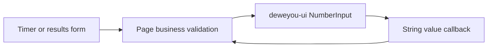

# Web Number Input Design Spec

**Date**: 2026-07-19
**Scope**: Numeric form controls in `apps/web`

## Goal

Use the shared `@deweyou-design/react` `NumberInput` for every editable numeric
field in the web app so stepping, focus, touch targets, error presentation, and
numeric typography have one owner.

## Ownership

- `NumberInput` owns the input, decrement and increment controls, visual states,
  numeric input mode, and static `min`, `max`, and `step` semantics.
- Timer and results pages continue to own domain rules. In particular, MBLD
  solved count cannot exceed attempted count and cumulative `+2` cannot exceed
  solved count.
- Pages pass validation messages through the component `error` prop. They do not
  recreate borders, focus rings, or inline error chrome in page CSS.
- Existing checkbox, chart axis, and non-editable numeric text are not number
  inputs and remain unchanged.

## Component Contract

- Upgrade `@deweyou-design/react` to a version that exports
  `@deweyou-design/react/number-input`.
- Keep form state as strings so empty and partially edited values remain
  representable.
- Consume `onValueChange({ value })` instead of DOM `change` events.
- Provide localized increment and decrement labels.
- Use the component label rather than wrapping the component in an HTML
  `<label>`.
- Use `size="sm"` in compact dialogs while preserving the component's minimum
  coarse-pointer target behavior.

## Acceptance Criteria

- No app page directly renders an `<input type="number">`.
- MBLD settings, stopped-result entry, and results editing use `NumberInput`.
- Direct typing and increment/decrement buttons update the same controlled value.
- Solved and penalty count limits remain dynamic and saving remains disabled for
  invalid values.
- Error text is announced through the component field relationship.
- Existing timer and results tests, web typecheck, and mobile/desktop browser
  smoke checks pass.

---

_Last updated: 2026-07-19 | Reason: centralize editable numeric controls in deweyou-ui_
