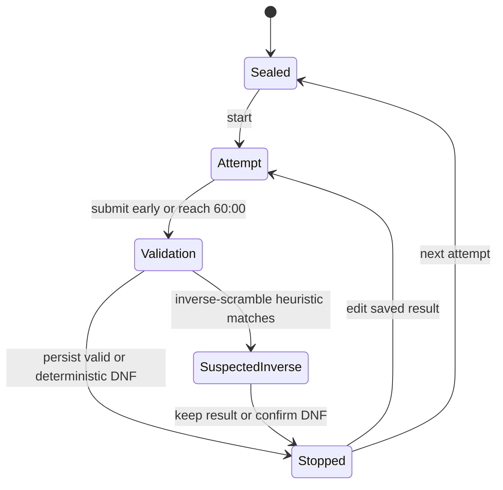

# Web Fewest Moves Workspace Design



## Goal

Give `333fm` a dedicated personal-practice workspace instead of adapting the
ordinary speed timer. The submitted solution is the source of truth. The app
derives move counts, solve validity, DNF reasons, and inverse-scramble warnings
from that solution while preserving the competitor's original text.

## WCA Rules Reflected

- The scramble must stay hidden before the attempt begins (Regulation E2a2).
- One attempt has a 60-minute limit and may be submitted early (Regulations E2b
  and E2b+). The UI announces five minutes remaining at `5:00` and ends editing
  at `0:00`.
- Starting from solved, applying the scramble followed by the submitted solution
  must result in a solved puzzle (Regulation E2c).
- The solution must be a single unambiguous sequential move sequence using
  permitted 3x3 notation (Regulations E2c2 and E2c4).
- The official result is Outer Block Turn Metric: face and outer-block moves
  count as one, rotations count as zero (Regulations E2d and 12a5).
- A solution exceeding 80 Execution Turn Metric moves, including rotations, is
  DNF (Regulations E2d1 and 12a6).
- A solution must not be directly derived from the scramble. A solution that
  begins with the same four or more moves as the inverse scramble is an official
  DNF example, but Regulation E2e leaves the final judgment to Delegate
  discretion. Cubegin therefore distinguishes deterministic rejection from a
  reviewable warning.
- Full round formats are Best of 1/2 and Mean of 3. Any DNF in a Mean of 3 makes
  the mean DNF; numeric means display exactly two decimals.

Cubegin is a personal-practice tool, not a substitute for competition judging.
It may automatically reject an exact normalized inverse scramble, but other
significant inverse-scramble overlap is presented for user review rather than
claimed as a complete WCA ruling.

## Workspace Flow

### Sealed

- Show only a static `60:00`; do not repeat the event identity or render a
  separate start button. Space remains the primary desktop start gesture, while
  the countdown itself is a tap target for mobile and pointer-only users.
- Hide the scramble text, scramble image, solution editor, scramble refresh, and
  any other control that could reveal or replace the attempt scramble.
- The session summary and application navigation may remain available.
- Starting by Space, Enter, or tapping the countdown reveals the same
  already-reserved scramble and begins the countdown without WCA inspection.

### Attempt

- Reveal the countdown, scramble text, scramble image, and solution editor as one
  workspace.
- The countdown is always `mm:ss`; ordinary in-progress timer display
  preferences do not alter it.
- The solution editor accepts physical-keyboard input and keeps a formula-aware
  token model with an insertion cursor and an optional selected token. It renders
  ten move cells per row, starts with two rows, and adds another row when input
  begins in the current last row. Clicking or focusing an existing token selects
  it for replacement or modifier editing; clicking an empty cell moves the
  insertion cursor. Arrow keys move the cursor, Backspace/Delete remove tokens,
  and pasted formulas insert at the cursor. It displays live OBTM and autosaves
  the draft locally so expensive work is not lost on refresh or an accidental
  route change.
- The touch formula keyboard exposes one key for each base face turn
  (`U/D/L/R/F/B`) and rotation (`x/y/z`), plus the shared prime and double
  modifiers, backspace, and submit. A base key inserts a plain token or replaces
  the selected token. The modifier keys update the selected or most recently
  inserted token and show its active suffix; activating the same modifier again
  restores the plain token. Wide moves are omitted. Touch keys remain at least
  44px and the keyboard respects the bottom safe area. The keyboard is shown by
  default on coarse-pointer/mobile layouts and collapsed by default on desktop,
  where a visible toggle keeps it available without competing with a physical
  keyboard.
- The competitor may submit early. At `0:00`, editing is frozen and validation
  starts automatically.

### Validation And Result

Validation runs in this order:

1. Parse and normalize the submitted formula.
2. Calculate ETM and reject values over 80.
3. Apply the scramble followed by the solution and require a solved state.
4. Calculate the official OBTM result.
5. Compare the normalized solution with the inverse scramble.

Submission ends the attempt even when it happens before the time limit. A valid
result or deterministic DNF is persisted immediately and opens the same stopped
result surface used by ordinary timer events; it does not expose a return-to-edit
or separate save step. Syntax, unsolved-state, over-80-ETM, and exact-inverse
failures are deterministic DNF results.

Significant inverse-scramble overlap is the only blocking adjudication state. It
shows explicit `保留成绩` and `判为 DNF` actions, then persists the chosen result
and enters the stopped surface. A saved result may still be edited from that
surface and is revalidated when resubmitted.

The stopped surface matches the ordinary timer's result hierarchy: primary
score, time/ETM metadata, and the same borderless edit/delete icon toolbar. It
does not repeat the submitted formula or show a dedicated next-attempt button;
Space or Enter starts the next attempt through the shared timer shortcuts.

## Formula Editor

- Preserve `rawSolution` exactly as entered and derive `normalizedSolution` for
  validation, replay, and metrics.
- Treat moves as tokens rather than relying on a numeric result input. The
  editor stores the ordered cell tokens separated by spaces and may normalize
  accepted capitalization for calculation without changing token meaning.
- Keep one editor state model across input methods: ordered tokens, cursor index,
  and optional selected-token index. Physical keys and touch keys must invoke the
  same insert, replace, modify, and delete operations so desktop and mobile do
  not drift apart.
- The first implementation includes the formula-aware editor, physical keyboard
  support, live metrics, and the move-key input surface required on touch
  devices. Rich handwriting recognition and solve-method analysis remain out of
  scope.
- Invalid tokens receive an inline error near the editor. Validation should not
  aggressively interrupt a partially typed token.

## Package Ownership

`@cubegin/scramble-puzzle` continues to own cube notation parsing, immutable
state transitions, and solved-state semantics. `@cubegin/solver` owns the new
platform-agnostic FMC validation facade because it composes puzzle operations
into a solve-domain result:

```ts
interface FewestMovesValidation {
  rawSolution: string;
  normalizedSolution: string | null;
  moveCount: number | null;
  executionMoveCount: number | null;
  status: 'valid' | 'dnf' | 'suspected-inverse';
  reason: 'syntax' | 'unsolved' | 'over-80-etm' | 'inverse-scramble' | null;
  inverseMatchLength: number;
}

function validateFewestMovesSolution(input: {
  scramble: string;
  solution: string;
}): FewestMovesValidation;
```

The package remains platform-agnostic and depends only on
`@cubegin/scramble-puzzle`. Web code owns countdown state, draft persistence,
confirmation, copy, and presentation; it must not reproduce move parsing or cube
state logic.

## Persisted Result

```ts
interface FewestMovesSolveResult {
  rawSolution: string;
  normalizedSolution: string | null;
  moveCount: number | null;
  executionMoveCount: number | null;
  attemptDurationMs: number;
  validationStatus: 'valid' | 'dnf';
  validationReason: 'syntax' | 'unsolved' | 'over-80-etm' | 'inverse-scramble' | 'manual' | null;
  inverseScrambleReview: 'not-suspected' | 'confirmed' | 'dismissed';
  rulesVersion: 'wca-2026-04-01';
}
```

- `SolveRecord.fewestMoves` owns this structured result. `elapsedMs` may mirror
  `attemptDurationMs` for existing record metadata but never affects FMC
  ranking.
- A valid result requires a non-null OBTM move count and `penalty === 'none'`.
  DNF uses `penalty === 'dnf'` and preserves the submitted formula and reason.
- Existing non-structured `333fm` records remain visible as legacy timed data
  but are excluded from FMC ranking until edited.

## Timer And Results UI

- The stopped timer face shows `<count> 步` or `DNF`; its actions are edit and
  delete icon buttons only. FMC has no `+2` action.
- The bottom summary shows valid/total, best single, current Mean of 3, and best
  Mean of 3.
- Result rows show move count or DNF as the primary value, with attempt duration,
  ETM, and a single-line solution preview as metadata.
- Solve detail shows the full raw and normalized solution, scramble, image,
  OBTM, ETM, attempt duration, validation result, edit/revalidate, replay entry,
  and delete.
- Statistics show total, valid, best/worst single, current/best Mean of 3,
  move-count trend, move-count distribution, and DNF-reason distribution.
  Ordinary elapsed-time averages, standard deviation, ao5+, and time
  distribution do not apply.

## Responsive And State Requirements

- At 375px, the countdown remains visible, the solution editor does not scroll
  horizontally, all ten move columns fit the viewport, formula keys remain at
  least 44px, and the fixed keyboard does not collide with the app navigation or
  OS safe area.
- Desktop uses a two-column scramble text/image region above a full-width editor;
  mobile stacks countdown, scramble, image, editor, metrics, and formula keys.
- During an active attempt, the workspace starts directly below the compact
  brand row, owns the remaining viewport height, and scrolls internally. Hidden
  navigation and footer tracks must not leave reserved blank space.
- Reserve stable dimensions for countdown, validation status, and toolbar so
  live metrics do not shift the editor.
- Cover sealed, active, five-minute warning, validating, valid, DNF,
  suspected-inverse, timeout-read-only, loading, parse error, persistence error,
  and destructive confirmation states.
- Focus remains visible, icon-only actions have accessible names, and formula
  editing works without hover.

## Out Of Scope

- Handwritten-solution image recognition.
- Complete WCA Delegate-style automatic adjudication.
- Competition group synchronization or shared starts across devices.
- Cloud synchronization of an in-progress attempt.
- Automatic solve-method decomposition or optimization advice.
- Building a new general-purpose formula player; an existing replay entry may be
  reused only if its current contract already supports the submitted formula.

## Acceptance Criteria

- Before starting `333fm`, no scramble text, image, or solution controls are
  rendered or exposed to assistive technology. The sealed surface shows only
  `60:00`, with no repeated title or separate start button.
- Starting reveals the reserved scramble and begins a 60-minute countdown with
  no WCA inspection. Five minutes remaining is announced once; zero freezes
  editing and triggers validation.
- Valid 3x3 notation is normalized without losing the raw input. The live OBTM
  and ETM metrics follow Regulations 12a5 and 12a6.
- The editor shows ten move cells per row, begins with two rows, expands by one
  row as the user enters the last row, and the touch keyboard contains no wide
  moves. Every populated token can be selected and replaced or deleted, and
  formulas can be inserted at a chosen cursor position rather than only appended.
- The compact touch keyboard uses base moves plus shared prime/double modifiers.
  It stays layout-stable, defaults visible on mobile, defaults collapsed on
  desktop, and remains available through an explicit toggle.
- Scramble plus solution must produce a solved cube. Invalid syntax, an unsolved
  cube, more than 80 ETM, and an exact inverse scramble save only as DNF.
- A four-or-more-move inverse prefix is presented as reviewable suspected
  inverse, and either user decision is persisted.
- Valid results rank by lower OBTM. Any DNF makes a Mean of 3 DNF; numeric means
  display exactly two decimals.
- Timer summary, result rows/detail, and statistics use move-count semantics and
  retain the submitted solution.
- Non-FMC events retain their existing behavior.

---

_Last updated: 2026-07-21 | Reason: unify editable FMC tokens across physical and touch keyboards_
