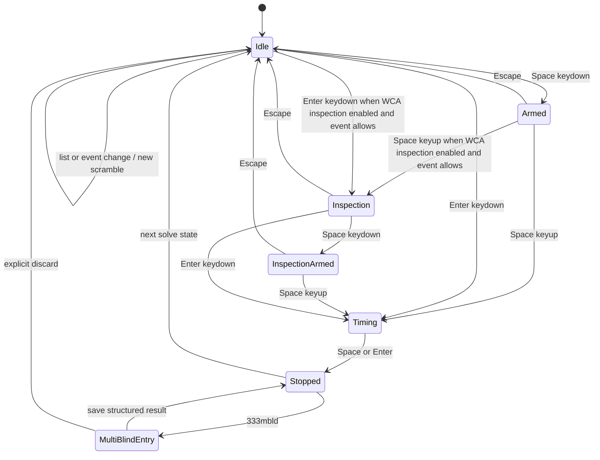

# Timer Workflow

The web timer now starts at `AppRouter`, uses React Router for page routing, and
uses `TimerPage` as the root `/` experience. Shared package code supplies timer
math, preference display rules, WCA inspection penalties, and solve/session
statistics, while React owns keyboard priority, scramble generation, list
selection, settings persistence, and page layout.

## Key Rules

- `AppRouter` wraps the app in React Router, keeps `TimerPage` mounted while the
  user moves between `/` and `/settings`, maps `/settings` to `SettingsPage`,
  and maps `/results` to `ResultsPage`; `/formulas` remains a follow-up page.
  Route components are lazy loaded at this boundary. See
  [apps/web/src/app-router.tsx#L1](../apps/web/src/app-router.tsx#L1) and
  [apps/web/src/app-routes.ts#L1](../apps/web/src/app-routes.ts#L1).
- `AppPreferencesProvider` wraps the router, persists preferences in
  localStorage, resolves browser language and system theme, and supplies the
  localized copy used by timer, settings, and placeholder routes.
- `TimerPage` owns the current scramble text, timer state, active list,
  result toolbar, session summary, recent solves, and scramble preview. See
  [apps/web/src/timer/timer-page.tsx#L1](../apps/web/src/timer/timer-page.tsx#L1).
- The scramble strip exposes one localized refresh icon button below the current
  scramble. It reuses the active list's generation path, disables repeat input
  while loading, and preserves the existing inline loading and error feedback.
  The text keeps the full reserved fitting viewport. After fitting, its rendered
  height positions the toolbar immediately below the text without shrinking the
  font-measurement area or sticking the toolbar to the viewport edge.
- Auxiliary solution formulas are an opt-in timer preference, disabled by
  default. When enabled, supported ordinary events place a formula icon beside
  scramble refresh, while `333fm` places the same action beside its
  collapse/expand control. The dialog remembers the last method independently
  for `333`, `333oh`, `333fm`, `222`, `sq1`, `pyram`, and `skewb`; list changes
  do not merge those choices. `333` and `333oh` expose Cross, XCross, EOline,
  Roux S1/S2, CFOP F2L, and ZZ F2L. `333fm` exposes Cross, XCross, EOline, EOFC,
  Petrus S1/S2, EO+DR, and 2x2x2 Block. The advanced 3x3 TwoPhase and General
  Mask helpers remain outside the timer UI.
- Formula calculation loads only the selected method in a dedicated worker.
  Alternative-target methods show every returned target, prefix the formula
  with `setupRotation`, and emphasize every tied minimum beside its target as
  `本组最短 · N FTM`; staged methods show numbered sequential steps without
  treating the shortest stage as an optimum. Alternative-target rows expose a
  full-height right-side drag rail for pointer, touch, and keyboard reordering
  without competing with selectable formula content. Their target order is
  stored by formula method rather than event, so a preferred Roux S1 order is
  shared by `333` and `333oh`; newly supported or previously unknown targets
  append in solver order. Single and staged methods retain solver-defined
  semantic order, and shortest highlighting remains metric-driven after a row
  moves. The dialog keeps a stable height while its result region scrolls
  independently, so changing methods does not move the surrounding surface.
  Loading, failure, retry, and stale request handling belong to the dialog.
  Opening the dialog pauses timer shortcuts, but viewing a formula does not mark
  the solve or change statistics.
  See
  [apps/web/src/solver-assist/solver-assist-dialog.tsx#L1](../apps/web/src/solver-assist/solver-assist-dialog.tsx#L1)
  and
  [apps/web/src/solver-assist/solver-assist-config.ts#L1](../apps/web/src/solver-assist/solver-assist-config.ts#L1).
- The `333mbld` scramble strip keeps the generated newline-separated group as
  the solve-record source while displaying one cube at a time. Previous and next
  icon buttons navigate within the group, and a settings dialog owns the
  session-only cube count (`2` to `99`, default `3`). Applying a changed count
  regenerates the group and returns the display to its first cube.
- `ScrambleText` owns rendered-size fitting inside the fixed scramble viewport.
  It measures real wrapped dimensions after layout and font loading, reserves a
  proportional width and height buffer, and steps back from the largest fitting
  value to avoid sub-pixel clipping. `TimerPage` owns only the viewport and CSS
  size bounds; density tiers remain the unsupported-browser fallback. See
  [apps/web/src/timer/components/scramble-text.tsx#L20](../apps/web/src/timer/components/scramble-text.tsx#L20).
- The page grid gives the timer stage a stable responsive height instead of
  letting it fill all remaining vertical space. The scramble hero and bottom
  dock absorb extra height, while the time face stays centered inside the stage;
  compact landscape uses a smaller stage. At every width, the stage reserves a
  fixed second row for placeholder and stopped-result actions so feedback stays
  inside the stage and the time face remains stable above it; responsive modes
  only adjust the row height. Do not restore full-height timer surfaces,
  width-only top alignment, absolute feedback positioning, or vertical translate compensation. See
  [apps/web/src/timer/timer-page.module.css#L1](../apps/web/src/timer/timer-page.module.css#L1).
- The bottom scramble preview is sized independently from the bottom dock using
  a width-and-viewport-height responsive clamp. The dock may absorb remaining
  page height, but the SVG must preserve its intrinsic ratio and must not stretch
  to fill that height. Width breakpoints may change summary/preview arrangement,
  not introduce a discontinuous preview-size jump.
- `SettingsPage` owns the first settings surface: theme, language, WCA
  inspection, auxiliary solution formulas, and timer display mode. Changes
  apply immediately and persist across reloads.
- `@cubegin/shared/timer` is platform-agnostic state only. It uses
  `performance.now()` and exposes `start`, `stop`, `reset`, and `getState`
  through [packages/shared/src/timer/timer.ts#L13](../packages/shared/src/timer/timer.ts#L13).
- `@cubegin/shared/preferences` is platform-agnostic preference logic. It owns
  default values, normalization, in-progress timer display formatting, WCA
  inspection countdown duration, and WCA +2/DNF penalty thresholds.
- `@cubegin/shared/timer-session` is platform-agnostic solve/session logic. It
  owns solve records, penalty display, elapsed formatting, and rolling averages
  including mo3, ao5, ao12, ao50, and ao100. Average calculation is centralized
  in `calculateSolveAverage`: a window is DNF only when more than half of its
  entries are DNF; otherwise numeric entries are averaged with the requested
  trim rule and a population standard deviation.
- `333mbld` results are a separate shared timer-session contract. Each new solve
  stores attempted count, solved count, cumulative `+2` count, raw elapsed time,
  and optional whole-attempt DNF. Shared helpers derive `score = solved - missed`,
  truncate final time to whole seconds, and render it in WCA clock form (`m:ss`,
  including a leading `0:` below one minute). They also derive rule-based DNF and
  compare by higher score, shorter time, then fewer missed puzzles. See
  [packages/shared/src/timer-session/multi-blind-result.ts#L1](../packages/shared/src/timer-session/multi-blind-result.ts#L1).
- The shared MBLD rule also derives the attempt limit: 10 minutes per puzzle
  below 6 attempted puzzles, capped at 60 minutes from 6 puzzles onward. The web
  timer presents this as a countdown, continues after zero with a `+m:ss`
  overtime display, and waits for the user to stop manually. A raw stopped time
  above the limit derives DNF when the structured result is evaluated.
  Cumulative `+2` penalties are added afterward, do not trigger timeout DNF, and
  may make a valid final time exceed the limit.
- Stopping `333mbld` opens a required result dialog before persistence. The timer
  keeps attempted count implicit, lays out solved count and cumulative `+2` as
  compact label/input rows, and omits the result preview. New attempts initialize
  to the common all-success result (`solved = attempted`, cumulative `+2 = 0`) so
  a clean solve can be saved immediately. All editable numeric fields in the timer
  and results pages use the shared deweyou-ui `NumberInput`;
  the component owns stepping, focus, touch targets, and error presentation,
  while the pages own the MBLD domain rules. The whole-attempt DNF action uses
  the shared `Checkbox`; selecting it disables both numeric fields without
  clearing their values, removes their required/error state, and keeps save
  available. A valid solved/penalty pair is preserved when the whole attempt is
  DNF; an empty or invalid pair is normalized to `0 / 0`. Without whole-attempt
  DNF, solved count cannot exceed attempted count, cumulative `+2` cannot exceed
  solved count, and both constraints are enforced by input bounds, inline errors,
  disabled save, and the submit handler. The timer's secondary escape action is
  labeled `本次不记录` / `Don't record` so it cannot be confused with recording a
  DNF. Clicking it opens a separate destructive confirmation dialog; canceling
  returns to the preserved result form, while confirming performs the discard.
  The timer and results pages display MBLD summaries, rows, and detail editing
  without ordinary averages, standard deviation, mo3/ao5, time distribution, or
  elapsed time trends. WCA MBLD has Best-of-X formats but no official average.
  Legacy MBLD records without structured fields remain visible but are excluded
  from WCA ranking until edited.
- `TimerSessionStoreProvider` owns web-local lists and solves through IndexedDB.
  `TimerPage` records, updates, and deletes solves through this store, while
  `ResultsPage` reads the same active list for score rows, rolling averages,
  detail editing, and statistics. Each list binds to one event/scramble type,
  and switching lists switches the active event for scramble generation.
- `333fm` uses a dedicated formula-first workspace instead of the ordinary
  stopwatch surface. Its sealed state keeps the reserved scramble, image, and
  editor out of the DOM and shows only the `60:00` countdown. Space starts on
  desktop, while the countdown itself remains a mobile tap target. Holding Space
  reuses the shared green ready state, and Escape visibly cancels back to the
  sealed countdown before release. Starting
  reveals the scramble, image, and a ten-column token editor with two initial
  rows; every completed token can be selected for replacement or modifier editing,
  while a movable insertion cursor and entering the last row append another row.
  Arrow keys, Backspace/Delete, and paste operate at the same cursor used by touch
  input. The editor heading separates
  the solution label from a right-aligned localized total-move count derived from
  OBTM, without exposing solved-state validation before submission. The solution
  editor and input panel form one bottom-aligned work area on desktop, while mobile
  keeps the editor in normal document flow above its fixed input panel. The scramble
  text and image can be collapsed to reclaim working space without hiding the countdown.
  The countdown
  stays at the scramble region's upper left in the normal layout. On small screens,
  a compact copy appears at the viewport's upper right only after the original
  countdown scrolls out of view; desktop never enables this pinned state. The
  workspace keeps scrolling available while hiding its scrollbar. The formula keyboard
  exposes one key per base face turn or rotation, shared prime/double modifiers,
  backspace, and the submit action but no wide moves. It remains visible during
  the attempt on both desktop and mobile, while desktop physical-keyboard input
  continues to work in parallel. On mobile, this custom keyboard
  suppresses the system soft keyboard, stays fixed above the safe area, and the
  scrollable workspace reserves its height so new formula rows move into view without
  moving or covering the keyboard. Submission delegates
  notation, OBTM/ETM, solved-state, and inverse-scramble checks to
  `@cubegin/solver`. Submission ends the attempt: deterministic valid or DNF
  results persist immediately and enter the stopped result surface without a
  return-to-edit or separate save step. A suspected inverse-scramble match is the
  only blocking review; choosing keep or DNF persists that decision and then
  enters the same stopped surface. That surface keeps only the primary result,
  time/ETM metadata, and the ordinary timer's borderless edit/delete toolbar; it
  does not repeat the formula or add a dedicated next-attempt button. Saved
  records retain both raw and normalized formulas, move metrics, attempt
  duration, validation outcome, and inverse-review decision.
  The timer summary and results page rank lower valid OBTM, calculate Mean of 3
  with DNF propagation, and do not reuse time-based averages, distributions, or
  trends.
- `useTimer` bridges the core timer to React with `requestAnimationFrame`; keep
  RAF cleanup on stop, reset, and unmount. See
  [apps/web/src/timer/hooks/use-timer.ts#L5](../apps/web/src/timer/hooks/use-timer.ts#L5).
- `TimerPage` captures Space and Enter at page priority so focused controls
  cannot consume Space to open selects while the user intends to time a solve.
  Space arms on keydown and starts on keyup; Enter starts immediately. Space or
  Enter stops while timing, and Escape cancels the armed state.
- When `TimerPage` is kept alive behind `/settings`, it is rendered inactive and
  hidden. The current scramble, list, solve state, and in-memory session state
  remain mounted, but page-level timer shortcuts are not registered while the
  settings page is active.
- When WCA inspection is enabled, Space keeps the same ready/release gesture as
  normal timing: Space keydown from idle enters the green ready state, Space
  keyup starts the 15 second inspection, Space keydown during inspection enters
  the green inspection-ready state, and Space keyup starts the solve. Enter
  still starts the next phase immediately. Escape cancels inspection, inspection
  over 15 seconds records `+2`, and inspection over 17 seconds records `DNF`.
  Blindfolded events (`333bld`, `444bld`, `555bld`, and `333mbld`) always skip
  inspection and start the solve directly without changing the persisted global
  preference.
- Timer display mode only affects in-progress solve display. Realtime shows
  hundredths while timing, seconds mode shows whole seconds while timing, and
  inspection-only mode shows localized `计时` / `timing` while timing. Inspection
  continues to show the countdown, and completed results keep millisecond
  precision plus penalties.
- Clock displays keep digits in fixed `1ch` slots and punctuation in fixed
  narrower slots so changing glyphs cannot shift the centered timer. The outer
  timer face may shrink once per display-format width bucket using its measured
  slot layout and a safety buffer; it must not refit on every animation frame.
- While timing, the right list selector and primary navigation are hidden; the
  brand stays visible.
- Stopped solves reveal a result toolbar with `+2`, `DNF`, and delete actions.
  Result UI is laid out in a fixed feedback slot so the timer does not jump
  between idle, armed, timing, and stopped states.

## Key Files

- [apps/web/src/app-router.tsx#L1](../apps/web/src/app-router.tsx#L1) - app route switch.
- [apps/web/src/preferences/app-preferences.tsx#L1](../apps/web/src/preferences/app-preferences.tsx#L1) - preference persistence, resolved theme, and localized copy.
- [apps/web/src/settings/settings-page.tsx#L1](../apps/web/src/settings/settings-page.tsx#L1) - settings route for general and timer preferences.
- [apps/web/src/solver-assist/solver-assist-config.ts#L1](../apps/web/src/solver-assist/solver-assist-config.ts#L1) - event-specific method availability and presentation modes.
- [apps/web/src/solver-assist/solver-assist-worker-client.ts#L1](../apps/web/src/solver-assist/solver-assist-worker-client.ts#L1) - lazy worker lifecycle and solver request boundary.
- [apps/web/src/solver-assist/solver-assist-dialog.tsx#L1](../apps/web/src/solver-assist/solver-assist-dialog.tsx#L1) - method memory, async states, and formula result presentation.
- [apps/web/src/solver-assist/solver-assist-preferences.ts#L1](../apps/web/src/solver-assist/solver-assist-preferences.ts#L1) - per-event method selection and per-method alternative target order.
- [apps/web/src/timer/timer-page.tsx#L1](../apps/web/src/timer/timer-page.tsx#L1) - redesigned timer state and layout.
- [apps/web/src/results/results-page.tsx#L1](../apps/web/src/results/results-page.tsx#L1) - persisted score history, detail surfaces, and statistics views.
- [apps/web/src/timer-session/timer-session-store.tsx#L1](../apps/web/src/timer-session/timer-session-store.tsx#L1) - React store over the IndexedDB list and solve adapter.
- [apps/web/src/timer/timer-navigation.tsx#L1](../apps/web/src/timer/timer-navigation.tsx#L1) - shared timer app navigation.
- [apps/web/src/timer/timer-page.module.css#L1](../apps/web/src/timer/timer-page.module.css#L1) - fixed timer, scramble, bottom dock, and mobile nav layout.
- [apps/web/src/timer/components/scramble-image.tsx#L5](../apps/web/src/timer/components/scramble-image.tsx#L5) - inline SVG boundary.
- [packages/shared/src/timer/format.ts#L1](../packages/shared/src/timer/format.ts#L1) - elapsed time formatting.
- [packages/shared/src/timer-session/solve-average.ts#L1](../packages/shared/src/timer-session/solve-average.ts#L1) - shared trimmed-average and standard-deviation rules.
- [packages/shared/src/timer-session/multi-blind-result.ts#L1](../packages/shared/src/timer-session/multi-blind-result.ts#L1) - MBLD score, DNF, formatting, ranking, and summary rules.
- [packages/shared/src/timer-session/fewest-moves-result.ts#L1](../packages/shared/src/timer-session/fewest-moves-result.ts#L1) - FMC move ranking, Mean of 3, and statistics semantics.
- [packages/shared/src/preferences/index.ts#L1](../packages/shared/src/preferences/index.ts#L1) - preference defaults, normalization, display formatting, and WCA inspection rules.

## Open Questions

- TODO: Confirm whether the WeChat miniprogram should mirror the web timer
  gesture model or use native mini-program interactions.
- TODO: Decide when local results history should add cloud sync, import, and
  export without changing the shared solve/session contract.

---

_Last updated: 2026-07-24 | Reason: document the full-height drag rail for persistent alternative-target ordering_
