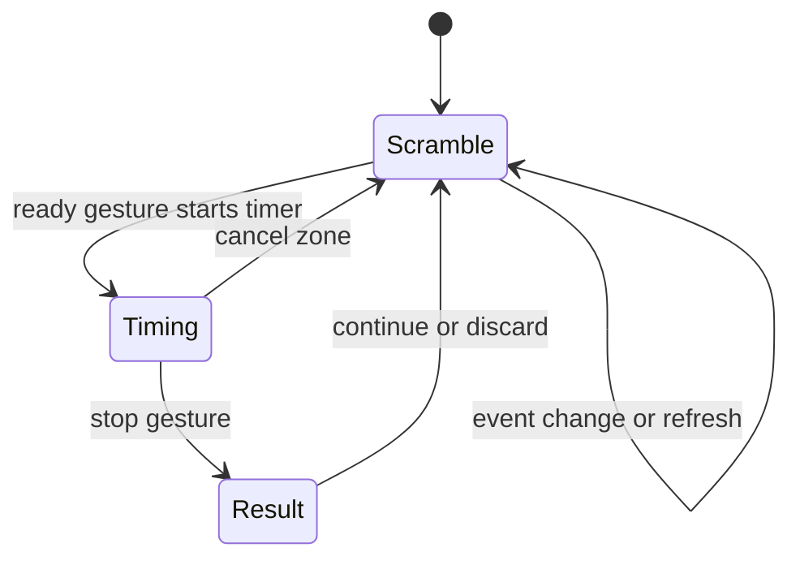

# Timer Workflow

The web timer keeps solve flow in `TimerPage`: package code supplies timer math
and scramble generation, while React hooks own browser input and animation.

## Key Rules

- `TimerPage` owns the current WCA event, scramble text, page state, and final
  elapsed result in one place. See [apps/web/src/timer/timer-page.tsx#L14](../apps/web/src/timer/timer-page.tsx#L14).
- `@cubegin/timer` is platform-agnostic state only. It uses `performance.now()`
  and exposes `start`, `stop`, `reset`, and `getState` through
  [packages/timer/src/timer.ts#L13](../packages/timer/src/timer.ts#L13).
- `useTimer` bridges the core timer to React with `requestAnimationFrame`; keep
  RAF cleanup on stop, reset, and unmount. See
  [apps/web/src/timer/hooks/use-timer.ts#L5](../apps/web/src/timer/hooks/use-timer.ts#L5).
- `useTimerGesture` owns browser input. Space key has a ready-on-keydown,
  start-on-keyup flow; touch starts after a 300 ms long press and can cancel in
  the top zone. See [apps/web/src/timer/hooks/use-timer-gesture.ts#L29](../apps/web/src/timer/hooks/use-timer-gesture.ts#L29).
- Cancel returns to the same scramble for review. Continue, discard, event
  change, and refresh generate a new scramble from the current event.

## Key Files

- [apps/web/src/timer/timer-page.tsx#L10](../apps/web/src/timer/timer-page.tsx#L10) - page states.
- [apps/web/src/timer/views/scramble-view.tsx#L15](../apps/web/src/timer/views/scramble-view.tsx#L15) - scramble UI and SVG rendering entry.
- [apps/web/src/timer/components/scramble-image.tsx#L5](../apps/web/src/timer/components/scramble-image.tsx#L5) - inline SVG boundary.
- [packages/timer/src/format.ts#L1](../packages/timer/src/format.ts#L1) - elapsed time formatting.

## Open Questions

- TODO: Confirm whether the WeChat miniprogram should mirror the web timer
  gesture model or use native mini-program interactions.

---

_Last updated: 2026-05-25 | Reason: initial memory setup after replacing legacy knowledge docs_
