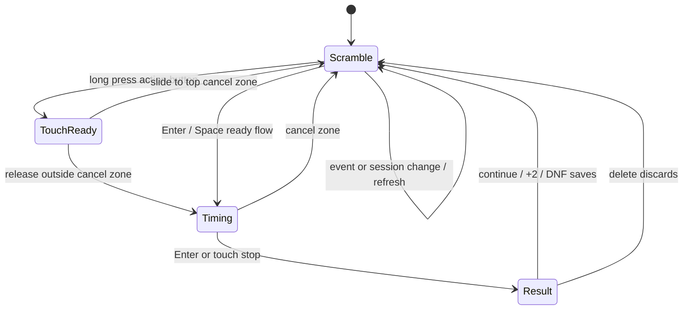

# Timer Workflow

The web timer keeps solve flow in `TimerPage`: shared package code supplies
timer math and session rules, while React hooks own browser input, animation,
and web storage integration.

## Key Rules

- `TimerPage` owns the current scramble text, page state, final elapsed result,
  session panel, and solve detail state. See
  [apps/web/src/timer/timer-page.tsx#L24](../apps/web/src/timer/timer-page.tsx#L24).
- `@cubegin/shared/timer` is platform-agnostic state only. It uses
  `performance.now()` and exposes `start`, `stop`, `reset`, and `getState`
  through [packages/shared/src/timer/timer.ts#L13](../packages/shared/src/timer/timer.ts#L13).
- `@cubegin/shared/timer-session` is platform-agnostic solve/session logic. It
  owns solve records, protected default sessions, custom session deletion
  rules, penalty display, reverse list numbering, and event/session transition
  rules.
- The web app persists sessions and solves in IndexedDB through
  [apps/web/src/timer/storage/timer-session-db.ts#L1](../apps/web/src/timer/storage/timer-session-db.ts#L1).
  If IndexedDB cannot open, the page falls back to in-memory storage and shows a
  storage warning.
- `useTimer` bridges the core timer to React with `requestAnimationFrame`; keep
  RAF cleanup on stop, reset, and unmount. See
  [apps/web/src/timer/hooks/use-timer.ts#L5](../apps/web/src/timer/hooks/use-timer.ts#L5).
- `useTimerGesture` owns browser input. Enter starts/stops when focus is not in
  a form control. Space keeps the existing ready-on-keydown, start-on-keyup
  flow. Touch start is action-button scoped: the user must long-press, release
  to start, or slide to the top cancel zone before releasing. Global page touch
  should not start the timer. See
  [apps/web/src/timer/hooks/use-timer-gesture.ts#L1](../apps/web/src/timer/hooks/use-timer-gesture.ts#L1)
  and [apps/web/src/timer/views/scramble-view.tsx#L1](../apps/web/src/timer/views/scramble-view.tsx#L1).
- Changing the event switches to that event's protected default session.
  Changing a session switches the current event from the newest solve when
  present, from the default session event when the default session is empty, and
  leaves the event unchanged for an empty custom session.
- Cancel returns to the same scramble for review. Continue, +2, and DNF save a
  solve before generating the next scramble; delete skips persistence and still
  advances to the next scramble. Result actions must work on mobile touch, and
  tapping blank result space continues with no penalty.
- Web solve ids are client generated as a fixed-shape timestamp/random id so
  Safari or LAN HTTP contexts without `crypto.randomUUID()` can still persist
  results. See
  [apps/web/src/timer/storage/client-id.ts#L1](../apps/web/src/timer/storage/client-id.ts#L1).

## Key Files

- [apps/web/src/timer/timer-page.tsx#L10](../apps/web/src/timer/timer-page.tsx#L10) - page states.
- [apps/web/src/timer/views/scramble-view.tsx#L15](../apps/web/src/timer/views/scramble-view.tsx#L15) - scramble UI and SVG rendering entry.
- [apps/web/src/timer/components/result-actions.tsx#L1](../apps/web/src/timer/components/result-actions.tsx#L1) - result action touch/click boundary.
- [apps/web/src/timer/hooks/use-timer-sessions.ts#L1](../apps/web/src/timer/hooks/use-timer-sessions.ts#L1) - React bridge around session storage and rules.
- [apps/web/src/timer/storage/timer-session-db.ts#L1](../apps/web/src/timer/storage/timer-session-db.ts#L1) - IndexedDB adapter for web solve persistence.
- [packages/shared/src/timer-session/session-rules.ts#L1](../packages/shared/src/timer-session/session-rules.ts#L1) - default/custom session and event/session transition rules.
- [apps/web/src/timer/components/scramble-image.tsx#L5](../apps/web/src/timer/components/scramble-image.tsx#L5) - inline SVG boundary.
- [packages/shared/src/timer/format.ts#L1](../packages/shared/src/timer/format.ts#L1) - elapsed time formatting.

## Open Questions

- TODO: Confirm whether the WeChat miniprogram should mirror the web timer
  gesture model or use native mini-program interactions.

---

_Last updated: 2026-06-30 | Reason: event metadata renamed_
