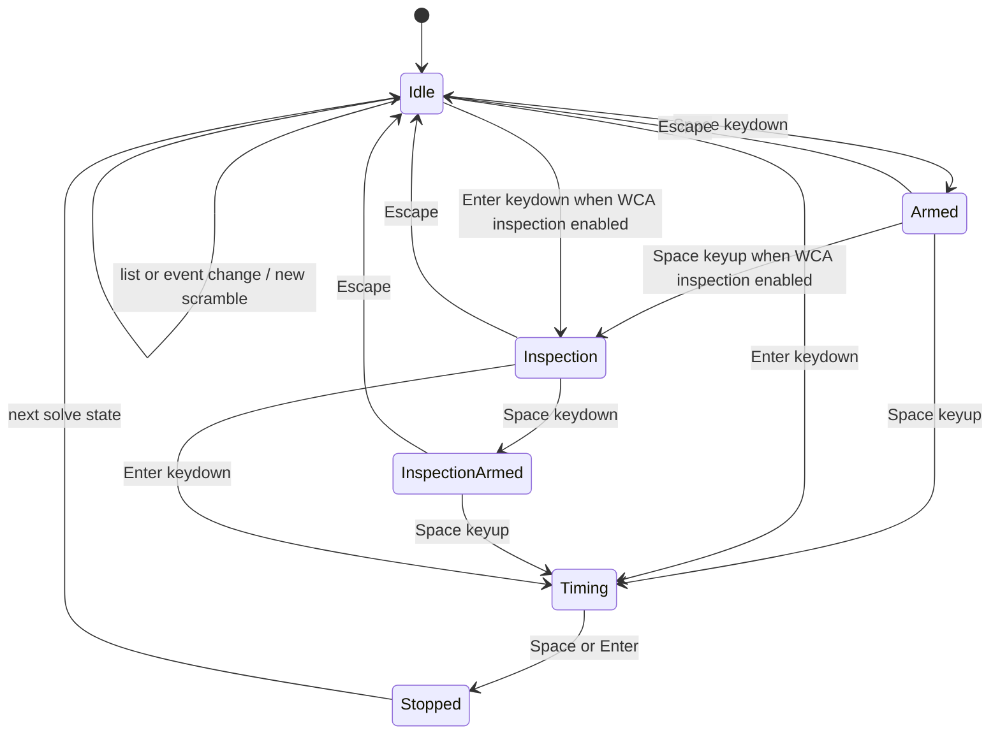

# Timer Workflow

The web timer now starts at `AppRouter`, uses React Router for page routing, and
uses `TimerPage` as the root `/` experience. Shared package code supplies timer
math, preference display rules, WCA inspection penalties, and solve/session
statistics, while React owns keyboard priority, scramble generation, list
selection, settings persistence, and page layout.

## Key Rules

- `AppRouter` wraps the app in React Router, keeps `TimerPage` mounted while the
  user moves between `/` and `/settings`, maps `/settings` to `SettingsPage`,
  and reserves `/results` and `/formulas` for follow-up pages. Route components
  are lazy loaded at this boundary. See
  [apps/web/src/app-router.tsx#L1](../apps/web/src/app-router.tsx#L1) and
  [apps/web/src/app-routes.ts#L1](../apps/web/src/app-routes.ts#L1).
- `AppPreferencesProvider` wraps the router, persists preferences in
  localStorage, resolves browser language and system theme, and supplies the
  localized copy used by timer, settings, and placeholder routes.
- `TimerPage` owns the current scramble text, timer state, active list,
  result toolbar, session summary, recent solves, and scramble preview. See
  [apps/web/src/timer/timer-page.tsx#L1](../apps/web/src/timer/timer-page.tsx#L1).
- `SettingsPage` owns the first settings surface: theme, language, WCA
  inspection, and timer display mode. Changes apply immediately and persist
  across reloads.
- `@cubegin/shared/timer` is platform-agnostic state only. It uses
  `performance.now()` and exposes `start`, `stop`, `reset`, and `getState`
  through [packages/shared/src/timer/timer.ts#L13](../packages/shared/src/timer/timer.ts#L13).
- `@cubegin/shared/preferences` is platform-agnostic preference logic. It owns
  default values, normalization, in-progress timer display formatting, WCA
  inspection countdown duration, and WCA +2/DNF penalty thresholds.
- `@cubegin/shared/timer-session` is platform-agnostic solve/session logic. It
  owns solve records, penalty display, elapsed formatting, and rolling averages
  including mo3, ao5, ao12, ao50, and ao100.
- `TimerPage` currently keeps lists and solves in React state. Each list binds
  to one event/scramble type, and switching lists switches the active event for
  scramble generation.
- `useTimer` bridges the core timer to React with `requestAnimationFrame`; keep
  RAF cleanup on stop, reset, and unmount. See
  [apps/web/src/timer/hooks/use-timer.ts#L5](../apps/web/src/timer/hooks/use-timer.ts#L5).
- `TimerPage` captures Space and Enter at page priority so focused controls
  cannot consume Space to open selects while the user intends to time a solve.
  Space arms on keydown and starts on keyup; Enter starts immediately. Space or
  Enter stops while timing, and Escape cancels the armed state.
- When `TimerPage` is kept alive behind `/settings`, it is rendered inactive and
  hidden. The current scramble, list, solve state, and in-memory session state
  remain mounted, but page-level timer shortcuts are not registered while the
  settings page is active.
- When WCA inspection is enabled, Space keeps the same ready/release gesture as
  normal timing: Space keydown from idle enters the green ready state, Space
  keyup starts the 15 second inspection, Space keydown during inspection enters
  the green inspection-ready state, and Space keyup starts the solve. Enter
  still starts the next phase immediately. Escape cancels inspection, inspection
  over 15 seconds records `+2`, and inspection over 17 seconds records `DNF`.
- Timer display mode only affects in-progress solve display. Realtime shows
  hundredths while timing, seconds mode shows whole seconds while timing, and
  inspection-only mode shows localized `计时` / `timing` while timing. Inspection
  continues to show the countdown, and completed results keep millisecond
  precision plus penalties.
- While timing, the right list selector and primary navigation are hidden; the
  brand stays visible.
- Stopped solves reveal a result toolbar with `+2`, `DNF`, and delete actions.
  Result UI is laid out in a fixed feedback slot so the timer does not jump
  between idle, armed, timing, and stopped states.

## Key Files

- [apps/web/src/app-router.tsx#L1](../apps/web/src/app-router.tsx#L1) - app route switch.
- [apps/web/src/preferences/app-preferences.tsx#L1](../apps/web/src/preferences/app-preferences.tsx#L1) - preference persistence, resolved theme, and localized copy.
- [apps/web/src/settings/settings-page.tsx#L1](../apps/web/src/settings/settings-page.tsx#L1) - settings route for general and timer preferences.
- [apps/web/src/timer/timer-page.tsx#L1](../apps/web/src/timer/timer-page.tsx#L1) - redesigned timer state and layout.
- [apps/web/src/timer/timer-navigation.tsx#L1](../apps/web/src/timer/timer-navigation.tsx#L1) - shared timer app navigation.
- [apps/web/src/timer/timer-page.module.css#L1](../apps/web/src/timer/timer-page.module.css#L1) - fixed timer, scramble, bottom dock, and mobile nav layout.
- [apps/web/src/timer/components/scramble-image.tsx#L5](../apps/web/src/timer/components/scramble-image.tsx#L5) - inline SVG boundary.
- [packages/shared/src/timer/format.ts#L1](../packages/shared/src/timer/format.ts#L1) - elapsed time formatting.
- [packages/shared/src/preferences/index.ts#L1](../packages/shared/src/preferences/index.ts#L1) - preference defaults, normalization, display formatting, and WCA inspection rules.

## Open Questions

- TODO: Confirm whether the WeChat miniprogram should mirror the web timer
  gesture model or use native mini-program interactions.
- TODO: Decide when `TimerPage` should move list and solve storage from React
  state to IndexedDB-backed session persistence.

---

_Last updated: 2026-07-07 | Reason: document settings preferences, WCA inspection, and timer display modes_
