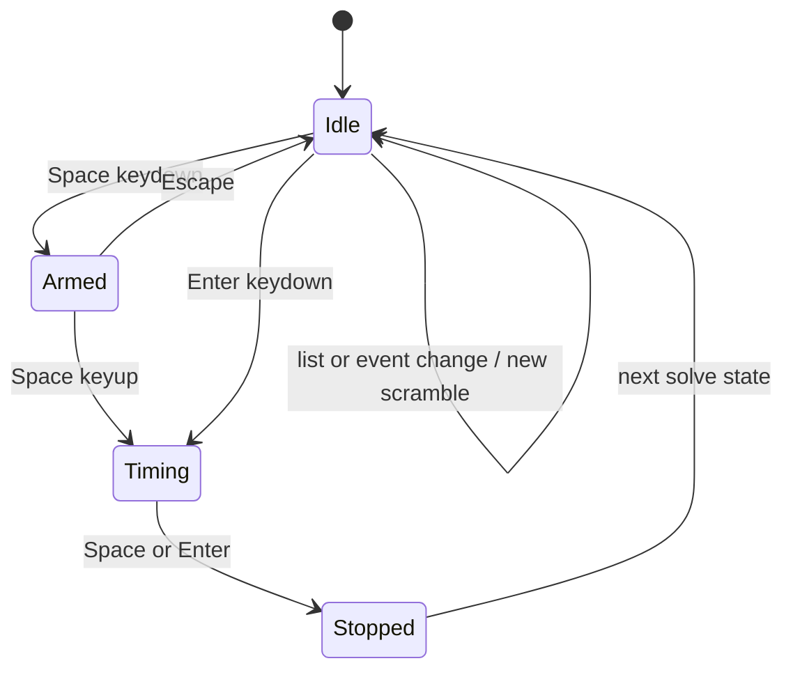

# Timer Workflow

The web timer now starts at `AppRouter` and uses `TimerPage` as the root `/`
experience. Shared package code supplies timer math and solve/session statistics,
while React owns keyboard priority, scramble generation, list selection, and the
redesigned page layout.

## Key Rules

- `AppRouter` maps `/` to `TimerPage` and reserves `/results`, `/formulas`,
  and `/settings` for follow-up pages. See
  [apps/web/src/app-router.tsx#L1](../apps/web/src/app-router.tsx#L1) and
  [apps/web/src/app-routes.ts#L1](../apps/web/src/app-routes.ts#L1).
- `TimerPage` owns the current scramble text, timer state, active list,
  result toolbar, session summary, recent solves, and scramble preview. See
  [apps/web/src/timer/timer-page.tsx#L1](../apps/web/src/timer/timer-page.tsx#L1).
- `@cubegin/shared/timer` is platform-agnostic state only. It uses
  `performance.now()` and exposes `start`, `stop`, `reset`, and `getState`
  through [packages/shared/src/timer/timer.ts#L13](../packages/shared/src/timer/timer.ts#L13).
- `@cubegin/shared/timer-session` is platform-agnostic solve/session logic. It
  owns solve records, penalty display, elapsed formatting, and rolling averages
  including mo3, ao5, ao12, ao50, and ao100.
- `TimerPage` currently keeps lists and solves in React state. Each list binds
  to one event/scramble type, and switching lists switches the active event for
  scramble generation.
- `useTimer` bridges the core timer to React with `requestAnimationFrame`; keep
  RAF cleanup on stop, reset, and unmount. See
  [apps/web/src/timer/hooks/use-timer.ts#L5](../apps/web/src/timer/hooks/use-timer.ts#L5).
- `TimerPage` captures Space and Enter at page priority so focused controls
  cannot consume Space to open selects while the user intends to time a solve.
  Space arms on keydown and starts on keyup; Enter starts immediately. Space or
  Enter stops while timing, and Escape cancels the armed state.
- While timing, the right list selector and primary navigation are hidden; the
  brand stays visible.
- Stopped solves reveal a result toolbar with `+2`, `DNF`, and delete actions.
  Result UI is laid out in a fixed feedback slot so the timer does not jump
  between idle, armed, timing, and stopped states.

## Key Files

- [apps/web/src/app-router.tsx#L1](../apps/web/src/app-router.tsx#L1) - app route switch.
- [apps/web/src/timer/timer-page.tsx#L1](../apps/web/src/timer/timer-page.tsx#L1) - redesigned timer state and layout.
- [apps/web/src/timer/timer-navigation.tsx#L1](../apps/web/src/timer/timer-navigation.tsx#L1) - shared timer app navigation.
- [apps/web/src/timer/timer-page.module.css#L1](../apps/web/src/timer/timer-page.module.css#L1) - fixed timer, scramble, bottom dock, and mobile nav layout.
- [apps/web/src/timer/components/scramble-image.tsx#L5](../apps/web/src/timer/components/scramble-image.tsx#L5) - inline SVG boundary.
- [packages/shared/src/timer/format.ts#L1](../packages/shared/src/timer/format.ts#L1) - elapsed time formatting.

## Open Questions

- TODO: Confirm whether the WeChat miniprogram should mirror the web timer
  gesture model or use native mini-program interactions.
- TODO: Decide when `TimerPage` should move list and solve storage from React
  state to IndexedDB-backed session persistence.

---

_Last updated: 2026-07-07 | Reason: document TimerPage as the primary web timer implementation_
