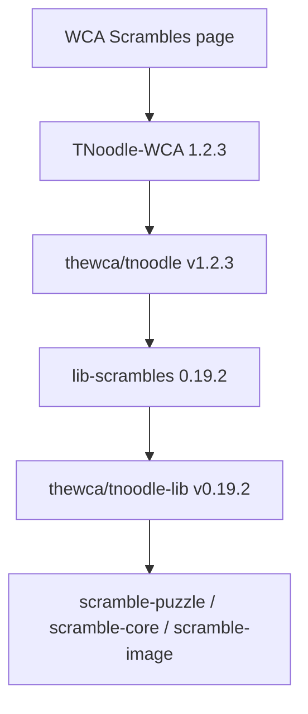

# TNoodle Baseline



CubeKit's TNoodle-compatible scramble work tracks the official WCA scramble
program by pinning both the application release and the core scramble library
release. Re-check this page before changing TNoodle-compatible generation,
notation, state transitions, or SVG rendering.

## Current Baseline

Last verified: 2026-05-26.

| Source | Baseline | Reference |
| --- | --- | --- |
| WCA Scrambles page | `TNoodle-WCA-1.2.3`; last official change January 1, 2026 | <https://www.worldcubeassociation.org/regulations/scrambles/> |
| `thewca/tnoodle` | tag `v1.2.3`; commit `2ed70d4c94e2b94ff2d2177b06a02708bcb881ac` | <https://github.com/thewca/tnoodle/tree/v1.2.3> |
| `thewca/tnoodle` build version | `version = "1.2.3"` | <https://github.com/thewca/tnoodle/blob/v1.2.3/build.gradle.kts> |
| `lib-scrambles` dependency | `org.worldcubeassociation.tnoodle:lib-scrambles:0.19.2` | <https://github.com/thewca/tnoodle/blob/v1.2.3/gradle/libs.versions.toml> |
| `thewca/tnoodle-lib` | tag `v0.19.2`; commit `9397fb605d8d593868dc75dbaf84c54c808ee9dc` | <https://github.com/thewca/tnoodle-lib/tree/v0.19.2> |

## Upgrade Check

When the WCA publishes a new official scramble program:

1. Confirm the new official version on the WCA Scrambles page.
2. Fetch the new `thewca/tnoodle` tag and inspect its `gradle/libs.versions.toml`
   to find the referenced `lib-scrambles` version.
3. Fetch the corresponding `thewca/tnoodle-lib` tag.
4. Diff both repositories from the baseline recorded above.
5. Classify changed files by implementation area before editing CubeKit.

Useful commands:

```bash
git ls-remote --tags https://github.com/thewca/tnoodle.git
git ls-remote --tags https://github.com/thewca/tnoodle-lib.git

git diff v1.2.3..vNEW -- gradle/libs.versions.toml server/src/main/kotlin/org/worldcubeassociation/tnoodle/server/model
git diff v0.19.2..vNEW -- scrambles/src/main/java/org/worldcubeassociation/tnoodle/scrambles
git diff v0.19.2..vNEW -- scrambles/src/main/java/org/worldcubeassociation/tnoodle/puzzle
git diff v0.19.2..vNEW -- min2phase threephase sq12phase svglite
```

## Diff Classification

| Upstream path | CubeKit area to inspect |
| --- | --- |
| `scrambles/src/main/java/org/worldcubeassociation/tnoodle/scrambles` | `packages/scramble-puzzle` shared contracts and generation helpers |
| `scrambles/src/main/java/org/worldcubeassociation/tnoodle/puzzle` | puzzle parsers, states, generators, and SVG renderers |
| `min2phase` | `packages/scramble-core` 3x3 solver |
| `threephase` | `packages/scramble-core` 4x4 solver |
| `sq12phase` | `packages/scramble-core` Square-1 solver |
| `svglite` | `packages/scramble-image` SVG serialization |
| `server/src/main/kotlin/org/worldcubeassociation/tnoodle/server/model` | WCA event and puzzle mapping assumptions |

Keep upgrade tasks small: one changed upstream area should become one focused
implementation task with its own fixtures and tests.

---

_Last updated: 2026-05-26 | Reason: record TNoodle baseline for future diff-based updates_
