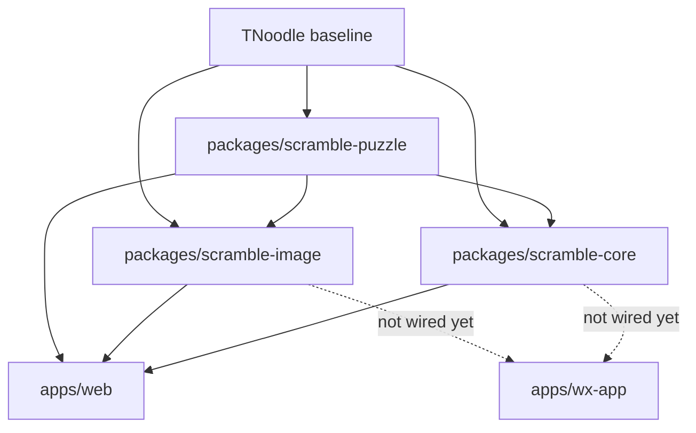

# TNoodle Implementation Notes

Cubegin now has standalone TypeScript packages for TNoodle-compatible puzzle
notation/state, scramble generation, and SVG rendering. `apps/web` imports
these packages directly; the removed legacy `@cubegin/scramble` package should
not be restored.

## Implemented Packages

- `packages/scramble-puzzle` owns event metadata, puzzle registries, notation
  parsers, state transitions, and shared fixture helpers. See
  [docs/packages/scramble-puzzle/index.md](packages/scramble-puzzle/index.md).
- `packages/scramble-core` owns random sources, batch uniqueness, event
  generator dispatch, and the solver/random-turn implementations. See
  [docs/packages/scramble-core/index.md](packages/scramble-core/index.md).
- `packages/scramble-image` owns DOM-free SVG serialization and event renderer
  dispatch. See
  [docs/packages/scramble-image/index.md](packages/scramble-image/index.md).

## Baseline

See [docs/tnoodle-baseline.md](tnoodle-baseline.md). The implementation tracks
TNoodle-WCA `1.2.3`, `thewca/tnoodle` `v1.2.3`, and `thewca/tnoodle-lib`
`v0.19.2`.

## Verification

Core package verification commands used during the implementation:

- `pnpm --filter @cubegin/scramble-puzzle test`
- `pnpm --filter @cubegin/scramble-core test`
- `pnpm --filter @cubegin/scramble-image test`
- `pnpm --filter @cubegin/scramble-puzzle test:coverage`
- `pnpm --filter @cubegin/scramble-core test:coverage`
- `pnpm --filter @cubegin/scramble-image test:coverage`
- `pnpm --filter @cubegin/scramble-puzzle typecheck`
- `pnpm --filter @cubegin/scramble-core typecheck`
- `pnpm --filter @cubegin/scramble-image typecheck`

Repository verification remains:

- `pnpm test`
- `pnpm check`

## Runtime Boundary

The new packages are platform-agnostic and do not require the `cstimer_module`
browser shim. Expensive scramble generation is exposed through
`createDefaultScrambleGenerator`, which is async-shaped so it can move behind a
Web Worker later without changing the high-level contract.

`apps/web` uses the new packages directly and builds their package exports
through `prepare:deps` before dev, build, test, and typecheck. WeChat
miniprogram support remains unverified; do not wire `apps/wx-app` to these
packages without a separate runtime check.

## Upgrade Flow

When TNoodle changes, diff the pinned upstream tags recorded in
[docs/tnoodle-baseline.md](tnoodle-baseline.md) before editing Cubegin. Split
updates by upstream area:

- `scrambles` contracts and puzzle files -> `scramble-puzzle`
- `min2phase`, `threephase`, `sq12phase` -> `scramble-core`
- `svglite` and image layouts -> `scramble-image`

Keep update tasks small enough that fixtures and regression tests can identify
which puzzle family changed.

---

_Last updated: 2026-06-30 | Reason: event metadata renamed and FTO support added_
