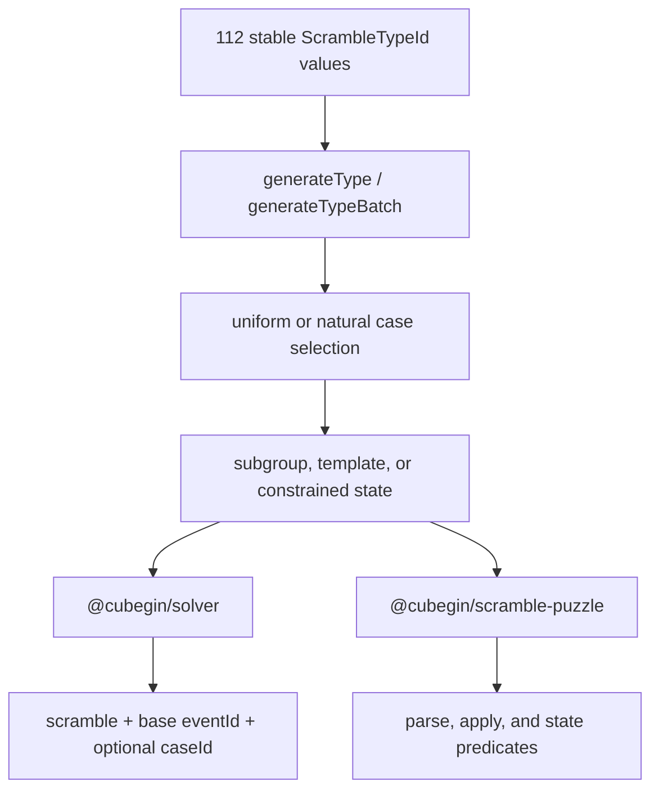

# Training Scramble System

`@cubegin/scramble-core` owns one catalog for 18 official event ids and 94
platform-independent training ids. Apps store the selected `scrambleTypeId`, but
render images and record solves with the returned base `eventId`.

## Public Contract

- [`SCRAMBLE_TYPE_CATALOG`](../packages/scramble-core/src/catalog.ts#L1) is the
  stable metadata source for `baseEventId`, `puzzleId`, category, generator kind,
  and optional case-set id.
- [`createDefaultScrambleGenerator`](../packages/scramble-core/src/generator.ts#L1)
  exposes `generateType` and unique `generateTypeBatch` without changing the
  existing official-event `generate` API.
- Case-backed types accept `enabledCaseIds` and `mode: 'uniform' | 'natural'`.
  Empty, duplicate, or unknown filters fail instead of silently widening scope.
- All randomness enters through `RandomSource`; generators do not read or mutate
  global random state.

| Family                      | Training ids | State strategy                                            |
| --------------------------- | -----------: | --------------------------------------------------------- |
| 2x2                         |           10 | exhaustive cubie cases and coordinate solve               |
| 3x3                         |           48 | min2phase masks, bounded states, and restricted subgroups |
| 4x4-7x7                     |           17 | threephase partial states and pairing templates           |
| Megaminx                    |            5 | restricted subsets plus dedicated LSLL coordinates        |
| Pyraminx / Skewb / Square-1 |            8 | event-specific coordinates and cases                      |
| FTO                         |            6 | constrained cubies plus fixed-color three-phase solve     |

## Solver Boundaries

- Reusable package code stays DOM-, Taro-, Worker-, and browser-global-free.
- Megaminx LSLL/PLL/LL use the dedicated coordinate solver in
  [`megaminx-lsll-solver.ts`](../packages/solver/src/training/megaminx-lsll-solver.ts#L1).
- FTO accepts any legal `FtoState`, validates facelet/cubie parity, caches its
  coordinate tables, and restores the fixed color orientation in
  [`fto-solver.ts`](../packages/solver/src/full/fto-solver.ts#L1).
- On the 2026-07-27 local Node 24 verification host, FTO table initialization was
  about 181 ms with an estimated 13.1 MB logical table footprint. A long arbitrary
  state solved in about 1.0-1.2 seconds; constrained training states in the focused
  test ranged from about 30-940 ms after initialization. Treat these as diagnostic
  reference values, not runtime budgets.

## Provenance

The clean TypeScript implementations were compared against these pinned GPL-v3
references:

- `cs0x7f/cstimer@22a6aedde88fd59255ab6a8ae8c06180e7a55d64`:
  `2x2x2.js`, `pyraminx.js`, `skewb.js`, `scramble_sq1_new.js`,
  `scramble_444.js`, `mgmlsll.js`, `scramble_fto.js`, and `solver/ftocta.js`.
- `MeigenChou/DCTimer-Android@fe806bd28953276cea2fe8d2cbd2f227a27d3f2f`:
  `arrays.xml` plus the 2x2, Skewb, Square-1, Yau/Hoya, POLL, and PPLL
  implementations used as behavioral and taxonomy cross-checks.

Package NOTICE files carry distribution attribution. No runtime dependency on
either upstream repository is introduced.

## Verification

- [`training-catalog.test.ts`](../packages/scramble-core/src/training-catalog.test.ts#L1)
  generates a unique two-item batch for every training id.
- Owner-scoped generator tests verify deterministic seeds, parser/apply behavior,
  state constraints, stable case ids, and filters.
- Solver tests verify coordinate round trips, arbitrary legal FTO states, fixed
  color restoration, cached initialization stats, and invalid-state rejection.

## Adding A Training Type

1. Add one stable id and its base-event/puzzle/category metadata to
   [`catalog.ts`](../packages/scramble-core/src/catalog.ts#L1).
2. Choose one honest generator kind: restricted subgroup, template, exhaustive
   case, or constrained state plus solver. Do not fall back to the official
   event generator.
3. Keep stable case ids semantic; expose them through the owner generator and
   route selection through the shared case filter.
4. Add deterministic parser/apply/state tests, then include the type in the
   complete two-item batch smoke test.
5. Update this document and package NOTICE when the algorithm, data, or taxonomy
   uses a new external source.

---

_Last updated: 2026-07-27 | Reason: document the complete auxiliary training scramble catalog and solver boundaries_
